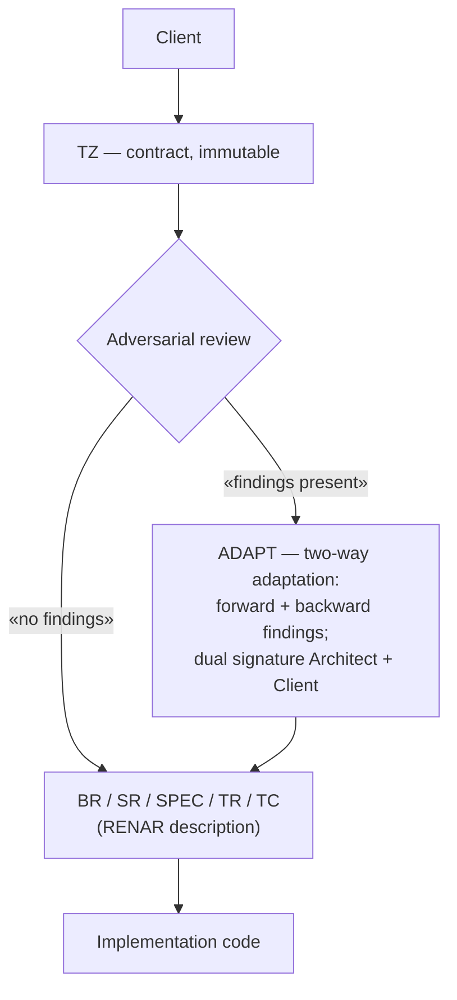

# RENAR Core

**Version:** 1.3-draft · **Date:** 2026-06-05 · **Site:** renar.tech
**Copyright:** (C) 2026 Vadim Soglaev, Andrey Yumashev. Licensed under [CC BY-SA 4.0](https://creativecommons.org/licenses/by-sa/4.0/).

---

> **What this is.** A conceptual overview of RENAR for the human reader: what the standard is about, why it is needed, and how it works at the top level. Without technical detail, frontmatter, the lifecycle, or normative rules — that is the domain of the full [RENAR Standard](../../standard/en/README.md).
>
> **Reading time:** ≤ 10 minutes.
> **Who it is for:** PMs, lawyers, regulators, and engineers encountering RENAR for the first time. If you are an AI agent, read the [Standard](../../standard/en/README.md) directly — you do not need Core.

---

## What RENAR Is

**RENAR** (*Requirements Engineering & Normative Adaptive Regulation*) is a normative requirements-engineering standard for development with AI agents. The standard governs:

- **The data model** of requirements artifacts: BR (business requirement), SR (system requirement), TR (task), ADAPT (two-way adaptation of the TZ), 9 SPEC types (architecture, API, data, integration, process, UI, AI, security, operations), TC (test cases).
- **The lifecycle and Quality Gates** (QG-0..QG-4) — artifact states and the conditions for transitions.
- **Substrate capabilities** V1–V6, which the artifact storage system MUST satisfy: immutable history, atomic changes, comparison/review, branching, end-to-end version pinning, author + timestamp.
- **Conformance** — the RENAR-1..RENAR-5 levels, mandatory clauses, the manifest, and assessment procedures.

RENAR is a **specialization of SENAR** (the methodological foundation for development with AI agents) in the area of requirements engineering. A RENAR-conformant implementation is always compatible with SENAR; the reverse does not hold.

---

## Why RENAR Exists

In development with AI agents, requirements live simultaneously across several artifacts: the client's contractual TZ, the engineering BR/SR/SPEC, test cases, the task description, the implementation in code. All of this is written and edited by a mix of humans and AI agents. Without formal contracts between artifacts, **requirements drift** arises — a divergence between what has been recorded, what is verified, and what is actually implemented.

RENAR closes eight normalized classes of drift:

1. **Schema drift** — artifact fields diverge between projects.
2. **Lifecycle drift** — statuses (`draft` / `approved` / `verified`) mean different things to different authors.
3. **Source-of-Truth drift** — one entity is edited in several places at once.
4. **Implementation drift** — code implements a requirement that has already been deleted or renamed.
5. **Terminological drift** — terms mean different things to different people.
6. **Order / provenance drift** — a delta-TZ is applied out of order, or references a non-existent requirement.
7. **TC ↔ requirement provenance drift** — a test verifies obsolete behavior.
8. **Test-fitting drift** — an AI agent weakens a test's criteria instead of fixing the code.

All eight classes are **structural**: they arise from the very fact that an artifact is co-owned by several authors, not from lapses in discipline. They can be closed only normatively — by recording a contract for how artifacts are linked, who writes which field, and which preconditions MUST hold at state transitions.

---

## How RENAR Works (Conceptually)

The full lifecycle of a single requirement:

**Key properties:**

- **The TZ is a contractual, immutable artifact.** Once signed by the client, it is not edited. Scope changes are formalized through a delta-TZ.
- **ADAPT is a reactive bridge between the client's language and the language of requirements.** It is created only when converting the TZ → RENAR requires agreement with the client (backward findings identified, term mapping, scope clarification). The adversarial reviewer (a separate AI agent on a different model) records a verdict of "findings present" or "no findings" for each TZ.
- **The RENAR description is the Source of Truth about the system's behavior.** Code is a derived implementation artifact, not the authoritative definition of behavior. If the code does X but the SR says Y, that is a defect in the code, not "the actual requirement has changed."
- **TC pos/neg pairing.** Every verifiable assertion of a requirement has at least one positive and one negative test case. AI agents readily cover the happy path and skip negative scenarios — RENAR makes pairing normative.
- **Adversarial review.** A separate AI agent on a different model deliberately looks for what the primary agent missed: missing backward findings, weakened TC criteria, hidden assumptions. This is a compensating mechanism against self-consistent but semantically incorrect AI outputs.
- **Dual signature of ADAPT.** When an ADAPT is created, it moves to approved only after two signatures: the client (or their representative) confirms that the interpretation matches their intent; the architect confirms technical feasibility and the closure of all findings.

The full lifecycle is governed through **Quality Gates** (QG-0 Approval, QG-1 Implementation, QG-2 Verification mandatory; QG-3 Architecture, QG-4 Acceptance optional). Each transition to a higher artifact status passes through the corresponding gate with a recorded participant and preconditions.

---

## The Default Executor — the AI Agent

RENAR artifacts are **by default** created and maintained by an AI agent on assignment from an engineer. The human acts as verifier and approver: reviewing the result, clarifying the task when needed, and approving lifecycle transitions.

Two things follow from this positioning that are unfamiliar when reading the standard for the first time:

- **Artifacts look dense** (dozens of frontmatter fields, lifecycle transitions, graph links) — because the primary reader is machine. The density is not bureaucracy but a requirement for "code in natural language" that the AI agent executes in subsequent steps.
- **The process overhead of maintenance is machine, not human.** An AI agent does not tire of filling in frontmatter; the volume of work is linear. To a human this overhead seems unbearable — but it is precisely this overhead that need not be borne by hand.

At the same time, **the human remains the source of decisions** on contractual outcomes: the ADAPT signature, QG-0 approval, the spot-check of tests, acceptance of the result. The AI agent is responsible (executes); the human is accountable (answers for the result).

---

## Who Will Find RENAR Useful

RENAR is built for **contract-oriented development**: projects with an explicit contractual TZ and an identifiable client party answerable for that TZ. Typical contexts:

- **Custom development** — an independent vendor + a client with a signed TZ and acceptance criteria.
- **Regulated industries** (healthcare, finance, the public sector) — where a compliance audit is mandatory by regulation.
- **Enterprise consulting** — a third party implements against a corporate client's TZ with approval from several stakeholders.
- **Public-sector / government IT** — tender TZs, formal acceptance, multi-year contracts.
- **Long-lived products** — where the Product Owner plays the role of the Client's representative for internal feature TZs.

RENAR is **not applicable** to lean startup discovery, pure R&D without a defined scope, hackathon proofs-of-concept, and other contexts without an immutable TZ and an identifiable Stakeholder.

---

## Routes by Role

| Role | Where to start |
|---|---|
| **PM / RTE** | [guide/05](../../guide/en/05-safe-comparison.md) — RENAR vs SAFe; then [guide/09 §E3](../../guide/en/09-worked-examples.md) — a practical example |
| **Legal / Compliance** | [guide/09 §E3](../../guide/en/09-worked-examples.md) → [guide/06](../../guide/en/06-compliance.md) → [reference/07](../../reference/en/07-iso29148-trace-matrix.md) — ISO 29148 mapping |
| **Regulator / Auditor** | [reference/07](../../reference/en/07-iso29148-trace-matrix.md) → [reference/08](../../reference/en/08-conformance-self-assessment.md) → [standard/13](../../standard/en/13-conformance.md) — conformance manifest |
| **RE engineer / Architect** | [guide/00 Quickstart](../../guide/en/00-quickstart.md) → [standard/06](../../standard/en/06-requirements-hierarchy.md) → [standard/10](../../standard/en/10-lifecycle-qg.md) |

---

## Where to Read Next

| Document | Purpose |
|---|---|
| [standard/](../../standard/en/README.md) — 15 normative chapters | The complete normative description; required reading for the AI agent and the assessor |
| [guide/00-quickstart](../../guide/en/00-quickstart.md) | A 30-minute practical end-to-end example: TZ → ADAPT → SR → SPEC → TC |
| [guide/01-walkthrough](../../guide/en/01-walkthrough.md) | An extended example on a full-scale scenario |
| [guide/06-compliance](../../guide/en/06-compliance.md) | GDPR, FZ-152, AI Act mapping |
| [reference/01-glossary](../../reference/en/01-glossary.md) | The canonical glossary + mapping to ISO 29148, BABOK, SAFe, NIST AI RMF |
| [reference/02-schemas](../../reference/en/02-schemas.md) | Machine-readable artifact schemas (JSON Schema), validation rules |
| [reference/03-ai-risk-register](../../reference/en/03-ai-risk-register.md) | 14 AI risks per ISO/IEC 23894 + NIST AI RMF |

---

*RENAR Core 1.3-draft — renar.tech*
*Copyright (C) 2026 Vadim Soglaev, Andrey Yumashev. Licensed under CC BY-SA 4.0.*
