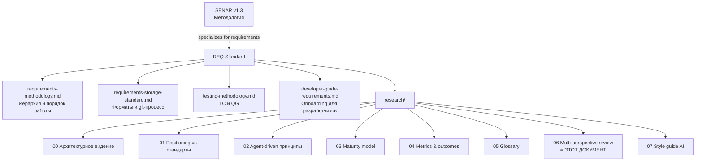

# Multi-perspective review RENARа

> Версия: черновик 0.1 | Дата: 2026-05-03
> Назначение: документ-анализ. Что бы сказали о RENARе 4 senior-роли (PM, PrjM/RTE, Tech Writer, Head of Engineering) + что взять из мировых стандартов. Не нормативный — источник для итераций.
>
> Документ систематизирует gaps, выявленные при review архитектурного видения [00-architecture-vision.md](00-architecture-vision.md). Часть из них уже адресована в [02-agent-driven-principles.md](02-agent-driven-principles.md), [03-maturity-model.md](03-maturity-model.md), [04-metrics-and-outcomes.md](04-metrics-and-outcomes.md). Часть — open для будущих итераций.

---

## 1. Не дублирует SENAR

SENAR Reference (§13 Conformance, §11 Configurations) и SENAR Guide содержат собственные перспективы внедрения. Этот документ:

- НЕ переписывает SENAR Conformance процедуры.
- НЕ заменяет SENAR Guide (it has chapter on roles).
- ДОБАВЛЯЕТ specifically для requirements management — что специалисты, не покрытые SENAR ролями (Product Manager, Technical Writer), скажут о нашем стандарте.

---

## 2. Перспектива 1 — Senior Product Manager

### 2.1 Главные замечания

| Замечание | Серьёзность | Адресовано в |
|---|---|---|
| Нет outcomes на уровне продукта (только outputs) | High | [04-metrics-and-outcomes.md §2](04-metrics-and-outcomes.md) |
| Нет value chain BR → бизнес-цель → KPI клиента | High | TODO — `req-business-mapping.md` |
| Нет prioritization framework (RICE / WSJF / MoSCoW) | Medium | priority enum есть, формула — open question |
| Stakeholder map отсутствует | Medium | TODO — расширить frontmatter BR |
| Нет success metrics для самого стандарта | High | [04 §3](04-metrics-and-outcomes.md) (метрики) и [04 §5](04-metrics-and-outcomes.md) (ROI) |
| Definition of Done на уровне продукта не определён | Medium | [03-maturity-model.md](03-maturity-model.md) частично |

### 2.2 Конкретные предложения

**A. Расширить frontmatter BR**:

```yaml
business-context:
  stakeholder: "Менеджер по продажам"
  business-goal: "Сократить время от лида до сделки"
  kpi-impact:
    - kpi: "Sales Cycle Time"
      direction: decrease
      target: "-30% за квартал"
    - kpi: "Conversion Rate"
      direction: increase
      target: "+5pp"
prioritization:
  framework: WSJF                     # WSJF | RICE | MoSCoW
  wsjf-score: 24                      # business-value (10) + time-criticality (8) + risk-reduction (6) / job-size (1)
  components:
    business-value: 10
    time-criticality: 8
    risk-reduction: 6
    job-size: 1
```

Это превращает BR из «потребности роли» в **business case с измеримым impact**.

**B. Добавить раздел в `requirements-methodology.md`**: «Prioritization Framework — WSJF для REQ-проектов».

**C. Расширить REQUIREMENTS.md sumary секцией**:

```markdown
## Stakeholder Map

| Stakeholder | Owns BR | Active Disputes | Acceptance Status |
|---|---|---|---|
| Sales Director | BR-01, BR-02 | 0 | 5/5 verified |
| Operations Director | BR-03, BR-04 | 1 (BR-04 §3.2) | 2/4 verified |

## Business Outcomes Tracking

| Business Goal | Driving BRs | KPI | Current | Target |
|---|---|---|---|---|
| Reduce sales cycle | BR-01, BR-02 | Sales Cycle Time | 14 days | < 10 days |
```

---

## 3. Перспектива 2 — Senior Project Manager / SAFe RTE

### 3.1 Главные замечания

| Замечание | Серьёзность | Адресовано в |
|---|---|---|
| Нет PI Planning интеграции (BR↔Epic, SR↔Feature, TR↔Story) | High | TODO — `req-safe-mapping.md` |
| Нет dependency management (cross-project blocks) | Medium | INT-SR + Finka cross-deps уже есть, но требует обвязки |
| Нет estimation модели | Medium | open |
| Нет integration с release management | Medium | open |
| Нет risk register | High | TODO — `req-risk-register.md` |
| Нет RACI таблицы | Medium | partially [02 §3 ролей](02-agent-driven-principles.md), но неполно |

### 3.2 Конкретные предложения

**A. Создать `req-safe-mapping.md`** с явной таблицей:

| SAFe artifact | REQ artifact | Где живёт |
|---|---|---|
| Strategic Theme | (out of REQ scope) | Portfolio level |
| Portfolio Epic | Группа BR одной системы | `<system>.req/br/` aggregated view |
| Capability / Program Epic | BR подсистемы | `<subsystem>.req/br/` |
| Feature | SR (или несколько связанных SR) | `<subsystem>.req/sr/` |
| Story | TR (Task в трекере) | TAUSIK DB / KAI DB / Raven `task` |
| Enabler Epic | AIC или TS | `<system>.req/ai-concepts/` или `tech-specs/` |

И workflow: Feature acceptance criteria = SR `verified-by` zеленые TC. Definition of Done на каждом уровне SAFe.

**B. RACI таблица для жизненного цикла требования**:

| Активность | Responsible | Accountable | Consulted | Informed |
|---|---|---|---|---|
| Импорт ТЗ | AI-агент | Архитектор | — | Команда |
| Декомпозиция → BR | AI-генератор | Архитектор | Stakeholder, AI-критик | Команда |
| Декомпозиция BR → SR | AI-генератор | Архитектор | AI-критик | Команда |
| Генерация TC pos/neg | AI-агент | Инженер верификации | — | Команда |
| Одобрение QG-0 | Архитектор (one-click) | Tech Lead | AI-критик | Stakeholder |
| Реализация TC | AI-агент | Разработчик | — | Tech Lead |
| Прогон CI | Бот | — | — | Команда |
| Одобрение QG-2 (verified) | Архитектор (one-click) | Tech Lead | — | Stakeholder |
| Дельта-ТЗ approval | Архитектор + Stakeholder | Tech Lead | AI-impact-agent | Команда |
| Spot-check 5 TC | Архитектор | — | — | Команда |
| Reconciliation MR | AI-агент-reconciler | Архитектор | — | Команда |

**C. Risk register обязателен** — отдельный документ `req-risk-register.md`. Связь с ISO/IEC 23894 (см. [01 §3.11](01-positioning-vs-world-standards.md)).

**D. Estimation**: для AI-driven контекста традиционные story points плохо работают. Предложение — **AI-augmented estimation**:

- AI-агент при создании TR пытается оценить complexity через `cost budget` (Принцип 5).
- Cycle Time исторически измеряется per requirement, агент учится на данных проекта.
- Velocity на уровне требований (Coverage Velocity, [04 §3.8](04-metrics-and-outcomes.md)) — основной планировочный сигнал.

---

## 4. Перспектива 3 — Senior Technical Writer

### 4.1 Главные замечания

| Замечание | Серьёзность | Адресовано в |
|---|---|---|
| Нет Information Architecture | High | [research/README.md](README.md) частично |
| Audience-mismatch (один документ для всех) | Medium | research/ split на роли |
| Нет визуальных артефактов (диаграмм) | Medium | TODO — добавить mermaid |
| Нет worked example end-to-end | High | TODO — `req-worked-example.md` |
| Терминология не унифицирована | High | [05-glossary-terminology.md](05-glossary-terminology.md) |
| Нет versioning policy для самого стандарта | Medium | [05 §5](05-glossary-terminology.md) частично |
| Нет «what's NOT in scope» секций | Low | TODO в каждом норм. документе |
| Нет style guide для AI-генерации | Medium | TODO — `07-style-guide-ai-generation.md` |

### 4.2 Конкретные предложения

**A. Создать information architecture diagram** (mermaid):



**B. Audience-specific entry points** в `README.md`:

- «Я партнёр» → architecture-vision (00) → maturity (03) → multi-perspective (06)
- «Я архитектор внедряющий REQ» → 00 → 02 → 05 → нормативные документы
- «Я Product Manager» → 04 → 03 → 01 → 06
- «Я AI-инженер / prompt engineer» → 02 → 07 → нормативные

**C. Worked example end-to-end**: пройти один полный цикл от ТЗ до verified требования с реальными артефактами. Объект: маленький проект (например, login flow). Покрывает все этапы.

Структура:
1. Подписан ТЗ (1 страница).
2. Импорт в `tz/`.
3. Декомпозиция в BR (с adversarial review).
4. SR + UIC.
5. TC pos/neg.
6. Реализация в `.src` через TAUSIK task.
7. CI прогон.
8. QG-2 + verified.
9. Дельта-ТЗ + impact analysis.

Это будет ~50-80 строк markdown + commits в demo-репо.

**D. «Not in scope» секция** в каждом нормативном документе. Пример:

```markdown
## Что RENAR НЕ покрывает

- DevOps практики (CI/CD pipeline patterns) — см. отдельный standard.
- Кодирование — см. SENAR Code Standards.
- UX-дизайн — REQ описывает UIC как контракт, не процесс дизайна.
- Performance tuning — RDBMS, caching — см. отдельный standard.
```

**E. Versioning policy стандарта**:

- Major (1.0 → 2.0): breaking change в data model, требует migration существующих проектов.
- Minor (1.0 → 1.1): новое поле, новый artifact type, новый принцип. Backward compatible.
- Patch (1.1.0 → 1.1.1): уточнения, исправления, дополнения.

Decisions track в `CHANGELOG.md` корня репо. Owner — архитектор стандарта.

---

## 5. Перспектива 4 — Head of Engineering / CTO

### 5.1 Главные замечания

| Замечание | Серьёзность | Адресовано в |
|---|---|---|
| Нет ROI обоснования | Critical | [04 §5](04-metrics-and-outcomes.md) |
| Нет maturity model (барьер входа) | High | [03-maturity-model.md](03-maturity-model.md) |
| Нет compliance / audit trail story | High | TODO — `req-compliance-mapping.md` |
| Нет mapping на регуляторку (GDPR/152-ФЗ/ИСО 27001) | Medium | TODO в `req-compliance-mapping.md` |
| Нет cost model AI-генерации | High | [04 §5.1](04-metrics-and-outcomes.md) частично |
| Нет competitive landscape | Medium | [01-positioning-vs-world-standards.md](01-positioning-vs-world-standards.md) |

### 5.2 Конкретные предложения

**A. Self-assessment audit checklist** для compliance teams:

Один документ с conformance checkpoints. ISO 27001 / GDPR / ФЗ-152 контрол points → REQ-артефакты, которые их закрывают:

| Регуляторный контрол | REQ-артефакт |
|---|---|
| ISO 27001 A.12.1.2 (Change management) | `[delta:TZ-XXX]` процесс + Impact Analysis + audit trail в git |
| ISO 27001 A.14.1.1 (Security in BR) | NFR через ISO 25010 Security characteristic |
| GDPR Art. 25 (Privacy by design) | BR с явным `data-classification` полем + соответствующие SR |
| ФЗ-152 ст.18.1 (Защита данных) | Аналогично, через `data-classification` |
| AI Act EU (when applicable) | AIC + ISO/IEC 5338 conformance + AI risk register |

**B. ROI dashboard** на уровне организации:

Per-project REQ-метрики aggregated → organisational level. Показывает:

- Cumulative savings from REQ adoption (в человеко-часах и $).
- Adoption curve (% проектов на RENAR-3+).
- Defect Escape Rate trend (до и после REQ).
- Время до первого commit'а нового проекта.

**C. Cost model для AI-генерации** (детализация [04 §5.1](04-metrics-and-outcomes.md)):

- Per-token tracking через `ai-provenance.context-tokens` / `output-tokens`.
- Aggregated per project, per month, per stakeholder.
- Cost-cap per project alarm.
- Recommendation engine: «этот проект использует Opus для всего, переключи декомпозицию SR на Sonnet — экономия 60%».

**D. Competitive positioning** в `req-standard-positioning.md`:

| Кто | Что предлагают | Чем REQ отличается |
|---|---|---|
| Atlassian (Jira + Confluence) | Issue tracker + wiki | Нет нормативной структуры, нет AI-генерации с гарантиями |
| IBM DOORS | Enterprise requirements management | Heavyweight, не agent-driven, дорогой |
| Modern Requirements (Microsoft) | Requirements suite в Azure DevOps | Manual-driven, не оптимизирован для AI |
| ReqIF standard | Interchange format | Только формат, не процесс |
| Open standards (29148, BABOK) | Методология | Не имплементированы как tooling |
| **REQ + TAUSIK/KAI/Raven** | Стандарт + runtime + agent-driven generation | **Полный стек, нативный для AI-агентов, conformant к мировым стандартам** |

---

## 6. Что взять из мировых стандартов (синтез)

Детально расписано в [01-positioning-vs-world-standards.md](01-positioning-vs-world-standards.md). Здесь — приоритетные пункты для следующих итераций REQ:

| Стандарт | Что взять (приоритет) | В какой документ |
|---|---|---|
| ISO/IEC 25010 (8 quality characteristics) | Расширить SR `quality-characteristic` поле | requirements-storage-standard.md (TODO) |
| ISO/IEC 25022/25023 (quality measures) | Рекомендации для Pass-критериев | testing-methodology.md (TODO §6.1 расширение) |
| BABOK Elicitation | Workflow интервью со стейкхолдерами через AI | TODO — `req-elicitation-workflow.md` |
| BABOK Solution Evaluation | Нормативный QG-4 с outcome metrics | TODO — `req-solution-evaluation.md` |
| ISTQB techniques | Equivalence partitioning, BVA в TC-генерации | testing-methodology.md (TODO) |
| ISO/IEC 5338 | Decision logs, model versioning, continuous validation | [02-agent-driven-principles.md](02-agent-driven-principles.md) (есть) |
| ISO/IEC 23894 | AI risk register | TODO — `req-ai-risk-register.md` |
| NIST AI RMF | Govern/Map/Measure/Manage mapping | TODO — `req-nist-mapping.md` (для US-клиентов) |
| SAFe 6.0 | WSJF priority, Built-in Quality, ART координация | TODO — `req-safe-mapping.md` |

---

## 7. Синтез: 7 пунктов как обязательные для RENAR-5

Эти 7 принципов из [02-agent-driven-principles.md](02-agent-driven-principles.md) + 5 пунктов отсюда:

**Из 02 (Agent-driven principles)**:
1. AI-conformance level (model cards в артефактах).
2. Adversarial review as gate.
3. Hallucination-defense через source citation.
4. Multi-model agreement для критических BR.
5. AI cost / latency budget per artifact.
6. Knowledge graph как central source.
7. Continuous reconciliation hook.

**Из этого документа (Multi-perspective)**:
8. WSJF prioritization для BR/SR.
9. RACI по lifecycle артефакта.
10. Compliance mapping (ISO 27001, ФЗ-152, GDPR, AI Act).
11. Cost dashboard на уровне организации.
12. Self-assessment conformance checklist.

Итого **12 пунктов** для RENAR-5. На RENAR-3..4 — подмножества (см. [03-maturity-model.md](03-maturity-model.md)).

---

## 8. План работы

### Сейчас (до 15 мая)

- [x] Этот документ создан.
- [ ] Обсудить с партнёром (review session).
- [ ] Зафиксировать архитектурные решения из [00 §9](00-architecture-vision.md).
- [ ] Отметить разногласия и пути их разрешения.

### Ближайшие 2-4 недели (после согласования)

- [ ] `req-safe-mapping.md` — для Finka и SAFe-клиентов.
- [ ] `req-compliance-mapping.md` — для corporate sales.
- [ ] `req-risk-register.md` — для ISO 23894 conformance.
- [ ] `req-elicitation-workflow.md` — закрытие BABOK gap.
- [ ] Worked example end-to-end.

### Медленный трек (после Raven приёмки)

- [ ] `req-solution-evaluation.md` — QG-4 нормирование.
- [ ] `req-nist-mapping.md` — для US-клиентов.
- [ ] Migration tooling git ↔ Raven.
- [ ] Hub UI workflow для approval / spot-check / reconciliation.

---

## 9. Open questions

- [ ] Как ranжировать — что делать сначала из этого списка? Варианты: по value (Compliance первый = corporate sales), по риску (Risk Register первый), по barrier (Worked Example первый = adoption).
- [ ] Нужен ли отдельный документ-resume на 1 страницу для C-level? «What is REQ in 30 seconds» — да, в README основного репо.
- [ ] Кто owner стандарта в долгосроке? Архитектор? Отдельная роль «Standard Steward»?
- [ ] Periodicity update стандарта? Ежеквартально? Ad-hoc по incident'ам?
