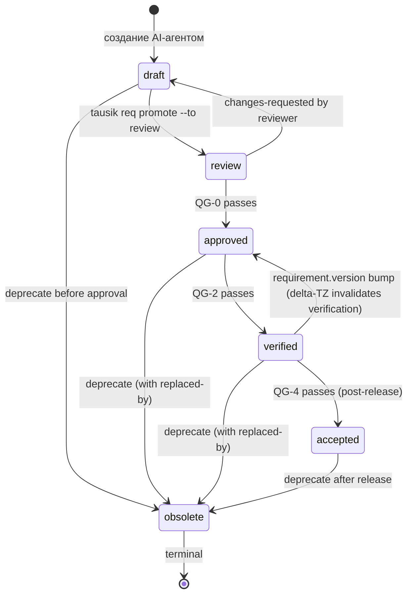

# Requirement Lifecycle (state machines)

> Версия: черновик 0.1 (для обсуждения) | Дата: 2026-05-03
> Назначение: формальная state machine для жизненного цикла требований и тест-кейсов. Pre/post-conditions для каждого перехода. Закрывает gap из [00-architecture-vision.md §A](00-architecture-vision.md).
>
> Финальная нормативная форма — после проверки переходов на реальном проекте.

---

## 1. Не дублирует SENAR

SENAR §8 описывает Quality Gates (QG-0..QG-4) как абстрактную концепцию. SENAR не нормирует **state machine** в формальном смысле — состояния, переходы, предусловия.

REQ specifies state machines for **requirement** и **test_case** entities. Используем UML state machine notation для строгости.

---

## 2. Requirement state machine

### 2.1 Diagram



### 2.2 Состояния — определения

| Состояние | Семантика | Что должно быть истинно |
|---|---|---|
| `draft` | AI создал, не отревьюено | Frontmatter валиден по schema; `ai-provenance` заполнен |
| `review` | Pre-approval, ждёт adversarial и архитектора | `draft` + adversarial-review запущен |
| `approved` | Утверждено для разработки/декомпозиции | QG-0 condition met; one-click approval сделан |
| `verified` | Реализовано и подтверждено тестами | QG-2 condition met; все TC из verified-by passing |
| `accepted` | Принято клиентом после релиза | QG-4 condition met; outcome metric достигнут |
| `obsolete` | Устарело (terminal) | `deprecated-date` + optional `replaced-by` указаны |

### 2.3 Переходы и предусловия

#### `[*] → draft`
- **Trigger**: AI-агент генерирует артефакт (например, через `/req-decompose`).
- **Pre-conditions**: 
  - frontmatter содержит обязательные поля per schema ([14-requirement-schema-draft.md](14-requirement-schema-draft.md))
  - `id` уникален в репо
  - source существует (TZ-NNN валиден)
  - `ai-provenance` заполнен
- **Post-conditions**: файл создан, в git committed.
- **Кто инициирует**: AI-агент (`tausik req decompose`).
- **Enforcement**: pre-commit hook валидирует schema.

#### `draft → review`
- **Trigger**: `tausik req promote --to review`.
- **Pre-conditions**:
  - `draft` всё ещё (status check).
  - Adversarial review запущен (артефакт `ai-concepts/critics/<artifact-id>-critic-<run-id>.json` существует).
  - Multi-model agreement если `priority: must` (`ai-concepts/critics/<artifact-id>-multi-model-<run-id>.json`).
  - Source citations validated (см. AIR-07 в [10](10-ai-risk-register.md)).
- **Post-conditions**: status: review, opens MR.
- **Кто инициирует**: AI-агент или архитектор.
- **Enforcement**: skill `req-promote` проверяет conditions.

#### `review → draft` (changes-requested)
- **Trigger**: reviewer отклоняет MR с комментариями.
- **Pre-conditions**: critic findings high severity ≥ 1, или explicit reviewer rejection.
- **Post-conditions**: MR closed; AI-агент извещён для regeneration.
- **Кто инициирует**: архитектор (через MR comment).

#### `review → approved` (QG-0)
- **Trigger**: one-click approval архитектора в MR.
- **QG-0 conditions**:
  - All assertions citations valid.
  - Adversarial: 0 high severity findings unresolved.
  - Multi-model: agreement ≥ threshold (для `priority: must`).
  - Children references existed (если есть).
  - All required TC generated с `verifies[].requirement-version = current`.
  - Pos/neg pair coverage = 100% для каждого утверждения.
  - All TC `automation.status: automated` ИЛИ `manual-pending` с дедлайном.
  - Threat Surface declared если `data-classification.contains-pii: true`.
- **Post-conditions**: status: approved; MR merged.
- **Кто инициирует**: архитектор.
- **Enforcement**: pre-merge hook + one-click approval UI.

#### `approved → verified` (QG-2)
- **Trigger**: `tausik req promote --to verified` после CI прогона.
- **QG-2 conditions**:
  - Все TC из `verified-by` имеют `last-run.result = pass`.
  - Все `last-run.requirement-version` совпадают с current `version` требования.
  - At least one TC с `negative: true` в verified-by.
  - Все TC в status `passing` (не `manual-pending`, не `failing`).
- **Post-conditions**: status: verified.
- **Кто инициирует**: AI-агент с одобрения архитектора (one-click).
- **Enforcement**: CI hook.

#### `verified → accepted` (QG-4)
- **Trigger**: `tausik req evaluate finalize`.
- **QG-4 conditions** (см. [12-solution-evaluation.md](12-solution-evaluation.md)):
  - `business-outcome.current-value` measured.
  - `achievement` ≥ acceptance threshold (default 80%, project-configurable).
  - Stakeholder formal sign-off.
- **Post-conditions**: status: accepted.
- **Кто инициирует**: stakeholder через формальную приёмку.

#### `verified → approved` (delta-TZ rebump)
- **Trigger**: дельта-ТЗ изменил требование (version++).
- **Pre-conditions**: 
  - Frontmatter `version` инкрементирован.
  - Затронутые TC обновлены (status: ready).
- **Post-conditions**: status: approved (нужно перепрогнать TC и QG-2 заново).
- **Кто инициирует**: AI-агент через `tausik req impact`.

#### `* → obsolete` (deprecate)
- **Trigger**: `tausik req deprecate <id> [--replaced-by <new-id>]`.
- **Pre-conditions**:
  - `replaced-by` (если указан) существует и имеет status ≥ approved.
  - Нет active linked tasks (TAUSIK задачи требующие этого SR должны быть либо closed, либо переадресованы на replacement).
- **Post-conditions**: status: obsolete; `deprecated-date` записан; `replaced-by` указан если есть.
- **Кто инициирует**: AI-агент с одобрения архитектора.
- **Enforcement**: blocks if linked tasks active.

### 2.4 Запрещённые переходы

| Из | В | Почему запрещено |
|---|---|---|
| `draft` | `verified` | Должен пройти review и approved |
| `draft` | `accepted` | Same |
| `obsolete` | `*` | Terminal state — нельзя «реанимировать»; нужно создать новый артефакт с supersedes |
| `verified` | `draft` | Понижение через несколько ступеней — потенциальная потеря trace |
| `accepted` | `verified` | Понижение требует delta-ТЗ |

---

## 3. Test Case state machine

### 3.1 Diagram

```mermaid
stateDiagram-v2
    [*] --> draft: AI генерирует TC
    
    draft --> ready: TC отревьюен; automation готова или manual-pending
    draft --> obsolete: deprecate before ready
    
    ready --> passing: CI run pass
    ready --> failing: CI run fail
    
    passing --> failing: subsequent run fails
    failing --> passing: fix code, re-run pass
    
    passing --> obsolete: requirement deprecated/replaced
    failing --> obsolete: requirement deprecated/replaced
    
    obsolete --> [*]: terminal
```

### 3.2 Состояния TC

| Состояние | Семантика |
|---|---|
| `draft` | AI создал, не отревьюено |
| `ready` | Готов к прогону, automation существует или явно manual-pending |
| `passing` | Last run = pass на текущей requirement-version |
| `failing` | Last run = fail на текущей requirement-version |
| `obsolete` | Требование, верифицируемое TC, deprecated/replaced |

### 3.3 Переходы

#### `draft → ready`
- **Trigger**: review completed.
- **Pre-conditions**:
  - `automation.status: automated` → `automation.location` существует и валиден.
  - `automation.status: manual-pending` → `manual-pending-until` ≤ +1 sprint, `manual-pending-reason` указан.
  - Pass / Fail criteria specified.
  - Citation на verified requirement.
- **Кто инициирует**: AI-агент → review → architect approval.

#### `ready → passing` или `ready → failing`
- **Trigger**: CI прогон.
- **Pre-conditions**: `automation.location` существует (если automated).
- **Post-conditions**: `last-run` заполнен ботом.
- **Кто инициирует**: CI bot.
- **Enforcement**: только бот может писать `last-run`.

#### `passing → failing` / `failing → passing`
- **Trigger**: subsequent CI runs.
- Только ботом, по факту.

#### `* → obsolete`
- **Trigger**: requirement, который TC verified, → obsolete.
- **Pre-conditions**: `verifies[].id` requirement в status `obsolete`.
- **Post-conditions**: status: obsolete; не удаляется.

### 3.4 Защита от подгонки тестов (test-fitting)

Особенный transition: change of Pass/Fail criteria.

```
TC.passing → (modify Pass criteria) → TC.passing'
```

Этот переход НЕ должен происходить «незаметно». Контракт:

- Любое изменение `## Критерий успеха` или `## Критерий неуспеха` в TC файле → MR требует tag `[test-spec-change]`.
- `[test-spec-change]` triggers separate approval workflow (cannot be approved одним же reviewer как соответствующий fix кода).
- Audit trail: все `[test-spec-change]` коммиты собираются в monthly report для архитектора.

См. [10-ai-risk-register.md AIR-06](10-ai-risk-register.md).

---

## 4. Workflow коммитов и тегов

### 4.1 Коммиты при transition

| Transition | Commit message format | Tags |
|---|---|---|
| `[*] → draft` | `[AI] feat(<type>): создан <id> <slug>` | — |
| `draft → review` | `[AI] chore(<id>): подготовка к review (adversarial passed)` | — |
| `review → approved` | `[Architect] approve(<id>): QG-0 passed` | (через MR merge) |
| `approved → verified` | `[CI bot] verify(<id>): QG-2 passed (TCs green)` | `[verify]` |
| `verified → accepted` | `[Stakeholder] accept(<id>): QG-4 passed (outcome met)` | `[accept]` |
| `* → obsolete` | `[AI] deprecate(<id>): replaced-by <new-id>` | `[deprecate]` |
| TC pass/fail | `[CI bot] last-run(<tc-id>): pass на v<X>` | `[ci-result]` |
| TC criteria change | `[AI] change-spec(<tc-id>): <description>` | `[test-spec-change]` |
| Coverage refresh | `[bot] coverage refresh` | `[coverage]` |
| Reconciliation MR | `[reconciliation-bot] findings: <count>` | `[reconciliation]` |
| Delta-TZ | `[Architect] feat: import <delta-tz>` | `[delta:TZ-YYYY-NNN]` |
| Baseline update (UX/eval) | `[AI] update baseline for <UIC-id>` | `[baseline-update]` |
| Multi-model disagreement | `[AI] BR with multi-model disagreement` | `[multi-model-disagreement]` |

### 4.2 Branch naming

| Тип изменения | Branch |
|---|---|
| Создание нового требования | `feat/<id>-<slug>` |
| Дельта-ТЗ | `change/TZ-YYYY-NNN-<slug>` |
| Fix без изменения spec | `fix/<id>-<slug>` |
| Deprecate | `deprecate/<id>` |
| TC изменение critic | `test-spec/<tc-id>-<reason>` |
| Coverage refresh | (бот, без отдельной ветки) |
| Reconciliation MR | `reconciliation/<date>` |

---

## 5. Hook enforcement points

| Хук | Когда | Что проверяет |
|---|---|---|
| `pre-commit` (.req) | Локальный commit | frontmatter schema, citations, immutable id |
| `pre-commit` (.src) | Локальный commit | upcoming SR/TC referenced exist в submodule |
| `pre-merge` (.req) | MR merge | All conditions `[*] → review` или `review → approved` |
| `pre-push` (.req) | Push | No direct push to main; tag enforcement (`[test-spec-change]` если меняли criteria) |
| `post-merge` (.req) | После merge | Trigger reconciliation; coverage regen if needed |
| `pre-merge` (.src) | MR merge | Submodule pointer matches expected; senar-req-id valid |
| `post-CI` | После CI прогона | Bot updates `last-run` в TC |
| `cron weekly` | По расписанию | Reconciliation findings MR |
| `pre-task-start` (TAUSIK) | `/task` | senar-req-id valid; SR existed in submodule |
| `pre-task-done` (TAUSIK) | `/task done` | All AC verified; QG-2 conditions met |

---

## 6. Configuration

`<project>.req/.req-config.yaml`:

```yaml
substrate: git                        # git | raven
schema-version: "1.0"
qg-thresholds:
  qg-0:
    multi-model-agreement-min: 0.85
    critic-high-findings-max: 0
    critic-medium-findings-max: 3
  qg-2:
    requires-negative-tc: true
  qg-4:
    achievement-min-percent: 80
hooks:
  pre-commit-validate-schema: true
  pre-merge-adversarial: true
  multi-model-required-priority: ["must"]
reconciliation:
  schedule: weekly                    # daily | weekly | monthly | on-merge
  checks:
    - schema
    - citations
    - orphans
    - lifecycle
    - graph-consistency
ai-budget:
  cost-cap-monthly-usd: 100
  alarm-on-overrun-percent: 80
```

---

## 7. State machine для других REQ-артефактов

Краткие notes (детальные — отдельные документы при необходимости):

### Work Order (ТЗ)

```
[*] → draft → signed → imported → closed
                            │
                            └─ или: superseded by delta
```

`signed` — подписан клиентом. `imported` — попал в `.req/tz/`. `closed` — релиз accepted.

### TZ-index

```
[*] → draft → published → archived
```

Pure auto-generated, lifecycle совпадает с парным TZ.

### COVERAGE.md / TEST-PLAN.md / REQUIREMENTS.md

Stateless — auto-regenerated при каждом релевантном merge или по расписанию. Нет lifecycle states.

### Risk Register entry

```
[*] → identified → active → mitigated → accepted/closed
                       │
                       └─ или: monitoring (long-term)
```

---

## 8. Logging переходов

Каждый transition логируется в `tool_event` (Raven) или `<project>.req/.tausik/events/transitions.jsonl` (git):

```json
{
  "timestamp": "2026-05-08T14:32:00Z",
  "artifact-id": "SR-01",
  "from-status": "approved",
  "to-status": "verified",
  "trigger": "qg-2-pass",
  "actor": "@architect",
  "evidence": {
    "tc-runs": ["TC-001:pass", "TC-002:pass", "TC-003:pass", "TC-004:pass"],
    "ci-pipeline": "https://gitlab.com/.../pipelines/12345"
  }
}
```

Полный audit trail для compliance аудита (см. [09-compliance-mapping.md](09-compliance-mapping.md)).

---

## 9. Open questions

- [ ] `verified → approved` (delta-TZ rebump): автоматический или explicit transition? Сейчас implicit (когда `version` инкрементируется). Может быть explicit лучше для audit trail?
- [ ] Multi-version TCs: можно ли иметь две версии TC параллельно (TC-001 v1.0 для SR-01 v1.0, TC-001 v1.1 для SR-01 v1.1)? Согласовано: НЕТ, TC обновляется до текущей requirement-version или становится obsolete.
- [ ] `accepted` это per-release или global? Per-release: BR-01 accepted в release v1.0, но добавление scope в release v2.0 переводит обратно в `verified`. Возможно нужен `release-id` поле.
- [ ] State machine extensions per-project? Пример: для regulated industries добавить `audit-passed` state перед accepted.
- [ ] Baseline updates (UX/eval): отдельный mini-state-machine?
- [ ] Reconciliation findings: state machine для них (open → resolved → dismissed → archive)?
