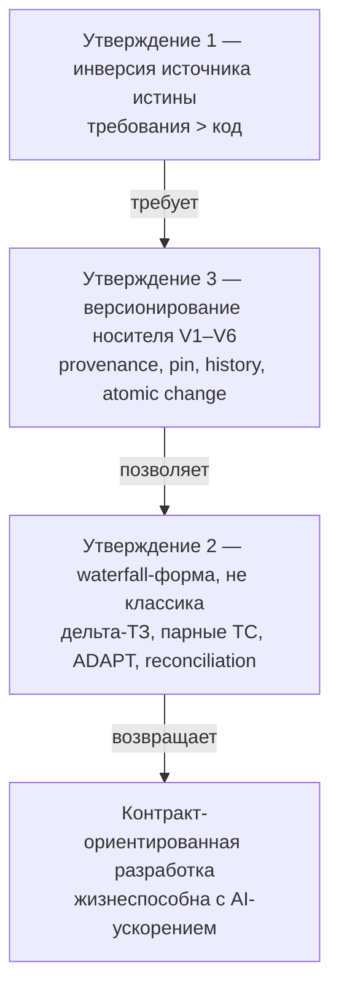

# 02. Положение в типологии методологий

> **Часть RENAR Standard v1.0-draft** · [← Оглавление](README.md)

## 2.1 Три утверждения, на которых всё держится

Прежде чем описывать артефакты и процессы, RENAR проговаривает три идеи, на которых стоит всё остальное: **источник истины — требования, а не код**; **форма процесса слоистая, но это не классический waterfall**; **версионирование — обязательное свойство носителя, а не привязка к инструменту**. Звучит как общие слова — но убери любую, и остальные главы рассыпаются. Иерархия требований ([глава 6](06-requirements-hierarchy.md)) теряет смысл источника истины, [ADAPT](07-adapt.md) — роль моста между договорным и инженерным контурами, [спецификации](08-specifications.md) — параллельную ось, [тест-кейсы](09-test-cases.md) — привязку к версии требования, [жизненный цикл](10-lifecycle-qg.md) — атомарность переходов, [версионирование носителя](03-substrate-versioning.md) — нормативную опору.

Поэтому эта глава — фундамент; §2.3–§2.5 стоит читать подряд. Все три утверждения — **нормативные положения**: каждое является обязательным положением для любого заявления о соответствии RENAR ([глава 13](13-conformance.md)).

## 2.2 Три фундаментальных утверждения

1. **Инверсия источника истины (Source of Truth inversion).** Источник истины о поведении системы — иерархия артефактов требований. Код — производный артефакт реализации. Это и есть разработка от спецификации (Spec-Driven Development, SDD).
2. **Waterfall-форма ≠ классический waterfall.** Процесс RENAR имеет последовательную слоистую форму с гейтами. Стандарт явно отстраивается от четырёх смертельных грехов классического waterfall.
3. **Независимое от носителя версионирование.** Версионирование — обязательное свойство носителя, реализующего RENAR. Конкретный инструмент версионирования взаимозаменяем. Шесть возможностей (V1–V6) нормируют требования к носителю; детали — в [главе 3](03-substrate-versioning.md).

Три утверждения логически связаны (см. §2.6).

---

## 2.3 Утверждение 1 — Источник истины о поведении: требования, не код (Source of Truth)

### 2.3.1 Нормативная формулировка

**Источник истины о поведении системы — иерархия артефактов требований: ТЗ → [ADAPT](07-adapt.md) → BR / SR / [SPEC](08-specifications.md) → TR → [TC](09-test-cases.md). Код — производный артефакт реализации этой иерархии. При расхождении между кодом и вышестоящим требованием — нормативно побеждает требование.**

### 2.3.2 Распределение ролей

| Уровень | Кто источник истины | Кто производный |
|---|---|---|
| ТЗ | Договор с клиентом | — |
| [ADAPT](07-adapt.md) | Двусторонняя интерпретация ТЗ | производный от ТЗ |
| [BR / SR / SPEC](06-requirements-hierarchy.md) | Инженерный стандарт системы | производный от ADAPT |
| [TC](09-test-cases.md) | Контракт верифицируемого поведения | производный от SR / SPEC |
| TR (задача) | Акт выдачи работы исполнителю | производный от SR + SPEC |
| Код | Реализация | производный от всего вышестоящего |

### 2.3.3 Контракт (обязательные следствия)

Стандарт требует следующего поведения от любой реализации, заявляющей соответствие RENAR:

1. **Запрет обратного восстановления поведения из кода в SR (reverse-engineering).** AI-агент или человек, создающий новый SR или дополнение существующего SR, использует в качестве источника ADAPT и существующие SR — но не наблюдаемое поведение реализации. Обратное восстановление допустимо только при создании bug-fix задачи (см. §2.3.4).
2. **Разделение ревью кода и ревью спецификации.** Ревью кода проверяет соответствие изменения коду. Ревью спецификации проверяет соответствие тестов и реализации требованиям. Это два разных гейта с разными артефактами и разными ревьюерами по умолчанию.
3. **Детектирование дрейфа как hook носителя.** При обнаружении в коде ссылки на SR/SPEC, отсутствующий в носителе требований, атомарная единица изменения в реализационном носителе блокируется (см. [глава 10 §10.5](10-lifecycle-qg.md), [глава 3 §3.5](03-substrate-versioning.md)).
4. **Запрет молчаливой адаптации SR под код.** Если реализация делает X, а SR требует Y, ровно одно из двух истинно: (a) реализация ошибочна — создаётся bug-fix задача с целью привести код к SR; (b) SR ошибочен — создаётся [delta-ADAPT](07-adapt.md#7.6) с обоснованием и подписями для изменения SR. Третий вариант («просто обновим SR под код») запрещён.

### 2.3.4 Положение в индустриальной типологии

Утверждение 1 является конкретной реализацией парадигмы **Spec-Driven Development (SDD)** — индустриального термина, появившегося в 2024–2025 как ответ на ускорение разработки с AI-агентами. SDD признаёт, что когда AI-агенты способны декомпозировать формальные спецификации в код за минуты, **корректность спецификации** становится критическим ограничением, а не корректность кода.

| Стандарт / методология или фреймворк | Соответствующее положение | Связь с RENAR §2.3 |
|---|---|---|
| ISO/IEC/IEEE 29148:2018 §6.4.5 | Requirements management mandates traceability from requirements to implementation | RENAR §2.3 — конкретная реализация этого мандата |
| BABOK Guide v3 §6.5 | Verify requirements before they drive solution work | RENAR §2.3 нормирует верификацию как два разных гейта (code/spec) |
| ISO/IEC 5338:2023 | Жизненный цикл ИИ-систем — требования управляют генерацией артефактов AI | RENAR §2.3 вместе с [reference/04 AI Style Guide](../reference/04-ai-style-guide.md) и состязательный обзор ([guide/07 §4.5](../guide/07-failure-modes.md#35-adversarial-review-процедура)) поддерживают этот мандат |
| Spec-Driven Development (industry, 2024-2025) | GitHub Spec Kit, Anthropic spec-first agents, Amazon Kiro, Tessl, BMAD-Method | RENAR — формальный стандарт в этой парадигме |

**Что здесь ново для RENAR.** Сама инверсия источника истины — определение парадигмы SDD, а не изобретение RENAR. Вклад RENAR — её **обеспечение соблюдения**: четыре контрактных следствия §2.3.3 (запрет обратного восстановления в SR, разделение ревью кода и спецификации, drift-hook, запрет молчаливой адаптации SR под код), переводящие парадигму из принципа в проверяемые нормативные требования.

### 2.3.5 Дифференциация от SDD-инструментов

Industry SDD-инструменты и RENAR — в одной парадигме, но в разных слоях:

| Ось | Industry SDD-инструменты (Spec Kit, Kiro, Tessl, BMAD) | RENAR |
|---|---|---|
| Природа | Эталонная реализация плюс готовый инструментарий с заданным процессом | Формальный нормативный стандарт (capabilities, жизненный цикл, инварианты) |
| Носитель | привязан к конкретному инструменту / платформе | независим от носителя (V1–V6); VCS / document-oriented store / иной — взаимозаменяемы |
| Договорный контур | Обычно отсутствует | ADAPT: двусторонняя адаптация ТЗ + двойная подпись ([§7](07-adapt.md)) |
| Соответствие | Не определён | Заявление о соответствии через манифест + обязательные положения ([§13](13-conformance.md)) |
| Верификация | Тесты как практика | pos/neg-парность + judge ≠ production как блокирующие гейты ([§9](09-test-cases.md)) |

RENAR не конкурирует с этими инструментами: industry SDD-инструмент может быть **нативной для носителя реализацией RENAR** без потери переносимости заявления о соответствии ([§14.5.2](14-normative-refs.md#14.5.2)).

---

## 2.4 Утверждение 2 — Waterfall-форма, не классический waterfall

### 2.4.1 Нормативная формулировка

**Процесс RENAR имеет последовательную слоистую форму: ТЗ → ADAPT → BR/SR/SPEC → TR → реализация → TC-прогон → accepted. Это waterfall-образная форма. Стандарт явно отстраивается от четырёх смертельных грехов классического waterfall и не должен интерпретироваться как классический waterfall в смысле Royce 1970.**

Это утверждение — **позиционное разъяснение** (снятие ложной аналогии с classical waterfall), а не заявление о новизне: после четырёх отстроек §2.4.2 форма совпадает с V-model и ATDD. Новизна RENAR — в ADAPT, V1–V6 и переводе практик в нормативные положения. Утверждение остаётся обязательным положением (§2.7) — без него ревьюер натягивает на RENAR неподходящий шаблон.

### 2.4.2 Четыре отстройки от классического waterfall

| Классический waterfall (Royce 1970, индустриальная практика 1970–1990) | RENAR |
|---|---|
| Один большой проход «требования → дизайн → код → тесты» за квартал или год | **Дельта-ТЗ workflow**: каждое изменение — мини-цикл за дни или часы. Та же форма повторяется сотни раз с AI-ускорением. См. [глава 7 §7.6 (delta-ADAPT)](07-adapt.md#7.6) |
| Тесты в конце цикла, после реализации | **TC — полноценный артефакт верификации** ([глава 9](09-test-cases.md)). Парные pos/neg TC создаются вместе с SR/SPEC, не после кода. Это ближе к V-model и ATDD, чем к waterfall |
| Одностороннее «throw spec over the wall» | **[ADAPT](07-adapt.md) — двусторонний документ** по построению. Forward (инженерная интерпретация) + backward (вопросы клиенту). Запрет на одностороннюю передачу |
| Спека написана один раз, потом неприкосновенна; реальность дрейфует | **Непрерывная сверка** (continuous reconciliation) через hooks носителя. Дрейф code ↔ spec детектируется автоматически и попадает в delta-ADAPT. Спека живая |

### 2.4.3 Применимость

RENAR применим в следующих контекстах:

- Контракт-ориентированная разработка (наличие договора с клиентом, подписанного ТЗ).
- Регулируемые отрасли: соответствие нормам, медицина, финтех, госсектор, обработка PII.
- Корпоративный консалтинг (третья сторона делает продукт по чужому ТЗ).
- Проекты с высокой стоимостью изменений требований поздно в цикле.
- Проекты, требующие журнала аудита для ревизий соответствия ([глава 13](13-conformance.md)).

RENAR **не применим** в следующих контекстах:

- Чистый продуктовый дискавери без договорного контекста (lean startup, продукт-MVP «сначала строим, потом понимаем что строим»).
- Чистое R&D без определённых требований.
- Прототипирование с жизненным циклом меньше срока написания ADAPT.

Применимость документируется как часть процедуры соответствия ([глава 13](13-conformance.md)).

### 2.4.4 Положение в индустриальной типологии

| Методология | Связь с RENAR |
|---|---|
| Classical Waterfall (Royce 1970) | RENAR отстраивается по 4 пунктам §2.4.2 |
| V-model | RENAR ближе к V-model: парные TC, тесты в начале каждого слоя |
| Scrum / Kanban | Не противоречит, но RENAR — другая ось (артефактная, не процессная). Scrum sprint может содержать RENAR delta-ADAPT cycle |
| SAFe Solution Intent | ADAPT — конкретная реализация Solution Intent для контракт-ориентированной разработки. См. [guide/05-safe-comparison.md](../guide/05-safe-comparison.md) |
| BABOK Requirements Analysis | RENAR §2.3+§2.4 — формальная реализация BABOK §3+§6 для контекста разработки с AI-агентами |

---

## 2.5 Утверждение 3 — Независимое от носителя версионирование

### 2.5.1 Нормативная формулировка

**Версионирование — обязательное свойство носителя, реализующего RENAR. Стандарт нормирует шесть возможностей (V1–V6), которые носитель обязан обеспечить. Конкретный инструмент версионирования взаимозаменяем: носитель, удовлетворяющий V1–V6, реализует RENAR независимо от того, является ли он распределённым VCS, централизованным VCS, документ-ориентированной СУБД с разрешением конфликтов или иным механизмом.**

### 2.5.2 Шесть обязательных возможностей (обзорно)

Полная нормативная формулировка V1–V6 — в [главе 3](03-substrate-versioning.md). На уровне положения в типологии:

| # | Возможность | Что обеспечивает |
|---|---|---|
| V1 | Неизменяемая история | Любое прошлое состояние артефакта восстановимо |
| V2 | Атомарная единица изменения | «Изменение» — одна транзакция; всё или ничего |
| V3 | Сравнение различий и рецензирование | Человек видит изменение и утверждает или отклоняет до интеграции |
| V4 | Ветвление / набор изменений | Черновики отделимы от утверждённой истины |
| V5 | Сквозная фиксация версии | Реализационный носитель фиксирует версию носителя требований |
| V6 | Автор и отметка времени | Каждое изменение имеет автора и время |

### 2.5.3 Носитель, не удовлетворяющий V1–V6, не реализует RENAR

Невозможность реализации RENAR на носителе без V1–V6 — структурная, не операционная: утверждение 1 (инверсия источника истины) физически не работает без версионирования, потому что:

- Невозможно сказать «реализация собрана против требований по состоянию на дату X» — пропадает происхождение (нарушение V1, V6).
- Невозможно построить [delta-ADAPT](07-adapt.md#7.6) — нет базовой версии для отсчёта дельты (нарушение V1).
- Невозможно верифицировать [TC](09-test-cases.md) — поле `verifies[].requirement-version` теряет смысл без стабильного идентификатора версии (нарушение V5).
- Невозможен переход требования `verified → accepted` — гейту не на что опереться (нарушение V1, V5).
- Невозможен журнал аудита «что мы сдавали клиенту по контракту 2025-Q3» (нарушение V1, V6).

Поэтому носитель без V1–V6 (плоский файловый сервер с переименованием файлов как механизмом версии; document store без разрешения конфликтов; иные системы без неизменяемой истории) **не реализует RENAR** независимо от других свойств.

### 2.5.4 Независимый от носителя нормативный язык

Нормативные параграфы RENAR используют независимый от носителя язык: «атомарная единица изменения», «фиксация версии», «автор и отметка времени», «сравнение различий и рецензирование» — а не названия конкретных примитивов инструментов. Это обеспечивает применимость стандарта к любому будущему носителю, удовлетворяющему V1–V6. Специфичные для носителя детали — в [Глава 3 §3.4](03-substrate-versioning.md) (нормативная таблица отображения V1–V6 × носителей), [guide/03-tool-guide-git.md](../guide/03-tool-guide-git.md) (distributed VCS), [guide/04-document-store-substrate.md](../guide/04-document-store-substrate.md) (document-oriented store).

### 2.5.5 Положение в индустриальной типологии

| Стандарт | Соответствующее положение | Нейтральность к носителю |
|---|---|---|
| ISO/IEC/IEEE 29148:2018 §6.4.5 | Configuration management of requirements | нейтрален к носителю; нормирует возможности, не инструменты |
| BABOK Guide v3 §5.3 | Maintain requirements (для прослеживаемости) | нейтрален к носителю |
| CMMI-DEV CM SG2 | Track and Control Changes | нейтрален к носителю |
| SAFe Solution Intent | Versioned artifact | Не нормирует носитель |
| ISO/IEC 5338:2023 | Происхождение артефактов ИИ (AI artifact provenance) | нейтрален к носителю; происхождение — возможность |

RENAR следует той же нейтральности и явно фиксирует V1–V6 как контракт, что эти стандарты оставляли неявным.

---

## 2.6 Логическая связь трёх утверждений

Три утверждения связаны направленно:

**Без утверждения 1**: источник истины диффузен, спека дрейфует, аудит невозможен.
**Без утверждения 3**: утверждение 1 декларативно, физически не работает.
**Без явного утверждения 2**: ревьюер натягивает на RENAR неподходящие шаблоны (agile sprint без waterfall-form, или classical waterfall без 4 отстроек) и отвергает стандарт по неверной аналогии.

Все три утверждения являются обязательными положениями ([глава 13](13-conformance.md)). На уровне v1 заявление о соответствии RENAR требует принятия всех трёх утверждений; без любого из них оно несостоятельно.

---

## 2.7 Следствия для процедуры соответствия

Утверждения §2.3, §2.4, §2.5 — **обязательные положения** для любого заявления о соответствии уровням RENAR (RENAR-1..RENAR-5; см. [гл.11](11-maturity-model.md), [гл.13](13-conformance.md)). Команда не может заявить «реализуем RENAR-1 без инверсии источника истины» (противоречие в терминах) или «реализуем RENAR на носителе без V1–V6» (носитель не соответствует стандарту); может выбрать **не заявлять** соответствие RENAR в контексте неприменимости (§2.4.3) — это нормативно допустимо. Конкретный чек-лист самооценки — [гл.13](13-conformance.md).

---

## 2.8 Связь с другими главами стандарта

| Глава | Связь |
|---|---|
| [06 Требования](06-requirements-hierarchy.md) | Иерархия BR/SR/TR — конкретизация цепь источника истины из §2.3.2 |
| [07 ADAPT](07-adapt.md) | Двусторонняя адаптация — конкретизация утверждения 2 (отстройка от «переброса спецификации через забор») |
| [08 Specifications](08-specifications.md) | SPEC-* как параллельная ось — следствие инверсия источника истины для структурного описания |
| [09 Test cases](09-test-cases.md) | TC как полноценный артефакт верификации — конкретизация утверждения 2 (отстройка от «тесты в конце») |
| [10 Жизненный цикл и QG](10-lifecycle-qg.md) | Гейты обеспечивают соблюдение утверждения 1 (drift hooks) и утверждения 2 (continuous reconciliation) |
| [03 Версионирование носителя](03-substrate-versioning.md) | Детальная нормативка V1–V6 (§2.5 — обзорно) |
| [11 Maturity](11-maturity-model.md) | Уровни RENAR-1..RENAR-5 расширяют утверждения дополнительными требованиями |
| [13 Соответствие](13-conformance.md) | Самооценка по трём обязательным положениям |

