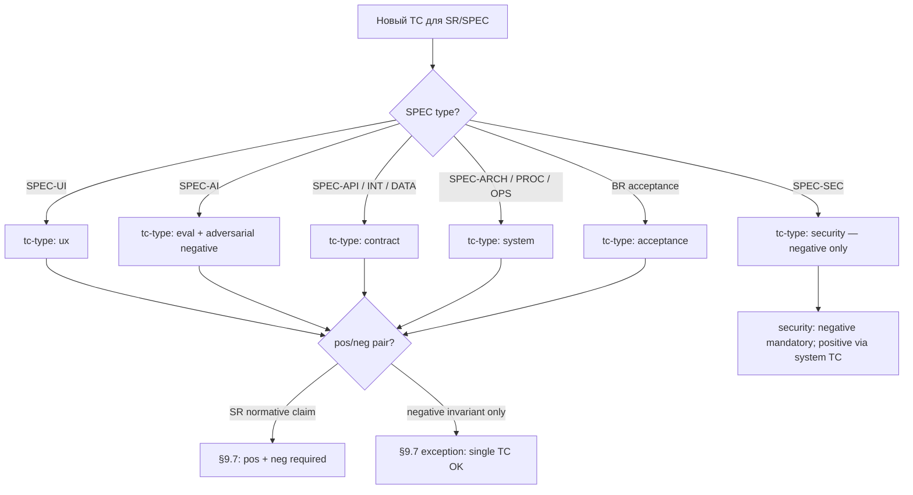

# 09. Тест-кейсы

> **Часть RENAR Standard v1.0-draft** · [← Оглавление](README.md)

## 9.1 Тест-кейс — полноценный артефакт

Тест в RENAR — не приписка в конце кода, а полноценный документ: у него своя версия, статус и место в цепочке прослеживаемости, как у требования, которое он проверяет. Причина проста: тесты пишет AI-агент, а AI охотно покрывает «счастливый путь» («ввели верный пароль — пустило») и тихо обходит неприятное («ввели чужой — не должно пустить, не должно подсказать, какое поле неверно, не должно записать пароль в лог»). Именно в необработанных негативных случаях и живут дефекты.

Поэтому RENAR делает нормативными два требования. **Парность pos/neg**: на каждое проверяемое утверждение — минимум один позитивный тест-кейс и один негативный (что должно произойти и что произойти не должно). **Изоляция судьи**: если результат оценивает другая AI-модель (для типов `ux`, `eval`), она обязана отличаться от той, что породила оцениваемое, — модель не проверяет сама себя. TC ([Test Case](04-terms.md#451-tc--test-case)) замыкает цепочку прослеживаемости ТЗ → [ADAPT](07-adapt.md) → BR / SR / [SPEC](08-specifications.md) → TR → TC (см. [§2.3](02-methodology-positioning.md#2.3)): от провала теста можно дойти до раздела ТЗ, который он в конечном счёте проверяет.

Глава опирается на ISO/IEC/IEEE 29119 «Software testing» в части концепций test design, test execution, test result reporting и pos/neg coverage, но фиксирует закрытый список типов TC, обязательную pos/neg-парность и judge ≠ production isolation как нормативные требования v1.0, не присутствующие в ISO 29119 в формализованном виде.

От практик Specification by Example (Adzic) и BDD / Gherkin — где исполняемые примеры также служат спецификацией — RENAR отличается тем, что переводит pos/neg-парность ([§9.7](#9.7)), judge ≠ production isolation ([§9.13](#9.13)) и version-pin TC к версии требования (V5, [§3.3.5](03-substrate-versioning.md#3.3.5)) из рекомендации в блокирующие нормативные положения ([§14.5.2](14-normative-refs.md#14.5.2)).

Положения главы являются нормативными. Закрытые списки (принципы, типы TC, обязательные виды TC по типу SPEC) — обязательные положения соответствия RENAR ([глава 13](13-conformance.md)); расширение — только через формальную процедуру изменения стандарта.

> **Плотная глава:** [reference/09](../reference/09-pedagogical-density.md) · decision tree ниже — informative routing.

### 9.1.1 Дерево решений: выбор `tc-type` (informative)



Процедура состязательного обзора TC — [guide/07 §4.5](../guide/07-failure-modes.md#35-adversarial-review-процедура); панель агентов (informative) — там же §4.5.

---

## 9.2 Закрытый список нормативных принципов TC

| # | Принцип | Нормативная формулировка |
|---|---|---|
| P1 | Полноценный артефакт (TC) | TC — самостоятельный артефакт стандарта, по жизненному циклу и версионированию равный требованию. Хранится отдельным файлом в подпапке `tests/` носителя требований ([§9.17](#9.17)). |
| P2 | Документ ≠ реализация | TC описывает **что и как проверяется** (отвязан от реализации). Реализация (код) адресуется полем `automation.location` и хранится в носителе кода. Один TC — одна реализация. |
| P3 | AI-generated | TC создаются и редактируются AI-агентом по заданию инженера; инженер не пишет TC вручную (см. [глава 11 §11.N](11-maturity-model.md)). |
| P4 | AI-executed | Все TC в статусе `ready` и выше — автоматизированы. Прогон выполняет автоматический runner (CI / AI-runner / specialized executor). Результаты в `last-run` записывает только runner (bot-managed участник) по факту прогона. |
| P5 | Pos/neg pairing | На каждое утверждение требования (BR / SR / SPEC) создаётся минимум одна пара positive + negative TC ([§9.7](#9.7)). |
| P6 | `last-run` — bot-managed | Поле `last-run` (date / result / runner-id / requirement-version / judge-report) заполняет только автоматический runner. Ручное редактирование `last-run` любым участником запрещено стандартом ([§9.12](#9.12)). |
| P7 | Judge ≠ production isolation | Для типов TC, использующих LLM-as-judge (ux, eval), judge-модель **не должна совпадать** с production-моделью, генерирующей оцениваемый артефакт. Совпадение блокирует hook носителя ([§9.6.2](#9.6.2)). |

Список закрыт. Новые принципы добавляются только через формальную процедуру изменения стандарта ([глава 13](13-conformance.md)).

---

## 9.3 Общая схема TC (frontmatter)

Все типы TC делят общий набор frontmatter-полей. Type-specific поля добавляются как extensions поверх (§9.6). Полная machine-readable схема — в [reference/02-schemas.md](../reference/02-schemas.md).

```yaml
---
# === Identity (mandatory) ===
id: TC-NN                            # immutable; NN sequential в рамках scope
title: "<short, descriptive>"
type: TC
slug: "<kebab-case>"                 # auto-derived

# === Classification (mandatory) ===
tc-type: acceptance | ux | system | contract | eval | security
negative: boolean                    # true для парного негативного TC

# === Scope (mandatory) ===
level: system | subsystem | module
scope:
  system: "<system-id>"
  subsystem: "<subsystem-id>"        # null если level=system
  module: "<module-id>"              # null если level ≠ module

# === Lifecycle (mandatory) ===
status: draft | ready | passing | failing | obsolete

# === Verification target (mandatory; хотя бы один из) ===
verifies:
  - id: SR-NN | BR-NN | SPEC-<TYPE>-NN
    requirement-version: "<нативный для носителя version-ref>"   # V5 pinning (см. глава 3)
  - id: ...

# === Pair link (mandatory если negative=false и существует парный) ===
paired-with:                         # ID парного TC (positive ↔ negative)
  - TC-NN

# === Automation (mandatory) ===
automation:
  status: automated | manual-pending
  location: "<нативный для носителя pointer to implementation>"  # mandatory если automated
  manual-pending-until: "<ISO date>"                        # mandatory если manual-pending
  manual-pending-reason: "<text>"                            # mandatory если manual-pending

# === Execution (mandatory если type=ux | eval) ===
judge:
  vendor: "<provider>"               # mandatory; см. P7 isolation
  model: "<model-id>"
  prompt-template: "<template-path>@<version>"

baseline:                            # mandatory для ux | eval
  artifact: "<нативный для носителя pointer>"
  perceptual-diff-threshold: float   # для ux
  metric-thresholds: {}              # для eval

# === Last run (auto-managed; bot-only) ===
last-run:
  date: "<ISO-datetime>"
  result: pass | fail | skipped | n/a
  runner-id: "<runner-name@version>"
  run-ref: "<нативная для носителя ссылка>"
  requirement-version: "<version-ref of verified artifact>"
  judge-report: "<inline or pointer>"

# === AI provenance (обязательно на RENAR-4+; canonical schema — §4.10.1) ===
ai-provenance:
  generated-by: "<vendor>-<model>@<date>"
  generated-at: "<ISO-8601>"
  prompt-template: "<template-path>@<version>"
  context-tokens: integer
  output-tokens: integer
  human-edits: boolean
  # optional на RENAR-4, обязательно на RENAR-5 (см. §4.10.1):
  # cost-budget, cost-actual, generation-time-ms

# === Замена / obsolescence ===
obsolete-pending: boolean            # true при detected delta-ТЗ инвалидации
replaces: "<old-id>"
replaced-by: "<new-id>"
obsoleted-date: "<ISO date>"
---
```

`verifies[]` — закрытый список ссылок на верифицируемые артефакты (BR / SR / SPEC). TR прямо не указывается в `verifies` — TR верифицируется через свой родительский SR (см. [§6.7](06-requirements-hierarchy.md#6.7)). `verifies[].requirement-version` — нативный для носителя pinning артефакта (V5 capability, см. [глава 3 §3.3.5](03-substrate-versioning.md#3.3.5)); QG-2 ([§9.10](#9.10)) требует совпадения `verifies[].requirement-version` с текущей версией артефакта.

---

## 9.4 Body разделы TC

Тело любого TC обязательно содержит следующие разделы (независимо от носителя):

| Раздел | Обязательность | Содержание |
|---|---|---|
| Контекст | обязательно | На какой пункт верифицируемого артефакта ссылается TC; цитата или пересказ утверждения. |
| Предусловия | обязательно | Состояние системы и данных, требуемое для прогона; обеспечивается seed-механизмом. |
| Шаги | обязательно | Действия runner; для `tc-type: ux` — намерения, не селекторы (см. [§9.6.1](#9.6.1)). |
| Pass-критерий | обязательно | Бинарный, наблюдаемый, воспроизводимый (см. [§9.11](#9.11)). |
| Fail-критерий | обязательно | Перечень наблюдаемых признаков нарушения (не отрицание Pass); включает утечки, side-effects, race conditions. |
| Постусловия | обязательно | Какое состояние ожидается после прогона; cleanup-механизм. |
| Out of scope | обязательно | Что **намеренно** не проверяется, с указанием парного TC, где это покрыто. |
| Связанные TC | optional | Ссылки на семантически связанные TC. |

Раздел «Out of scope» — нормативно обязательный: защищает от ложного ощущения покрытия. Отсутствие раздела блокирует переход TC в `ready`.

Имена секций тела — machine-detectable заголовки уровня `##`. Канонические идентификаторы секций критериев — `## Pass-критерий` и `## Fail-критерий`; именно их детектирует хук контроля change-of-criteria ([§10.11.3](10-lifecycle-qg.md#10.11.3)), поэтому имена этих секций фиксированы и не подлежат локальной замене.

---

## 9.5 Закрытый список типов TC

```text
tc-type ∈ { acceptance, ux, system, contract, eval, security }
```

| Тип | Что проверяет | Применяется к | runner-семейство |
|---|---|---|---|
| `acceptance` | Достигнута ли бизнес-цель? | BR | E2E + AI-валидатор |
| `ux` | Соответствует ли UX заявленному опыту? | SPEC-UI | AI-driver + VLM-judge |
| `system` | Ведёт ли система себя как описано? | SR, SPEC-PROC, SPEC-ARCH | xUnit-семейство |
| `contract` | Соблюдён ли контракт? | SPEC-API, SPEC-INT, SPEC-DATA | Contract-testing framework |
| `eval` | Достигнуто ли качество AI-компонент? | SPEC-AI | Eval-runner с эталонным набором данных |
| `security` | Соблюдены ли security-инварианты? | SPEC-SEC | Authz/threat-test framework |

Список закрыт. Новые типы добавляются только через формальную процедуру изменения стандарта ([глава 13](13-conformance.md)). Конкретные технологии runner специфичны для носителя и фиксируются в манифесте соответствия реализации.

---

## 9.6 Type-specific extensions

### 9.6.1 `tc-type: ux` — UX тесты на основе SPEC-UI

UX-тест нормативно построен как двухслойная структура:

| Слой | Содержание | Исполнитель |
|---|---|---|
| Сценарий (намерение) | «<участник> хочет <результат> после <условие>» | AI-driver: переводит намерение в действия, находит элементы по семантике (без жёстких селекторов) |
| Перцептивная проверка | «На отрисованном состоянии видно <критерий>» | Perceptual judge (VLM): принимает рендер + критерий, возвращает pass/fail с обоснованием |

**Обязательное расширение frontmatter:** `judge.vendor`, `judge.model`, `baseline.artifact`, `baseline.perceptual-diff-threshold`.

**Обязательные секции тела дополнительно к §9.4:** Сценарий (намерение, не селекторы); Перцептивный критерий (что должен увидеть judge); Парный негативный (пустое состояние / ошибка / отсутствие прав).

**Регрессия по визуалу.** Дополнительно к VLM-judge — perceptual diff против `baseline.artifact` с порогом `perceptual-diff-threshold`. Превышение порога блокирует переход TC в `passing`.

**Обновление эталона.** Изменение `baseline.artifact` требует нативного для носителя approval-механизма с тегом `[baseline-update]` (см. [§9.13](#9.13)); автоматическое обновление запрещено.

### 9.6.2 `tc-type: eval` — Eval-тесты на основе SPEC-AI

Eval-тест нормативно проверяет качество AI-компонент через dataset с метриками и порогами.

**Обязательное расширение frontmatter:** `judge.vendor`, `judge.model`, `baseline.artifact` (versionable dataset), `baseline.metric-thresholds`.

**Обязательные секции тела:** происхождение dataset (как собран, какая разметка); метрика-кластер (одна eval-TC = одна семантически связная группа метрик; разные семейства — разные TC); regression rule (что считается провалом — выход за threshold или регрессия ≥ N% против эталона).

**Judge ≠ production isolation (нормативно).** Поле `judge.vendor` + `judge.model` обязано отличаться от `production-model` спецификации SPEC-AI, нормирующей оцениваемое поведение. Нативный для носителя hook ([глава 3 §3.3.3](03-substrate-versioning.md#3.3.3)) обязан блокировать merge change unit при совпадении.

**Версионирование dataset.** Eval-dataset — управляемый носителем versionable artifact: каждое изменение фиксируется как atomic change unit с описанием (что добавлено / убрано / переразмечено) и авторством (генератор-агент / критик-агент / human выборочная проверка).

**Cost gating.** Eval не запускается на каждое изменение реализации (cost): runner запускается при изменении SPEC-AI, production-model, или dataset, либо по расписанию. Триггеры фиксируются в нативной для носителя runner-configuration.

**Двухступенчатая разметка dataset.** Generator-agent создаёт кандидатов; critic-agent проверяет по чек-листу; инженер делает выборочную проверку ≥ 10% случайных примеров до merge dataset.

### 9.6.3 `tc-type: contract` — Контрактные тесты на основе SPEC-API / SPEC-INT / SPEC-DATA

**Обязательные секции тела:** machine-readable контракт (ссылка на OpenAPI / GraphQL SDL / Protobuf / JSON Schema из SPEC); сторона генератор / сторона потребитель; мок counterparty (для SPEC-INT — sandbox / реальная среда отдельным TC).

**Обязательное расширение для SPEC-INT.** Контрактные TC обязательно сочетаются с интеграционным TC (`tc-type: contract`, `level: subsystem | system`) против реальной или sandbox-counterparty — мокированного контракта недостаточно для верификации SPEC-INT.

### 9.6.4 `tc-type: security` — Security-тесты на основе SPEC-SEC

**Обязательные секции тела:** атрибуты модели угроз (STRIDE-категория или эквивалент); subject под тестом (authn / authz / data classification / secrets / audit / encryption); negative scenarios (попытка обхода, неавторизованный доступ, leakage); ожидаемое поведение системы при нарушении.

Security-TC нормативно содержит **только negative scenarios** (попытка обхода защиты). Positive «дать корректный доступ корректному участнику» покрывается `tc-type: system` с областью охвата SPEC-SEC.

---

## 9.7 Pos/neg pairing — нормативное требование

**На каждое утверждение требования (BR / SR / SPEC), описывающее наблюдаемое поведение, создаётся минимум одна пара positive + negative TC.**

| Положительный TC | Парный отрицательный TC |
|---|---|
| `negative: false` | `negative: true` |
| Описывает happy path / success behavior | Описывает граничные условия, нарушения, обходы |
| `paired-with: [TC-<neg-id>]` | `paired-with: [TC-<pos-id>]` |

Negative TC нормативно описывает наблюдаемые признаки нарушения (что **не должно** произойти), а не отрицание Pass-критерия позитивного TC. Примеры:

| Утверждение | Pos TC | Neg TC |
|---|---|---|
| «Аутентификация по email + password» | Корректные credentials → 200 + JWT | Неверный пароль → 401 без раскрытия, какое поле неверно; отсутствие записи в session-store; rate-limit после N попыток |
| «Создание заказа» | Валидный payload → 201 + order-id | Невалидный price < 0 → 422 с явной ошибкой; отсутствие записи в БД; отсутствие side-effect (уведомление, начисление) |

QG-2 ([§9.10](#9.10)) обязан блокировать promote артефакта в `verified`, если хотя бы одно нормативное утверждение покрыто только положительным TC.

Single-TC-coverage допускается **только** в одном случае: артефакт описывает запрет / negative invariant сам по себе (например, security-TC по STRIDE-категории — он негативный по природе).

---

## 9.8 Spec-specific TC — обязательные виды по типу SPEC

Закрытая нормативная таблица: каждый тип SPEC обязан иметь минимум по одному TC каждого «обязательного вида» перед переходом в `verified` ([глава 8 §8.8](08-specifications.md#8.8)).

| Тип SPEC | Обязательные виды TC | Дополнительные виды TC |
|---|---|---|
| SPEC-ARCH | Соответствие (zoning / dependency rules) | Эталонные значения атрибутов качества (latency / throughput / availability) |
| SPEC-API | Contract (по контракту из `contract-file`) | Auth negative; rate-limit; versioning compatibility |
| SPEC-DATA | Constraint (FK / NOT NULL / unique); Migration (прямой проход + откат) | PII handling; retention; index regression |
| SPEC-INT | Contract (mocked counterparty); контрактный TC `tc-type: contract` (real / sandbox counterparty) | Failure injection; idempotency; observability (correlation IDs) |
| SPEC-PROC | Happy path E2E; Alternative paths E2E | Compensation (для saga); SLA end-to-end |
| SPEC-UI | VLM-judge с эталоном (judge ≠ production); Accessibility (WCAG-AA минимум) | i18n (string overflow / RTL); Journey E2E |
| SPEC-AI | Eval против эталонного набора данных (judge isolated) | Состязательный (prompt injection как negative TC); Cost regression; Hallucination tests |
| SPEC-SEC | Authz / RBAC matrix; Threat-test per STRIDE-категории | Журнал аудита; Secrets leakage; Encryption invariants |
| SPEC-OPS | Smoke after deploy; SLO regression (load test) | Failover / DR drill; Observability (alert firing correctness) |

Нативный для носителя hook `promote SPEC → verified` ([глава 3 §3.3.3](03-substrate-versioning.md#3.3.3)) обязан проверять наличие минимум по одному TC каждого обязательного вида и блокировать переход при отсутствии.

Таблица закрыта на v1.0. Расширение — только через формальную процедуру изменения стандарта ([глава 13](13-conformance.md)).

---

## 9.9 Жизненный цикл TC

### 9.9.1 Машина состояний

```text
draft  ──[QG-0 approval]──▶  ready  ──[runner pass]──▶  passing
                                │                          │
                                │   [runner fail]          │
                                └─────────────────────▶  failing
                                                           │
            [delta-ТЗ invalidation;                        │
             see §9.16]                                    │
                  ┌────────────────────────────────────────┘
                  ▼
              obsolete
```

| Статус | Смысл | Триггер перехода |
|---|---|---|
| `draft` | Создан, реализация в работе | Создание AI-агентом |
| `ready` | Реализация валидна; dry-run runner прошёл; pos/neg парность подтверждена | QG-0 ([§9.10](#9.10)): one-click approval |
| `passing` | Последний прогон `last-run.result = pass` на текущей `requirement-version` | Bot-managed по факту прогона |
| `failing` | Последний прогон `last-run.result = fail` | Bot-managed по факту прогона |
| `obsolete` | Терминальный; покрываемое поведение больше не существует | Delta-ТЗ инвалидация ([§9.16](#9.16)) или deprecation родительского артефакта |

`obsolete` — терминальный статус. TC в `obsolete` нативно для носителя сохраняется как исторический след: реализация носителя **должна** обеспечивать неизменность идентификатора TC и **не должна** допускать его переиспользование для нового TC (V1 capability; см. [глава 3 §3.3.1](03-substrate-versioning.md#3.3.1)).

### 9.9.2 Связь со статусом верифицируемого артефакта

Перевод BR / SR / SPEC в `verified` нормативно требует: все TC из `verified-by` верифицируемого артефакта имеют `last-run.result = pass` и `last-run.requirement-version` совпадает с текущей версией артефакта (см. [§9.10](#9.10) QG-2).

---

## 9.10 Контрольные точки качества для TC

Канонические определения Quality Gates — в [главе 10 §10.3](10-lifecycle-qg.md#10.3). Эта секция — TC-локальная сводка gates, применимых к TC напрямую (QG-0, QG-1) или использующих TC как доказательную базу (QG-2). Нумерация и семантика обязаны совпадать с канонической §10.3; локальное переопределение на уровне проекта запрещено ([§10.10.2](10-lifecycle-qg.md#10.10.2)).

| Gate (канонический) | Роль TC | Предусловие (кратко; полная формулировка — гл. 10) | Постусловие |
|---|---|---|---|
| QG-0 — утверждение ([§10.3.1](10-lifecycle-qg.md#10.3.1)) | TC (`draft → ready`) — часть «утверждение» | Ссылка на `verifies[]` — артефакт есть в носителе в состоянии не ниже `approved`; общие предусловия §10.3.1; решение утверждающего зафиксировано нативно для носителя (V3 + V6) | TC допускается к проверкам гейта реализации (QG-1) |
| QG-1 — реализация проверки ([§10.3.2](10-lifecycle-qg.md#10.3.2)) | TC (`draft → ready`) — часть «реализация» | `automation.status = automated` (или `manual-pending` с дедлайном и причиной); pos/neg парность ([§9.7](#9.7)); dry-run runner прошёл; обязательные секции body TC ([§9.4](#9.4)) заполнены | TC переходит в `ready`; допускается production-прогон runner |
| QG-2 — верификация ([§10.3.3](10-lifecycle-qg.md#10.3.3)) | Артефакт (BR / SR / SPEC / TR) `→ verified` / `→ done`; TC — доказательная база | Все TC из `verified-by` верифицируемого артефакта в статусе `passing`; pos/neg парность по каждому нормативному утверждению; обязательные spec-specific виды TC ([§9.8](#9.8)) присутствуют; `last-run.requirement-version` совпадает с текущей `version` артефакта | Верифицируемый артефакт переходит в `verified` (TR — в `done`); TC остаётся `passing` |

Нативный для носителя one-click promote `draft → ready` атомарно проверяет предусловия обоих QG-0 и QG-1 как единый bundle (см. [§10.3.2 «Триггер»](10-lifecycle-qg.md#10.3.2)) — диаграмма [§9.9.1](#9.9) показывает агрегированное прохождение гейта как «утверждение QG-0».

Проверка совпадения `last-run.requirement-version` с текущей `version` верифицируемого артефакта при каждом последующем прогоне TC — runner-managed consistency check ([§10.9.3](10-lifecycle-qg.md#10.9.3)), **не** отдельный Quality Gate в смысле [§10.2.1](10-lifecycle-qg.md#10.2.1). При несовпадении носитель автоматически переводит TC в `failing` до повторного прогона на актуальной версии артефакта; запись в audit-trail (§10.13) фиксируется типом `runner-fail`, не `gate-passage`.

Нативные для носителя hooks ([глава 3 §3.3](03-substrate-versioning.md#3.3)) обязаны блокировать gate-переходы, нарушающие предусловие.

---

## 9.11 Pass / Fail / Out of scope — нормативные критерии

### 9.11.1 Pass-критерий

Pass-критерий обязан быть:

- **Бинарным** — да или нет, без интерпретации.
- **Наблюдаемым** — фиксируется без доступа к внутренним структурам системы.
- **Воспроизводимым** — повторный прогон в тех же условиях даёт тот же результат.

| Плохо | Хорошо |
|---|---|
| «Логин работает корректно» | «`POST /auth/login` с верными credentials возвращает 200 и JWT с `exp = now + 24h ± 1м`» |
| «Производительность приемлемая» | «p95 latency < 200 мс при 100 RPS на `/search` в течение 5 минут» |
| «Ошибка обрабатывается» | «При невалидном email возвращается 422 с телом `{"field":"email","code":"invalid_format"}`» |

### 9.11.2 Fail-критерий

Fail-критерий — **не отрицание** Pass. Перечисляет наблюдаемые признаки нарушения, в том числе те, которые Pass-критерий явно не покрывает:

- Какой ответ / состояние / событие признаётся отказом.
- Утечки информации (например, в 401 не должно быть указано, какое именно поле credentials неверно).
- Side-effects, которых не должно быть — запись в лог, отправка письма, мутация других записей.
- Race conditions: одновременные запросы не приводят к нарушению инвариантов.

### 9.11.3 Out of scope

Каждый TC обязательно содержит секцию «Out of scope» с явным перечислением:

- Что намеренно не проверяется этим TC;
- Где это покрыто (ссылка на парный TC или другой TC).

Раздел защищает от ложного ощущения покрытия (см. также [глава 11](11-maturity-model.md) — coverage matrix). Отсутствие явного «Out of scope» нормативно блокирует QG-0 ([§9.10](#9.10)).

---

## 9.12 `last-run` — bot-managed only

Поле `last-run` (date / result / runner-id / run-ref / requirement-version / judge-report) заполняет **только** автоматический runner (CI-bot / AI-runner / specialized executor). Ручное редактирование `last-run` любым человеком — нарушение стандарта; hook носителя ([глава 3 §3.3.6](03-substrate-versioning.md#3.3.6)) обязан блокировать change unit, изменяющий `last-run` от автора, не являющегося ботом.

Состав `last-run`:

| Поле | Обязательно | Содержание |
|---|---|---|
| `date` | да | ISO-datetime прогона |
| `result` | да | `pass \| fail \| skipped \| n/a` |
| `runner-id` | да | Идентификатор runner + версия |
| `run-ref` | да | нативный для носителя pointer на полный лог прогона |
| `requirement-version` | да | Версия верифицируемого артефакта на момент прогона (V5 pinning) |
| `judge-report` | да для `ux \| eval` | Inline или pointer на отчёт VLM/eval-judge |

---

## 9.13 Защита от подгонки тестов

### 9.13.1 Нормативное правило

**AI-агент не может одновременно изменить implementation-код и Pass / Fail-критерии существующего TC в одном change unit так, чтобы `failing` TC становился `passing`, без явного approval инженером на изменение TC.**

Без этого правила AI-агент имеет тривиальный путь к зелёному прогону — ослабить критерий вместо исправления кода.

### 9.13.2 Механизм `[test-spec-change]`

| Класс изменения | Тег | Утверждение |
|---|---|---|
| Изменение Pass / Fail-критериев существующего TC | `[test-spec-change]` | Обязательно: явный approval инженером change unit отдельно от любого изменения implementation-кода |
| Изменение `automation.location` (перенос реализации без изменения проверяемого поведения) | — | Без отдельного approval |
| Изменение implementation-кода без правок TC | — | Standard workflow |
| Обновление `baseline.artifact` / dataset / `mockup-baseline` | `[baseline-update]` | Обязательно: явный approval инженером |
| Создание нового TC | — | QG-0 ([§9.10](#9.10)) |

Нативная для носителя реализация тегов специфична для носителя (см. [guide/03](../guide/03-tool-guide-git.md), [guide/04](../guide/04-document-store-substrate.md)); нормативное требование — атомарность change unit, явное обозначение класса изменения, и опциональная (но рекомендуемая) изоляция таких изменений в отдельный change unit от изменений implementation-кода.

### 9.13.3 Аудит

Все change units с тегом `[test-spec-change]` агрегируются в нативный для носителя audit-feed для архитектора. Цель — отследить паттерн: если AI-агент часто запрашивает изменение критериев, это сигнал о проблеме формулировок исходного требования ([глава 7 ADAPT](07-adapt.md), категории обратных находок `terminology` или `gap`).

### 9.13.4 Judge isolation (P7) — частный случай защиты

`judge.vendor` + `judge.model` обязательно отличается от production-модели верифицируемого SPEC-AI ([§9.6.2](#9.6.2)). Совпадение блокирует hook носителя.

---

## 9.14 Спот-чек инженера

### 9.14.1 Нормативная процедура

Раз в итерацию (по умолчанию — регулярный цикл реализации; конкретный интервал фиксируется в манифесте соответствия проекта) инженер выполняет спот-чек 5 случайных TC в статусе `passing`. Цель — поймать ситуацию, когда AI-агент сгенерировал «зелёный» TC, который ничего значимого не проверяет (`assert True`-эквивалент; VLM-prompt, проходящий на пустом экране; eval-критерий, всегда возвращающий pass на эталоне).

### 9.14.2 Sampling

| Параметр | Нормативное требование |
|---|---|
| Размер выборки | 5 TC (по умолчанию); может быть увеличено в манифесте соответствия проекта |
| Распределение по типам | Равномерное по `tc-type` (acceptance / ux / system / contract / eval / security) — каждый тип имеет шанс быть выбранным |
| Статус | Только `passing` |
| Кто выбирает | AI-агент случайным образом (нативная для носителя случайность; seed фиксируется в audit-feed) |

### 9.14.3 Что инженер проверяет

1. Соответствует ли Pass / Fail-критерий заявленному поведению в верифицируемом артефакте?
2. Не слишком ли мягкий критерий VLM-judge или eval-judge?
3. Реальны ли предусловия (не подменены ли через seed, маскирующий bug)?
4. Покрывает ли Out-of-scope именно то, что должен покрывать парный TC?

### 9.14.4 Фиксация результата

Результат спот-чека фиксируется нативно для носителя:

```yaml
last-выборочная проверка:
  date: "<ISO-date>"
  by: "<engineer-id>"
  sampled-tests: [TC-NN, TC-NN, ...]
  issues-found: integer
  issues:
    - test: "TC-NN"
      issue: "<краткое описание>"
```

### 9.14.5 Реакция на находки

При `issues-found > 0`:

- Архитектор регистрирует change unit на исправление найденных TC.
- AI-агент обязан учесть выявленный паттерн в следующих генерациях TC; паттерн добавляется в system prompt агента или в meta-style guide.
- При повторном обнаружении того же паттерна — эскалация на пересмотр шаблона генерации TC.

---

## 9.15 Матрица покрытия (auto-generated)

### 9.15.1 COVERAGE-artifact

`COVERAGE.md` (нативное для носителя имя artifact) — auto-generated сводный отчёт покрытия требований и спецификаций тест-кейсами на уровне носителя требований. Помечается нативным для носителя флагом auto-generated.

### 9.15.2 Обязательные метрики

| Метрика | Цель | Действие при нарушении |
|---|---|---|
| `coverage-percent` (verified / total artifacts) | Целевой порог фиксируется в манифесте соответствия | нативный для носителя gate блокирует промоушн |
| `approved` без `verified` | 0 перед промоушн | Бэклог AI-агента на следующую итерацию |
| Покрытие парным negative TC | 100% утверждений | AI-агент создаёт change unit с парным негативом |
| `passing-tests / total-tests` | 100% перед промоушн change unit | Блокирует QG-2 ([§9.10](#9.10)) |
| `manual-pending` overdue | 0 | Уведомление архитектору; блокировка затронутых артефактов |
| Stale (`last-run.requirement-version` < текущей) | 0 | AI-агент перезапускает прогон |

### 9.15.3 Триггеры перегенерации

`COVERAGE.md` перегенерируется автоматически при:

- Завершении change unit с изменением артефактов требований / SPEC / TC;
- Промоушн change unit в основную линию носителя;
- Каждом успешном прогоне runner (обновление `last-run`);
- По расписанию (нативный для носителя scheduler).

---

## 9.16 Delta-ТЗ и TC

### 9.16.1 Impact analysis по тестам

При delta-ТЗ ([глава 7 §7.6](07-adapt.md#7.6)) AI-агент выполняет impact analysis по TC одновременно с impact analysis по требованиям:

1. Находит все TC, у которых `verifies[].requirement-version` ниже новой версии верифицируемого артефакта.
2. Помечает их `obsolete-pending: true`.
3. Формирует таблицу затронутых TC в frontmatter delta-ADAPT или связанном change unit:

   | TC | Verifies | Старая версия | Новая версия | Действие |
   |---|---|---|---|---|
   | TC-NN | SR-NN | v1.1 | v1.2 | Update (новый шаг) |
   | TC-NN | SR-NN | v1.1 | v1.2 | Без изменений (актуален) |
   | TC-NN | BR-NN | v1.0 | deprecated | Перевести в `obsolete` |

4. Генерирует обновлённые версии TC в том же change unit, что delta-ADAPT.
5. После прогона обновлённых TC и их перехода в `passing` — снимает `obsolete-pending` и обновляет `verifies[].requirement-version` на новую версию артефакта.

### 9.16.2 Переход TC в `obsolete`

TC переходит в `obsolete` (терминально), если:

- Родительский артефакт (BR / SR / SPEC) переведён в `deprecated` без замены;
- Родительский артефакт заменён новым (`replaced-by`), для которого создан новый набор TC, **и** старый набор не покрывает поведения нового артефакта;
- Поведение, покрываемое TC, в новой версии артефакта больше не существует.

`obsolete` TC immutable и не удаляется (V1; см. [глава 3 §3.3.1](03-substrate-versioning.md#3.3.1)).

---

## 9.17 Схема хранения

Тест-кейсы хранятся в подпапке `tests/` носителя требований. Нативная для носителя реализация хранения специфична для носителя (см. [guide/03](../guide/03-tool-guide-git.md) для distributed VCS; [guide/04](../guide/04-document-store-substrate.md) для document-oriented store).

### 9.17.1 На уровне системы / подсистемы

```text
[requirements-substrate]/      # system или subsystem scope (глава 6 §6.11)
  br/   sr/   tr/                # глава 6
  specs/                          # глава 8
  adapt/                          # глава 7
  tests/
    acceptance/  TC-NN-*.md
    system/      TC-NN-*.md
    ux/          TC-NN-*.md
    contract/    TC-NN-*.md
    eval/        TC-NN-*.md
    security/    TC-NN-*.md
    baselines/                    # для ux / eval
      <baseline-artifact>.png
      <eval-dataset>.jsonl
  COVERAGE.md                     # auto-generated (см. §9.15)
```

### 9.17.2 Реализация в субстрате кода

Реализация TC (код) живёт в носителе кода отдельно от носителя требований; адресуется полем `automation.location` (нативный для носителя pointer). Связь TC↔implementation: 1:1.

---

## 9.18 Связь с другими главами

| Глава | Связь |
|---|---|
| [02 Положение в типологии методологий](02-methodology-positioning.md) | TC — нижний слой цепочки прослеживаемости (Утверждение 1 инверсия источника истины); pinning требования через `verifies[].requirement-version` (Утверждение 3 версионирование носителя) |
| [06 Иерархия требований](06-requirements-hierarchy.md) | TC верифицирует BR / SR; `verified-by[]` — auto-derived inverse edge на стороне требования |
| [07 ADAPT](07-adapt.md) | TC → SR → ADAPT → ТЗ — полная цепочка прослеживаемости; обратные находки (`terminology`, `gap`) питаются паттернами из `[test-spec-change]` audit ([§9.13.3](#9.13.3)) |
| [08 Specifications](08-specifications.md) | Spec-specific TC по таблице §9.8; SPEC → `verified-by[]` auto-derived; type-specific extensions §9.6 |
| [10 Жизненный цикл и QG](10-lifecycle-qg.md) | машина состояний TC; QG-0 + QG-1 bundle для TC (`draft → ready`); QG-2 для верифицируемого артефакта требует pos/neg парность и spec-specific виды TC |
| [03 Версионирование носителя](03-substrate-versioning.md) | Immutable IDs (V1); atomic change unit и hooks (V2 + V3); diff & review для `[test-spec-change]` (V3); версионирование TC без потери истории (V4); pinning `verifies[].requirement-version` (V5); author + timestamp для `last-run` (V6) |
| [11 Maturity model](11-maturity-model.md) | RENAR-1: TC обязательно; RENAR-3+: pos/neg pairing 100%, spec-specific TC table обязательно; RENAR-4+: AI-generated + AI-executed |
| [13 Соответствие](13-conformance.md) | Закрытый список типов TC (§9.5) — обязательное положение v1.0; spec-specific TC table (§9.8) — обязательное положение v1.0; pos/neg pairing — обязательное положение v1.0; judge ≠ production isolation — обязательное положение v1.0 |
| [reference/02 — schemas](../reference/02-schemas.md) | Полная machine-readable schema TC frontmatter + type-specific extensions |

