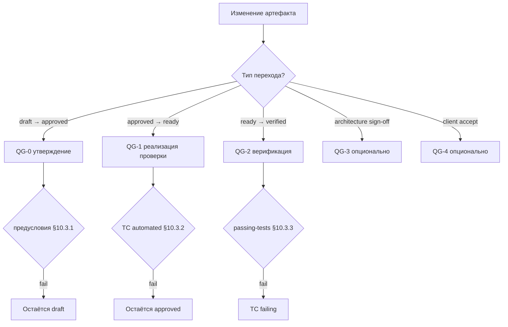

# 10. Жизненный цикл и Quality Gates

> **Плотная глава:** читать после [§6](06-requirements-hierarchy.md)–[§9](09-test-cases.md); прохождение QG — [guide/00](../guide/00-quickstart.md); плотность — [reference/09](../reference/09-pedagogical-density.md).

## 10.1 Как артефакты движутся: статусы и гейты

Артефакт RENAR — требование, спецификация, ADAPT, тест — не лежит статично. Он движется по состояниям: `draft → approved → verified → …`. И двигаться как попало нельзя: каждый переход стережёт **контрольная точка качества** (Quality Gate) — условие, которое обязано выполниться, иначе переход не происходит. Требование не станет `verified`, пока все его тесты не позеленели на текущей версии; ADAPT не станет `approved` без двух подписей. Gate — это не «галочка успеха», а проверка, которая вправе сказать «нет» и оставить артефакт на месте.

Эта глава сводит воедино машины состояний всех артефактов и нормирует гейты: что проверяется перед каждым переходом, кто и когда обязан проверить. Глава фиксирует **только** состояния, переходы и гейты; frontmatter артефактов определяют главы 6–09.

### 10.1.1 Дерево решений: какой гейт сейчас (informative)



---

## 10.2 Нормативное определение Quality Gate

### 10.2.1 Quality Gate

**Quality Gate (gate)** — нормативное условие, проверка которого обязана быть выполнена для разрешённого перехода артефакта из одного состояния жизненного цикла в другое. Каждый gate состоит из:

1. **Идентификатор** — `QG-N` или `QG-<artifact>-<state>` (закрытый список §10.3, §10.4).
2. **Предусловие** — набор проверяемых утверждений об артефакте и связанных артефактах, которые обязаны быть истинны на момент запуска gate.
3. **Постусловие** — состояние, в которое переходит артефакт после успешного прохождения gate, и наблюдаемые эффекты (например, появление записи в лог переходов §10.13).
4. **Триггер** — кто или что инициирует проверку gate (участник: AI-агент / архитектор / автоматический runner; событие: одобрение / завершение прогона / поступление delta-ТЗ).
5. **Точка контроля** — место в носителе, где проверка обязана быть автоматизирована (§10.11).

Gate не является событием успеха — это условие, которое **обязано быть проверено**. Прохождение gate может быть отрицательным (предусловие не выполнено) — в этом случае переход запрещён и артефакт остаётся в текущем состоянии.

### 10.2.2 Кто обязан проверять gate

| Тип gate | Обязательный участник | Обеспечение соблюдения носителя |
|---|---|---|
| Утверждение (QG-0) | Архитектор или авторизованный носитель роли | Атомарная фиксация авторства и времени (V6, [§3.3.6](03-substrate-versioning.md#3.3.6)) |
| Реализация проверки (QG-1) | Автоматический runner (CI, eval-runner) | Атомарная фиксация результата прогона привязанного к версии артефакта (V5, [§3.3.5](03-substrate-versioning.md#3.3.5)) |
| Верификация (QG-2) | Автоматический runner с подтверждением `version-pin` | V5 + V6 |
| Архитектура (QG-3, опционально) | Двойная подпись (клиент + архитектор) | V3 + V6 |
| Приёмка (QG-4, опционально) | Заинтересованная сторона с полномочиями | V6 |

### 10.2.3 Связь с SENAR

SENAR §8 описывает Quality Gates как абстрактную концепцию для AI-управляемой разработки. RENAR **расширяет** SENAR в области инженерии требований:

- Сохраняет идентификаторы QG-0 / QG-1 / QG-2 как обязательные.
- Нормирует **формальные машины состояний** для каждого типа артефакта (SENAR этого не делает).
- Привязывает каждый переход в машине состояний к конкретному gate с предусловиями и постусловиями.
- Добавляет опциональные QG-3 / QG-4 для отраслей с расширенными требованиями к аудиту.

RENAR не противоречит SENAR; реализация SENAR-совместима с RENAR если выполнены требования §10.3 + §10.11.

---

## 10.3 Канонические RENAR gates (обязательные)

Закрытый список из трёх обязательных gates. Расширения вне этого списка — только опциональные §10.4 или через формальную процедуру изменения стандарта §10.10.

### 10.3.1 QG-0 — гейт утверждения

**Назначение**: разрешает переход артефакта из черновика в утверждённое для разработки состояние.

**Предусловие** (общая часть, дополняется per-artifact в §10.5–§10.9):

- Frontmatter артефакта валиден по схеме своей главы.
- Идентификатор артефакта уникален в носителе (V1, [§3.3.1](03-substrate-versioning.md#3.3.1)).
- Состязательный обзор произведён; или явно зафиксировано отсутствие применимости — допустимо **только** для тривиальных артефактов (по критериям, объявленным в манифесте соответствия, [§13](13-conformance.md)) с записью причины в лог переходов (§10.13).
- Если артефакт ссылается на источник (`source.adapt` для BR/SR/SPEC, `verifies[]` для TC) — ссылаемый артефакт существует в носителе в состоянии не ниже `approved`.

**Постусловие**:

- Артефакт переходит в `approved` (для requirements / SPEC) или `ready` (для TC) или `approved` ADAPT (§10.8).
- Запись в лог переходов (§10.13).
- Для requirements / SPEC: разрешается декомпозиция в дочерние артефакты (для BR — SR; для SR — TR + SPEC через `constrained-by` / `implements-spec`).

**Триггер**: явное одобрение архитектором / носителем роли в нативном для носителя механизме (V3 diff & review, [§3.3.3](03-substrate-versioning.md#3.3.3)).

**Применимые артефакты**: BR, SR, TR, SPEC, ADAPT, TC.

### 10.3.2 QG-1 — гейт реализации проверки (только TC)

**Назначение**: подтверждает, что для артефакта существует валидная реализация — код, конфигурация, инфраструктурный артефакт — пригодная для верификации.

**Предусловие**:

- Реализация привязана к версии артефакта через `version-pin` (V5, [§3.3.5](03-substrate-versioning.md#3.3.5)).
- `automation.status: automated` (с валидным `automation.location`) или `automation.status: manual-pending` (с указанным `manual-pending-until` и `manual-pending-reason`).
- Все статические проверки реализации агента носителя (типы, lint, схема) — пройдены.
- Pos/neg парность для покрываемых утверждений артефакта обеспечена ([глава 9 §9.7](09-test-cases.md#9.7)).
- Все обязательные секции body TC ([глава 9 §9.4](09-test-cases.md#9.4)) заполнены.

**Постусловие**:

- TC переходит в `ready`.
- Запись в лог переходов.

**Триггер**: одобряющий участник (one-click promote `draft → ready`) при подтверждении автоматического runner о прохождении dry-run.

**Применимые артефакты**: TC (`draft → ready`).

**Примечание**: TR не проходит отдельно гейт QG-1. Условия валидности реализации (impl scope, version-pin, статические проверки) для TR входят в предусловия QG-2 ([§10.6.2](#10.6.2)). **QG-1 применим только к TC.** Для BR / SR / SPEC переход `approved → verified` управляется единым QG-2; промежуточного гейта реализации QG-1 для требований и SPEC нет.

### 10.3.3 QG-2 — гейт верификации

**Назначение**: подтверждает, что наблюдаемое поведение системы соответствует артефакту: все TC из `verified-by` артефакта в состоянии `passing` на текущей версии артефакта.

**Предусловие**:

- Для BR / SR / SPEC: все TC из `verified-by` имеют `last-run.result = pass` и `last-run.requirement-version` (или эквивалент `spec-version` / `version`) совпадает с текущей `version` верифицируемого артефакта.
- Pos/neg парность по нормативным утверждениям артефакта — выполнена.
- Все обязательные spec-specific виды TC для типа артефакта присутствуют ([глава 9 §9.8](09-test-cases.md#9.8)).
- Для TR: все его AC верифицированы привязанными TC (`last-run.result = pass`).
- Spec-specific дополнительные предусловия:
  - SPEC-UI / SPEC-AI: TC в состоянии `passing` с `judge-isolation` соблюдённой ([глава 9 §9.13.4](09-test-cases.md#9.13.4)).
  - SPEC-SEC: TC `tc-type: security` присутствует и `passing`.

**Постусловие**:

- Артефакт переходит в `verified`.
- Запись в лог переходов с evidence-refs (список ID прогонов).
- Носитель обязан фиксировать `version` верифицируемого артефакта в evidence-записи (V5).

**Триггер**: автоматический runner подтверждает passing TC и инициирует promote-transition по запросу автора (one-click promote `approved → verified`).

**Применимые артефакты**: BR, SR, SPEC, TR.

---

## 10.4 Опциональные gates

QG-3 и QG-4 — нормативно описаны, но **не обязательны** для соответствия ([глава 13](13-conformance.md)). Реализация может объявить в манифесте соответствия либо поддержку QG-3 / QG-4, либо их отсутствие. Соответствие без QG-3 / QG-4 остаётся валидным.

### 10.4.1 QG-3 — гейт архитектуры (опционально)

**Назначение**: разрешает переход ADAPT из `answered` в `approved` (§10.8). Также применим к декомпозиционным решениям SPEC-ARCH в проектах с регулируемой архитектурной приёмкой.

**Предусловие**:

- Все обратные находки в ADAPT в статусе `resolved` ([глава 7 §7.4.5](07-adapt.md#7.4.5)).
- Двойная подпись готова: подпись клиента + подпись архитектора ([глава 7 §7.5](07-adapt.md#7.5)).
- Для SPEC-ARCH (если QG-3 применяется): декомпозиционное решение зафиксировано в носителе как ADR-like артефакт со ссылкой из SPEC-ARCH (форма ADR специфична для носителя — fits в guide/).

**Постусловие**:

- ADAPT переходит в `approved` (immutable наравне с ТЗ).
- Запись в лог переходов с обеими подписями (V6 author + timestamp фиксирует обоих участников).

**Триггер**: явное двойное утверждение; носитель обязан атомарно фиксировать обе подписи (V2 atomic change unit, [§3.3.2](03-substrate-versioning.md#3.3.2)).

**Когда применять**:

- ADAPT — всегда (но реализация может объявить QG-3 как локальный псевдоним для утверждения ADAPT, не выделяя его в отдельный gate).
- SPEC-ARCH — в проектах с регуляторными требованиями к архитектурной приёмке.

### 10.4.2 QG-4 — гейт приёмки (опционально)

**Назначение**: фиксирует приёмку клиентом бизнес-результата после релиза. Переход BR из `verified` в `accepted`.

**Предусловие**:

- BR в `verified` (QG-2 пройден).
- Измеримый бизнес-результат (`business-outcome` в frontmatter BR) — измерен; `current-value` зафиксирован.
- `achievement` ≥ project-configurable порога (по умолчанию 80%, фиксируется в манифесте соответствия).
- Формальная подпись заинтересованной стороны.

**Постусловие**:

- BR переходит в `accepted` (терминальный недеградируемый статус — обратный переход требует delta-ТЗ).
- Запись в лог переходов с подписью заинтересованной стороны.

**Триггер**: формальная приёмка заинтересованной стороной по факту релиза.

**Когда применять**:

- Проекты с явной фиксацией post-release outcomes (продуктовые SaaS, регулируемые отрасли).
- При отсутствии QG-4 — статус `accepted` не используется; BR остаётся в `verified` до `deprecated`.

### 10.4.3 Соответствие стандарту с опциональными гейтами

Манифест соответствия ([глава 13](13-conformance.md)) обязан явно объявлять:

```yaml
quality-gates:
  qg-0: required          # всегда required
  qg-1: required
  qg-2: required
  qg-3: declared          # required | declared | absent
  qg-4: declared
```

`declared` означает: реализация поддерживает gate; артефакты могут проходить его, но соответствие не требует прохождения для всех артефактов. `absent` — gate не применяется в реализации; терминальное состояние артефакта — `verified` (без `accepted`).

---

## 10.5 Машина состояний BR / SR

### 10.5.1 Состояния и переходы

```text
draft  ──[QG-0]──▶  approved  ──[QG-2]──▶  verified  ──[QG-4 (опционально)]──▶  accepted
  │                     │                      │                                    │
  │                     │                      │                                    │
  └──────────┬──────────┴──────────────────────┴──────────[deprecation]─────────────┘
             ▼
        deprecated  (terminal; с `replaced-by` если есть замена)
```

| Статус | Семантика | Gate перехода |
|---|---|---|
| `draft` | Создан AI-агентом или архитектором; ещё не утверждён | — (создание) |
| `approved` | Утверждён к декомпозиции / реализации | QG-0 (§10.3.1) |
| `verified` | Все производные TC `passing` на текущей версии | QG-2 (§10.3.3) |
| `accepted` | Post-release бизнес-результат подтверждён | QG-4 (§10.4.2, опционально) |
| `deprecated` | Терминальный; не удаляется (V1 immutable history) | Deprecation transition (§10.5.3) |

Frontmatter BR / SR (включая обязательные поля статуса) определяется в [главе 6 §6.5.2 / §6.6.2](06-requirements-hierarchy.md#6.5.2). Этот раздел нормирует **только** переходы между состояниями и привязку к gates.

### 10.5.2 Предусловия по переходам

| Переход | Gate | Дополнительные предусловия (поверх §10.3) |
|---|---|---|
| `draft → approved` | QG-0 | BR: `business-outcome` заполнен. SR: `parent` BR в состоянии не ниже `approved`. Если SR ссылается на SPEC через `constrained-by[]` — все SPEC в `approved` или выше. |
| `approved → verified` | QG-2 | Хотя бы один TC с `negative: true` в `verified-by`. Все `last-run.requirement-version` совпадают с текущей `version`. |
| `verified → accepted` | QG-4 | Только если реализация объявила QG-4. |
| `* → deprecated` | Deprecation transition (§10.5.3) | См. §10.5.3 |

### 10.5.3 Deprecation transition

**Предусловие**:

- Артефакт находится в любом не-`deprecated` состоянии.
- `replaced-by` (если указан) существует в носителе и находится в состоянии не ниже `approved`.
- Нет активных дочерних TR в состоянии `approved` или активных задач исполнителя по этому артефакту (атомарная переадресация задач на replacement — обязательное условие, V2 atomic change unit).

**Постусловие**:

- `status: deprecated`.
- `deprecated-date` записан (V6).
- `replaced-by` указан, если есть замена.

**Триггер**: архитектор или Владелец продукта.

### 10.5.4 Reverse-эволюция верификации

Если артефакт уже `verified`, но `version` инкрементировался (например, после применения delta-ADAPT, [глава 7 §7.6](07-adapt.md#7.6)) — статус обязан вернуться в `approved` до повторного прохождения QG-2 на новой версии. Этот переход обязателен и автоматический: носитель обязан инвалидировать `verified` при изменении `version` ([глава 6 §6.5.4 reverse-эволюция](06-requirements-hierarchy.md#6.5.4)).

---

## 10.6 Машина состояний TR

### 10.6.1 Состояния и переходы

```text
draft  ──[QG-0]──▶  approved  ──[QG-2 (per TR)]──▶  done
  │                     │                            │
  │                     │                            │
  └─────────────────────┴───[обесценивание]─────────▶ obsolete
```

| Статус | Семантика | Gate |
|---|---|---|
| `draft` | TR создан; AC ещё не финализированы | — |
| `approved` | AC утверждены; разрешён старт работы исполнителя | QG-0 (§10.3.1) с предусловиями TR из §10.6.2 |
| `done` | AC верифицированы; все привязанные TC `passing` | QG-2 (§10.3.3) с предусловиями TR из §10.6.2 |
| `obsolete` | TR утратил актуальность до завершения (родительский SR изменился) | Обесценивание (архитектор) |

### 10.6.2 Предусловия для TR

**QG-0 для TR (`draft → approved`)** — дополнительно к общей части:

- Цель сформулирована (`goal`).
- AC верифицируемы и независимы (каждый AC — отдельная проверка).
- Хотя бы один негативный сценарий присутствует.
- Установлена ссылка на parent SR (или BR для простых конфигураций) через `implements`.
- Если TR реализует SPEC — обязательное поле `implements-spec[]` ([глава 8 §8.6.2](08-specifications.md#8.6.2)).
- Если задача затрагивает безопасность — `threat-surface` задекларирован ([глава 8 §8.5.8](08-specifications.md#8.5.8)).

**QG-2 для TR (`approved → done`)**:

- Все AC TR подтверждены прохождением соответствующих TC (`last-run.result = pass`).
- Pos/neg парность по каждому AC.
- Для TR реализующего SPEC: TC соответствующего spec-specific вида существует и `passing` ([глава 9 §9.8](09-test-cases.md#9.8)).

### 10.6.3 Обесценивание TR

Если родительский SR переходит в `deprecated` или его `version` изменилась так, что AC TR более не актуальны — TR переходит в `obsolete`. Это **не** деградация — это альтернативный терминальный путь. TR в `obsolete` не удаляется.

---

## 10.7 Машина состояний SPEC

### 10.7.1 Состояния и переходы

```text
draft  ──[review-transition]──▶  review  ──[QG-0]──▶  approved  ──[QG-2]──▶  verified
                                                          │                       │
                                                          └───[обесценивание]──▶ obsolete  (terminal)
```

| Статус | Семантика | Gate |
|---|---|---|
| `draft` | SPEC создан; обязательные frontmatter-поля заполняются | — |
| `review` | Обязательные body-разделы ([§8.4.1](08-specifications.md#8.4.1)) и type-specific ([§8.5](08-specifications.md#8.5)) присутствуют; готов к рецензированию | Review-transition (§10.7.2) |
| `approved` | Архитектор подтвердил; `depends-on[]` консистентен | QG-0 |
| `verified` | Все обязательные spec-specific TC `passing` | QG-2 |
| `obsolete` | Заменён или больше не актуален; `replaced-by` обязателен | Deprecation (§10.5.3 mutatis mutandis) |

### 10.7.2 Review-transition (`draft → review`)

Review-transition не является полноценным gate в смысле §10.2.1 — это автоматическая проверка структурной полноты. **Предусловие**:

- Все обязательные frontmatter-поля [§8.4](08-specifications.md#8.4) заполнены.
- Все обязательные body-разделы [§8.4.1](08-specifications.md#8.4.1) присутствуют.
- Type-specific разделы [§8.5](08-specifications.md#8.5) присутствуют для соответствующего `spec-type`.

**Постусловие**: `status: review`; артефакт виден архитектору для рецензирования.

Если review-transition не пройден — артефакт остаётся в `draft`; носитель обязан вернуть список отсутствующих секций (V3 diff & review поддерживает структурный фидбек).

### 10.7.3 Предусловия для SPEC

**QG-0 для SPEC (`review → approved`)** — дополнительно к общей части §10.3.1:

- `depends-on[]` граф ацикличен ([глава 8 §8.6.3](08-specifications.md#8.6.3)).
- Все SPEC из `depends-on[]` в состоянии не ниже `approved`.
- Если SPEC ссылается на ADAPT через `source.adapt` — ADAPT в состоянии `approved`.

**QG-2 для SPEC (`approved → verified`)**:

- Все обязательные spec-specific виды TC для `spec-type` присутствуют и `passing` ([глава 9 §9.8](09-test-cases.md#9.8)).
- Для SPEC-AI: pos/neg pair coverage по `evaluation-criteria` = 100%; judge-isolation соблюдена.
- Для SPEC-SEC: `tc-type: security` присутствует.
- Для SPEC-DATA: `tc-type: contract` присутствует для опубликованных interface-полей.

---

## 10.8 Машина состояний ADAPT

### 10.8.1 Macro-состояния

```text
draft  ──[review-transition]──▶  review  ──[backward-ready]──▶  client-ready
                                                                       │
                                                                       │ [client returns answers]
                                                                       ▼
                                                                  answered
                                                                       │
                                                                       │ [QG-3]
                                                                       ▼
                                                                  approved
                                                                       │
                                                                       │ [неизменяемо; только delta-ADAPT / errata / дезавуирование]
                                                                       ▼
                                                                  frozen ──[дезавуирование: §10.8.5]──▶ superseded
                                                                                                        (терминальное)
```

Состояния ADAPT (`draft → review → client-ready → answered → approved → frozen`, и терминальное `superseded` при дезавуировании) определены в [главе 7 §7.4](07-adapt.md#7.4) и [§7.6.4](07-adapt.md#7.6). Этот раздел нормирует gates.

| Переход | Gate | Предусловие |
|---|---|---|
| `draft → review` | Review-transition | Прямая интерпретация охватывает все разделы ТЗ; первичные обратные находки зафиксированы в `open` |
| `review → client-ready` | Backward-ready | Все обратные находки переведены в `asked-to-client`; пакет вопросов сформирован |
| `client-ready → answered` | Client-return | Все обратные находки в `answered` с author + timestamp ответа клиента (V6) |
| `answered → approved` | **QG-3** (§10.4.1) | Все обратные находки в `resolved`; двойная подпись готова |
| `approved → frozen` | Freeze-transition | Автоматический после approve; ADAPT immutable; разрешается генерация BR / SR / SPEC с `source.adapt = approved` |
| `frozen → superseded` | **QG-3 дезавуирующего ADAPT** (§10.8.5) | Дезавуирующий ADAPT (`supersedes: ADAPT-MMM`) достиг `approved`; производные BR / SR / SPEC перенаправлены или пере-выведены |

### 10.8.2 Вложенная машина состояний для записи об обратной находке

Каждая запись об обратной находке внутри ADAPT имеет собственную подчинённую машину состояний ([глава 7 §7.4.5](07-adapt.md#7.4.5)):

```text
open  ──▶  asked-to-client  ──▶  answered  ──▶  resolved  ──[approve ADAPT]──▶  frozen
                  ▲                  │
                  └──── revised ─────┘  (если ответ требует уточнения)
```

| Sub-state | Семантика |
|---|---|
| `open` | Записан инженером; не отправлено клиенту |
| `asked-to-client` | Отправлен клиенту; зафиксирована дата вопроса |
| `answered` | Клиент ответил; ответ записан (V6 author + timestamp) |
| `resolved` | Инженер интегрировал ответ в прямую интерпретацию |
| `revised` | Ответ расплывчатый; повторный вопрос (возврат к `asked-to-client`) |
| `frozen` | После approval ADAPT; изменения невозможны |

**Нормативное правило**: QG-3 (approve ADAPT) **запрещён**, если хотя бы одна запись об обратной находке в `open` / `asked-to-client` / `answered` / `revised`. Все такие записи обязаны быть в `resolved` ([глава 7 §7.4.5](07-adapt.md#7.4.5)).

### 10.8.3 QG-3 для ADAPT — детализация

**Предусловие** (полная):

- Все разделы прямой интерпретации заполнены (критерий forward complete).
- Все записи об обратных находках в `resolved`.
- Подпись клиента получена и зафиксирована нативным для носителя механизмом (V3 + V6).
- Подпись архитектора получена и зафиксирована.
- Если ADAPT — delta-ADAPT: parent-ADAPT в `frozen` ([глава 7 §7.6](07-adapt.md#7.6)).

**Постусловие**:

- ADAPT переходит в `approved`.
- Запись в лог переходов с обеими подписями.
- Носитель обязан атомарно (V2) зафиксировать обе подписи: частичная подпись (только клиент / только архитектор) **не** переводит ADAPT в `approved`.

**Триггер**: явное одобрение обоими участниками.

### 10.8.4 Errata для frozen ADAPT

`frozen` — терминальное состояние по линии деривации. Изменения возможны только добавлением нового артефакта по одному из трёх путей:

1. **Delta-ADAPT** (если ТЗ содержит ambiguity, обнаруженную поздно) — новый артефакт с явной связью `parent-adapt`.
2. **Errata-ADAPT** (если ошибка интерпретации инженера) — отдельный артефакт с подписью клиента (если меняется контрактный итог) или только архитектора (если косметическая).
3. **Дезавуирование** (если прежнее решение было верным, но позже опровергнуто) — дезавуирующий ADAPT переводит дезавуируемый в `superseded` (§10.8.5, [глава 7 §7.6.4](07-adapt.md#7.6)).

Во всех трёх случаях frozen ADAPT **не редактируется**. Это требование V1 (immutable history) для контрактных артефактов ([глава 7 §7.6.3](07-adapt.md#7.6.3)).

### 10.8.5 Переход frozen → superseded (дезавуирование)

Дезавуирование approved/frozen ADAPT нормировано в [главе 7 §7.6.4](07-adapt.md#7.6). Переход жизненного цикла:

```text
frozen ──[дезавуирующий ADAPT достиг approved через QG-3]──▶ superseded (терминальное, неизменяемое)
```

**Отдельный QG не вводится.** Дезавуирование проходит через тот же **QG-3** (двойная подпись, §10.8.3), что и обычный ADAPT — дополнительной контрольной точки не создаётся.

**Предусловие** перехода `ADAPT-MMM → superseded`:

- Создан дезавуирующий `ADAPT-NNN` с полем `supersedes: ADAPT-MMM` и непустым `supersession-rationale` ([глава 7 §7.6.4](07-adapt.md#7.6)).
- Дезавуирующий ADAPT прошёл QG-3 и достиг `approved`. Если дезавуируемое решение имело контрактный итог (типовой случай) — двойная подпись **обязана** включать подпись клиента; подпись только архитектора допустима лишь для строго косметической правки без контрактного итога.
- Все производные `BR` / `SR` / `SPEC` с `source.adapt: ADAPT-MMM` перенаправлены на дезавуирующий ADAPT либо пере-выведены (нет висячих ссылок).

**Постусловие**:

- `ADAPT-MMM` переходит в терминальное **`superseded`** — отдельное от `obsolete` и от `frozen`; неизменяемо и **сохраняется** для аудита (V1), не удаляется.
- Поле `superseded-by: ADAPT-NNN` на `ADAPT-MMM` фиксируется автоматически.
- Запись в лог переходов с подписями дезавуирующего ADAPT (V6).

**Триггер**: утверждение дезавуирующего ADAPT через QG-3.

**Hook-обязательство**: после перехода висячая ссылка `source.adapt` на ADAPT в статусе `superseded` — **fatal**; обеспечение соблюдения — `adapt-supersession` validation (§10.11.1), гейт `check-adapt-supersession.js`.

---

## 10.9 Машина состояний TC

### 10.9.1 Состояния и переходы

```text
draft  ──[QG-0]──▶  ready  ──[runner pass]──▶  passing
                      │                            │
                      │   [runner fail]            │ [criteria change |
                      └─────────────────────▶ failing      delta invalidation]
                                                   │            │
                                                   ▼            ▼
                                                obsolete  ◀─────┘  (terminal)
```

| Статус | Семантика | Gate / триггер |
|---|---|---|
| `draft` | TC создан; реализация в работе | — |
| `ready` | dry-run runner прошёл; pos/neg парность подтверждена | QG-0 (§10.3.1) с предусловиями TC из §10.9.2 |
| `passing` | `last-run.result = pass` на текущей `requirement-version` | runner pass; bot-managed |
| `failing` | `last-run.result = fail` | runner fail; bot-managed |
| `obsolete` | Покрываемое поведение более не существует | Deprecation (§10.9.4) |

Frontmatter TC и pos/neg pairing определяются в [главе 9](09-test-cases.md).

### 10.9.2 Предусловия для TC

**QG-0 для TC (`draft → ready`)** — дополнительно к общей части:

- `automation.status: automated` (с валидным `automation.location`) ИЛИ `automation.status: manual-pending` (с `manual-pending-until` ≤ +1 sprint и заполненным `manual-pending-reason`).
- Pos/neg парность по покрываемым утверждениям подтверждена ([§9.7](09-test-cases.md#9.7)).
- Dry-run runner прошёл (только структурная валидность; не путать с production-прогоном).
- Все обязательные секции body TC ([§9.4](09-test-cases.md#9.4)) заполнены.
- Citation на `verifies[]` — артефакт существует в носителе в состоянии не ниже `approved`.

**Постусловие**:

- `status: ready`.
- Runner разрешён к production-прогону.

### 10.9.3 Переходы под управлением runner (не Quality Gates)

`ready → passing`, `ready → failing`, `passing → failing`, `failing → passing` — переходы, происходящие **только** по факту прогона runner ([глава 9 §9.12 `last-run` bot-managed](09-test-cases.md#9.12)). Эти переходы **не являются** Quality Gates в смысле §10.2.1: они — нормативные следствия результатов прогона, а не прохождение гейта с предусловиями и постусловиями. В частности, проверка совпадения `last-run.requirement-version` с текущей версией верифицируемого артефакта (см. [§9.10](09-test-cases.md#9.10)) — это проверка согласованности под управлением runner, а не отдельный gate.

**Постусловие каждого runner-перехода**:

- `last-run` обновлён: `result`, `timestamp`, `requirement-version`, `evidence-refs`.
- Носитель обязан запретить ручную модификацию `last-run` (только runner-actor).

### 10.9.4 Обесценивание TC

TC переходит в `obsolete` если:

1. Артефакт из `verifies[]` переходит в `deprecated` / `obsolete`.
2. Delta-ТЗ инвалидирует тестовое поведение ([глава 9 §9.16](09-test-cases.md#9.16)).

**Постусловие**: `status: obsolete`. TC не удаляется (V1 immutable history).

### 10.9.5 Change-of-criteria — отдельный нормативный путь

Изменение `## Pass-критерий` или `## Fail-критерий` в TC — **не обычный transition**; это специальный путь, требующий отдельного approval workflow ([глава 9 §9.13](09-test-cases.md#9.13)). Подробности обеспечения соблюдения — §10.11.3.

---

## 10.10 Политика закрытого списка

### 10.10.1 Нормативное правило

Закрытый список Quality Gates RENAR — обязательные {QG-0, QG-1, QG-2} и опциональные {QG-3, QG-4}. Изменение списка возможно **только** через формальную процедуру изменения стандарта RENAR ([глава 13](13-conformance.md)).

Настоящая политика является специализацией [§1.7](01-scope.md#1.7) Политика закрытого списка для квалити-гейтов; общее правило для всех закрытых списков RENAR и master-индекс — [§1.7.5](01-scope.md#1.7.5).

### 10.10.2 Что запрещено

| Действие | Запрещено? | Почему |
|---|---|---|
| Локальное создание нового gate-типа `QG-N` на уровне проекта | Запрещено | Нарушает закрытый список; делает соответствие не-портируемым |
| Локальное переопределение предусловий канонического гейта | Запрещено | Делает соответствие несравнимым между реализациями |
| Дополнительное ужесточение предусловий локального гейта | Разрешено | Манифест соответствия может объявить более строгие пороги (например, `qg-2.required-negative-tc: true`) |
| Локальное ослабление предусловий канонического гейта | Запрещено | Нарушает контракт стандарта |
| Объявление QG-3 / QG-4 как `absent` в манифесте соответствия | Разрешено | Опциональные gates — §10.4 |
| Объявление QG-0 / QG-1 / QG-2 как `absent` | Запрещено | Нарушает соответствие §10.4.3 |

### 10.10.3 Расширение списка

Добавление нового gate-типа возможно через:

1. Запрос на изменение стандарта с обоснованием — исследовательский черновик с типологией и сравнением с каноническими gates.
2. Публичное обсуждение (срок и форум фиксируется политикой стандарта, [глава 13](13-conformance.md)).
3. Включение в следующую minor-версию стандарта (`v1.X` или `v2.0`).

Локальные для проекта расширения остаются за пределами соответствия — они допустимы как internal-практики, но **не** влияют на манифест соответствия.

---

## 10.11 Независимое от носителя обеспечение соблюдения

### 10.11.1 Нормативные требования

Носитель, реализующий RENAR, обязан обеспечить автоматическую проверку предусловий гейтов на следующих точках:

| Точка контроля | Что обязано быть проверено | Опирается на capabilities |
|---|---|---|
| **Promote-transition** (любой переход в более высокий статус) | Предусловия соответствующего gate (§10.3, §10.4, §10.5–§10.9) | V3 (diff & review) для блокировки перехода до approve; V4 (branching) для отделения WIP от утверждённой правды |
| **Approve-transition** (любое действие утверждения) | Авторство зафиксировано (actor) и временная метка | V6 (author + timestamp) |
| **Reference-validation** (любое создание/изменение артефакта с ссылкой на другой) | Referenced артефакт существует и в требуемом состоянии | V1 (immutable history) для stable identifier; V5 (version pin) для межносительных ссылок |
| **Change-of-criteria для TC** (§10.11.3) | Применён отдельный процесс утверждения | V3 + V6 |
| **Runner-transitions для TC** (`ready → passing`/`failing`) | Только runner-actor может писать `last-run` | V6 (authorship); нативный для носителя ACL или role-based restrictions |
| **Инвалидация жизненного цикла** (артефакт `verified`, версия инкрементировалась) | Артефакт автоматически переведён в `approved` | V5 (version pin) для детекции |
| **`implements`-edge validation** (BR подсистемы со ссылкой на BR системы, [§6.5.2](06-requirements-hierarchy.md#6.5.2), [§6.8.2](06-requirements-hierarchy.md#6.8.2)) | (1) target BR существует по `id + scope.system`; (2) target в `approved`+ при approve данного BR (`deprecated` target — warning, не fatal; cascade-warning по `implemented-by[]`); (3) цепочка `implements` не образует циклов; (4) `implements[]` не присутствует при `level: system` | V1 (stable identifier для target lookup); V3 (block approve до пройденной валидации); V5 (cross-substrate ID разрешение когда target в другом носителе) |
| **`adapt-applicability` validation** ([§7.4.1](07-adapt.md#7.4.1)) | (1) Для каждого ТЗ зафиксирован вердикт состязательного обзора (V6 author + timestamp). (2) Если вердикт «findings present» — должен существовать соответствующий ADAPT в `approved`+ с двойной подписью; BR/SR/SPEC производные имеют `source.adapt`. (3) Если вердикт «no findings, no clarifications» — ADAPT отсутствует, BR/SR/SPEC имеют `source.tz-section` + `source.adversarial-review-ref` evidence. (4) Запрет смешения: artifacts с `source.adapt` omitted без свидетельства вердикта — fatal. | V3 (block approve до прохождения validation); V6 (вердикт + signature attribution); V1 (вердикт immutable evidence) |
| **`adapt-supersession` validation** ([§7.6.4](07-adapt.md#7.6), §10.8.5) | (1) `supersedes: ADAPT-MMM` ссылается на существующий ADAPT; обратная связь `superseded-by` симметрична. (2) `supersession-rationale` непустой и ссылается на конкретное противоречащее `BR` / `SR` / `SPEC`. (3) При контрактном итоге дезавуируемого решения — дезавуирующий ADAPT имеет подпись клиента. (4) Висячая ссылка `source.adapt` на ADAPT в статусе `superseded` — **fatal**. | V1 (stable identifier + immutable superseded history); V3 (block approve до пройденной валидации); V6 (signature attribution) |

### 10.11.2 Носитель без V3 / V4 / V6 — не соответствующий

Носитель, не обеспечивающий V3 (diff & review), не может реализовать gates: нет способа отделить «предложенное изменение» от «утверждённой правды» ([глава 3 §3.3.3](03-substrate-versioning.md#3.3.3)). Аналогично V4 (branching, [§3.3.4](03-substrate-versioning.md#3.3.4)) и V6 (author + timestamp, [§3.3.6](03-substrate-versioning.md#3.3.6)) — без них механика утверждения невозможна. Носитель, не удовлетворяющий V3 / V4 / V6, **не реализует RENAR** независимо от других свойств.

### 10.11.3 Change-of-criteria для TC — особое обеспечение соблюдения

Изменение Pass / Fail критерия TC — высокорисковая операция (защита от test-fitting, [глава 9 §9.13](09-test-cases.md#9.13)). Носитель обязан:

1. **Детектировать**: любое изменение секций `## Pass-критерий` / `## Fail-критерий` в TC-артефакте.
2. **Принудительно изолировать**: change-of-criteria обязано быть отдельным change-set (V4 atomic change unit), помеченным признаком, отличающим его от обычных правок (нативный для носителя механизм — частный случай V3 diff & review; форма признака специфична для носителя, выносится в guide/).
3. **Запретить совмещение**: одно и то же лицо не имеет права одобрить change-of-criteria и одобрение fix кода, который тестируется этим же TC. Носитель обязан проверять это правило при approve-transition.
4. **Регистрировать**: change-of-criteria записывается в audit-trail (§10.13) с явной типизацией события.

### 10.11.4 Формы нативной для носителя реализации

Конкретные нативные для носителя механизмы (как именно реализуется hook в данном носителе) — выносятся в `guide/` и манифест соответствия. Стандарт не нормирует **форму** hook (это специфичное для носителя решение). Стандарт нормирует **что hook обязан проверять и в какой точке**.

Раздел `guide/` обязан содержать для каждого поддерживаемого носителя:

- Mapping точек обеспечения соблюдения §10.11.1 на нативные для носителя механизмы.
- Примеры реализаций.
- Известные ограничения носителя относительно автоматизации каждой проверки.

---

## 10.12 Запрещённые переходы

Закрытый список переходов, нарушающих жизненный цикл. Носитель обязан их блокировать.

| Из | В | Артефакт | Почему запрещено |
|---|---|---|---|
| `draft` | `verified` | BR / SR / SPEC | Пропускает QG-0; нет evidence approval |
| `draft` | `accepted` | BR | Same; и пропускает QG-2 |
| `draft` | `done` | TR | Пропускает QG-0 |
| `draft` | `passing` | TC | Пропускает QG-0 (нет dry-run runner) |
| `obsolete` | * | Любой | Терминальный статус; «реанимация» запрещена — нужен новый артефакт с `supersedes` |
| `deprecated` | * | Любой | Same |
| `frozen` | * | ADAPT | Same; изменения только через delta-ADAPT или errata (§10.8.4) |
| `verified` | `draft` | BR / SR / SPEC | Деградация через несколько ступеней — потенциальная потеря trace; если требуется доработка — `verified → approved` через delta или reverse-эволюция §10.5.4 |
| `accepted` | `verified` | BR | Деградация после приёмки — недопустима без delta-ТЗ |
| `accepted` | `approved` | BR | Same |
| `passing` | `draft` | TC | Деградация теряет history runs; используется `passing → failing → obsolete` или change-of-criteria путь |
| `ready` | `draft` | TC | Деградация теряет dry-run evidence (§10.9.2); ослабление TC через `[test-spec-change]` ([глава 9 §9.13](09-test-cases.md#9.13)) — не путь возврата в `draft` |
| `failing` | `draft` | TC | Деградация теряет runner history; повторная диагностика — через новый прогон (`failing → passing` runner-managed) или `obsolete` |

### 10.12.1 Реакция носителя

При попытке запрещённого перехода носитель обязан:

1. Заблокировать transition (V3 diff & review).
2. Вернуть вызывающему участнику код ошибки с указанием конкретного нарушенного правила (по идентификатору строки этой таблицы).
3. Не создавать запись в лог переходов (§10.13).

---

## 10.13 Логирование событий прохождения gate

### 10.13.1 Нормативное требование

Каждое успешное прохождение gate (любого типа: QG-0, QG-1, QG-2, QG-3, QG-4, runner-transition, deprecation, freeze-transition) обязано быть зафиксировано в носителе как неизменяемое событие со следующими полями:

| Поле | Семантика | Обязательность |
|---|---|---|
| `timestamp` | UTC ISO-8601 момент успешного прохождения | Обязательно |
| `artifact-id` | Идентификатор артефакта (immutable, V1) | Обязательно |
| `artifact-type` | `BR` / `SR` / `TR` / `SPEC-<type>` / `ADAPT` / `TC` | Обязательно |
| `artifact-version` | Версия артефакта на момент перехода (V5) | Обязательно |
| `from-status` | Исходное состояние | Обязательно |
| `to-status` | Целевое состояние | Обязательно |
| `gate-id` | `QG-0` / `QG-1` / `QG-2` / `QG-3` / `QG-4` / `deprecation` / `freeze` / `runner-pass` / `runner-fail` / `change-of-criteria` | Обязательно |
| `actor` | Идентификатор инициатора (V6); для двойной подписи — список участников | Обязательно |
| `evidence-refs` | Ссылки на доказательства: ID прогонов runner, ID артефактов состязательного обзора, ID подписей | Обязательно для QG-2 / QG-3 / QG-4 |
| `notes` | Свободный текст | Опционально |

### 10.13.2 Независимый от носителя формат

Формат хранения событий — специфичен для носителя (отдельный лог-стрим / append-only collection / иные формы). Стандарт нормирует только обязательные поля §10.13.1, не их сериализацию.

Манифест соответствия обязан указать механизм хранения событий и формат экспорта (для аудита, [глава 13](13-conformance.md)).

### 10.13.3 Retention

События **не удаляются** в течение всего жизненного цикла артефакта и после его перехода в `deprecated` / `obsolete` / `frozen`. Этого требует V1 (immutable history) и нормативные положения compliance ([глава 13](13-conformance.md)).

---

## 10.14 Связь с другими главами

| Глава | Связь |
|---|---|
| [02](02-methodology-positioning.md) | SENAR QG-0..QG-2 — концептуальная основа; RENAR расширяет (§10.2.3) |
| [06](06-requirements-hierarchy.md) | frontmatter и body BR / SR / TR ([§6.5](06-requirements-hierarchy.md#6.5)–[§6.7](06-requirements-hierarchy.md#6.7)); state machines детализированы здесь (§10.5–§10.6) |
| [07](07-adapt.md) | frontmatter ADAPT ([§7.8](07-adapt.md#7.8)); backward sub-states ([§7.4.5](07-adapt.md#7.4.5)); двойная подпись ([§7.5](07-adapt.md#7.5)); delta-ADAPT ([§7.6](07-adapt.md#7.6)) — машина состояний здесь (§10.8) |
| [08](08-specifications.md) | frontmatter SPEC ([§8.4](08-specifications.md#8.4)); type-specific QG ([§8.8](08-specifications.md#8.8)); машина состояний здесь (§10.7) |
| [09](09-test-cases.md) | frontmatter TC ([§9.3](09-test-cases.md#9.3)); pos/neg pairing ([§9.7](09-test-cases.md#9.7)); change-of-criteria ([§9.13](09-test-cases.md#9.13)); машина состояний здесь (§10.9) |
| [03](03-substrate-versioning.md) | V1–V6 — фундамент обеспечения соблюдения (§10.11); без V3 / V4 / V6 — нет реализации gates |
| [11](11-maturity-model.md) | Уровни зрелости определяют объём применимых gates (например, RENAR-1 — QG-0 / QG-1 / QG-2 обязательны; на более высоких уровнях усиливаются предусловия QG-2: pos/neg парность, spec-specific TC) |
| [13](13-conformance.md) | Манифест соответствия объявляет gate support (§10.4.3); хранит retention policy событий (§10.13.3) |

