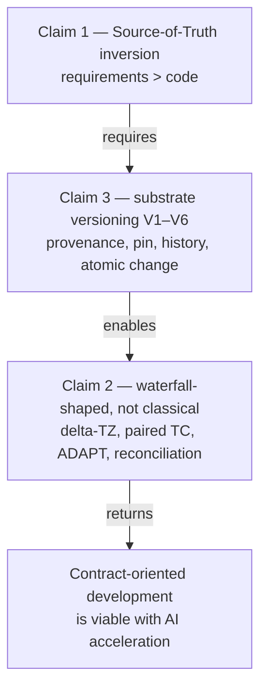

# 02. Positioning in the Typology of Methodologies

> **Part of the RENAR Standard v1.0-draft** · [← Table of contents](README.md)

## 2.1 The three claims everything rests on

Before describing artifacts and processes, RENAR states the three ideas everything else stands on: **the Source of Truth is the requirements, not the code**; **the process has a layered form, but this is not classical waterfall**; **versioning is a mandatory substrate property, not a tie to a tool**. It sounds like generalities — but remove any one of them, and the remaining chapters fall apart. The requirements hierarchy ([chapter 6](06-requirements-hierarchy.md)) loses its Source-of-Truth meaning, [ADAPT](07-adapt.md) loses its role as the bridge between the contractual and engineering loops, the [specifications](08-specifications.md) lose their parallel axis, the [test cases](09-test-cases.md) lose their binding to a requirement version, the [lifecycle](10-lifecycle-qg.md) loses transition atomicity, and [substrate versioning](03-substrate-versioning.md) loses its normative footing.

This chapter is therefore the foundation; §2.3–§2.5 SHOULD be read in sequence. All three claims are **mandatory clauses**: each is a mandatory clause for any RENAR conformance claim ([chapter 13](13-conformance.md)).

## 2.2 The three fundamental claims

1. **Source-of-Truth inversion.** The Source of Truth about system behavior is the hierarchy of requirement artifacts. Code is a derived implementation artifact. This is Spec-Driven Development (SDD).
2. **Waterfall-shaped ≠ classical waterfall.** The RENAR process has a sequential, layered shape with gates. The standard explicitly distances itself from the four deadly sins of classical waterfall.
3. **Substrate-independent versioning.** Versioning is a mandatory property of the substrate implementing RENAR. The particular versioning tool is interchangeable. Six capabilities (V1–V6) set the normative requirements on the substrate; the details are in [chapter 3](03-substrate-versioning.md).

The three claims are logically connected (see §2.6).

---

## 2.3 Claim 1 — Source of Truth about behavior: requirements, not code (Source of Truth)

### 2.3.1 Normative formulation

**The Source of Truth about system behavior is the hierarchy of requirement artifacts: TZ → [ADAPT](07-adapt.md) → BR / SR / [SPEC](08-specifications.md) → TR → [TC](09-test-cases.md). Code is a derived artifact implementing this hierarchy. On a divergence between the code and a higher-level requirement, the requirement normatively wins.**

### 2.3.2 Distribution of roles

| Level | Who is the Source of Truth | Who is derived |
|---|---|---|
| TZ | Contract with the client | — |
| [ADAPT](07-adapt.md) | Two-way interpretation of the TZ | derived from the TZ |
| [BR / SR / SPEC](06-requirements-hierarchy.md) | The system's engineering standard | derived from ADAPT |
| [TC](09-test-cases.md) | Contract of verifiable behavior | derived from SR / SPEC |
| TR (task) | The act of handing work to an implementer | derived from SR + SPEC |
| Code | Implementation | derived from everything above |

### 2.3.3 Contract (mandatory consequences)

The standard requires the following behavior from any implementation claiming RENAR conformance:

1. **Prohibition of reverse-engineering behavior from code into an SR.** An AI agent or human creating a new SR or amending an existing SR uses ADAPT and the existing SRs as the source — but not the observable behavior of the implementation. Reverse-engineering is permissible only when creating a bug-fix task (see §2.3.4).
2. **Separation of code review and specification review.** Code review checks that a change conforms to the code. Specification review checks that the tests and the implementation conform to the requirements. These are two distinct gates, with distinct artifacts and distinct default reviewers.
3. **Drift detection as a substrate hook.** When a reference to an SR/SPEC absent from the requirements substrate is found in code, the atomic change unit in the implementation substrate is blocked (see [chapter 10 §10.5](10-lifecycle-qg.md), [chapter 3 §3.5](03-substrate-versioning.md)).
4. **Prohibition of silently adapting an SR to the code.** If the implementation does X while the SR requires Y, exactly one of two things is true: (a) the implementation is wrong — a bug-fix task is created to bring the code to the SR; (b) the SR is wrong — a [delta-ADAPT](07-adapt.md#7.6) is created with justification and signatures to change the SR. A third option ("we'll just update the SR to match the code") is prohibited.

### 2.3.4 Positioning in the industry typology

Claim 1 is a concrete realization of the **Spec-Driven Development (SDD)** paradigm — an industry term that emerged in 2024–2025 in response to the acceleration of development with AI agents. SDD recognizes that when AI agents can decompose formal specifications into code in minutes, **specification correctness** becomes the critical constraint, rather than code correctness.

| Standard / methodology or framework | Corresponding provision | Relation to RENAR §2.3 |
|---|---|---|
| ISO/IEC/IEEE 29148:2018 §6.4.5 | Requirements management mandates traceability from requirements to implementation | RENAR §2.3 is a concrete realization of this mandate |
| BABOK Guide v3 §6.5 | Verify requirements before they drive solution work | RENAR §2.3 normatively specifies verification as two distinct gates (code/spec) |
| ISO/IEC 5338:2023 | AI-system lifecycle — requirements govern the generation of AI artifacts | RENAR §2.3, together with the [reference/04 AI Style Guide](../../reference/en/04-ai-style-guide.md) and adversarial review ([guide/07 §4.5](../../guide/en/07-failure-modes.md)), supports this mandate |
| Spec-Driven Development (industry, 2024-2025) | GitHub Spec Kit, Anthropic spec-first agents, Amazon Kiro, Tessl, BMAD-Method | RENAR is the formal standard within this paradigm |

**What is new here for RENAR.** The Source-of-Truth inversion itself is the definition of the SDD paradigm, not a RENAR invention. RENAR's contribution is its **enforcement**: the four contractual consequences of §2.3.3 (prohibition of reverse-engineering into an SR, separation of code review and specification review, the drift hook, prohibition of silently adapting an SR to the code), which turn the paradigm from a principle into verifiable normative requirements.

### 2.3.5 Differentiation from SDD tools

Industry SDD tools and RENAR are in one paradigm, but in different layers:

| Axis | Industry SDD tools (Spec Kit, Kiro, Tessl, BMAD) | RENAR |
|---|---|---|
| Nature | Reference implementation plus ready-made tooling with a prescribed process | Formal normative standard (capabilities, lifecycle, invariants) |
| Substrate | tied to a specific tool / platform | substrate-independent (V1–V6); VCS / document-oriented store / other — interchangeable |
| Contractual loop | Usually absent | ADAPT: two-way adaptation of the TZ + dual signature ([§7](07-adapt.md)) |
| Conformance | Undefined | Conformance claim via a manifest + mandatory clauses ([§13](13-conformance.md)) |
| Verification | Tests as a practice | pos/neg pairing + judge ≠ production as blocking gates ([§9](09-test-cases.md)) |

RENAR does not compete with these tools: an industry SDD tool MAY be a **substrate-native RENAR implementation** without losing the portability of the conformance claim ([§14.5.2](14-normative-refs.md#14.5.2)).

---

## 2.4 Claim 2 — Waterfall-shaped, not classical waterfall

### 2.4.1 Normative formulation

**The RENAR process has a sequential, layered shape: TZ → ADAPT → BR/SR/SPEC → TR → implementation → TC run → accepted. This is a waterfall-like shape. The standard explicitly distances itself from the four deadly sins of classical waterfall and MUST NOT be interpreted as classical waterfall in the sense of Royce 1970.**

This claim is a **positioning clarification** (removing a false analogy with classical waterfall), not a claim of novelty: after the four distancings of §2.4.2 the shape coincides with the V-model and ATDD. RENAR's novelty lies in ADAPT, V1–V6, and the translation of practices into mandatory clauses. The claim remains a mandatory clause (§2.7) — without it, a reviewer forces an unsuitable template onto RENAR.

### 2.4.2 The four distancings from classical waterfall

| Classical waterfall (Royce 1970, industry practice 1970–1990) | RENAR |
|---|---|
| One big "requirements → design → code → tests" pass per quarter or year | **delta-TZ workflow**: each change is a mini-cycle taking days or hours. The same shape repeats hundreds of times with AI acceleration. See [chapter 7 §7.6 (delta-ADAPT)](07-adapt.md#7.6) |
| Tests at the end of the cycle, after implementation | **TC is a full-fledged verification artifact** ([chapter 9](09-test-cases.md)). Paired pos/neg TCs are created together with the SR/SPEC, not after the code. This is closer to the V-model and ATDD than to waterfall |
| One-way "throw the spec over the wall" | **[ADAPT](07-adapt.md) is a two-way document** by construction. Forward (engineering interpretation) + Backward (questions to the client). Prohibition of one-way handoff |
| The spec is written once, then untouchable; reality drifts | **Continuous reconciliation** through substrate hooks. code ↔ spec drift is detected automatically and lands in a delta-ADAPT. The spec is alive |

### 2.4.3 Applicability

RENAR is applicable in the following contexts:

- Contract-oriented development (the presence of a contract with the client, a signed TZ).
- Regulated industries: regulatory conformance, medicine, fintech, the public sector, PII processing.
- Enterprise consulting (a third party builds the product against someone else's TZ).
- Projects with a high cost of requirement changes late in the cycle.
- Projects requiring an audit trail for conformance reviews ([chapter 13](13-conformance.md)).

RENAR is **not applicable** in the following contexts:

- Pure product discovery without a contractual context (lean startup, product-MVP "build first, understand what we are building later").
- Pure R&D without defined requirements.
- Prototyping with a lifecycle shorter than the time to write an ADAPT.

Applicability is documented as part of the conformance procedure ([chapter 13](13-conformance.md)).

### 2.4.4 Positioning in the industry typology

| Methodology | Relation to RENAR |
|---|---|
| Classical Waterfall (Royce 1970) | RENAR distances itself on the 4 points of §2.4.2 |
| V-model | RENAR is closer to the V-model: paired TCs, tests at the start of each layer |
| Scrum / Kanban | Not in conflict, but RENAR is a different axis (artifact-based, not process-based). A Scrum sprint MAY contain a RENAR delta-ADAPT cycle |
| SAFe Solution Intent | ADAPT is a concrete realization of Solution Intent for contract-oriented development. See [guide/05-safe-comparison.md](../../guide/en/05-safe-comparison.md) |
| BABOK Requirements Analysis | RENAR §2.3+§2.4 is a formal realization of BABOK §3+§6 for the context of development with AI agents |

---

## 2.5 Claim 3 — Substrate-independent versioning

### 2.5.1 Normative formulation

**Versioning is a mandatory property of the substrate implementing RENAR. The standard sets six capabilities (V1–V6) that the substrate MUST provide. The particular versioning tool is interchangeable: a substrate satisfying V1–V6 implements RENAR regardless of whether it is a distributed VCS, a centralized VCS, a document-oriented DBMS with conflict resolution, or another mechanism.**

### 2.5.2 The six mandatory capabilities (overview)

The full normative formulation of V1–V6 is in [chapter 3](03-substrate-versioning.md). At the level of typological positioning:

| # | Capability | What it provides |
|---|---|---|
| V1 | Immutable history | Any past state of an artifact is recoverable |
| V2 | Atomic change unit | A "change" is one transaction; all or nothing |
| V3 | Diff & review | A human sees a change and approves or rejects it before integration |
| V4 | Branching / change-set | Drafts are separable from the approved truth |
| V5 | Cross-substrate version pin | The implementation substrate pins the version of the requirements substrate |
| V6 | Author + timestamp | Every change has an author and a time |

### 2.5.3 A substrate that does not satisfy V1–V6 does not implement RENAR

The impossibility of implementing RENAR on a substrate without V1–V6 is structural, not operational: claim 1 (Source-of-Truth inversion) physically does not work without versioning, because:

- It is impossible to say "the implementation was built against the requirements as of date X" — provenance is lost (violation of V1, V6).
- It is impossible to build a [delta-ADAPT](07-adapt.md#7.6) — there is no base version against which to measure the delta (violation of V1).
- It is impossible to verify a [TC](09-test-cases.md) — the `verifies[].requirement-version` field loses meaning without a stable version identifier (violation of V5).
- The requirement transition `verified → accepted` is impossible — the gate has nothing to rely on (violation of V1, V5).
- An audit trail of "what we delivered to the client under contract 2025-Q3" is impossible (violation of V1, V6).

Therefore a substrate without V1–V6 (a flat file server with file renaming as the versioning mechanism; a document store without conflict resolution; other systems without immutable history) **does not implement RENAR** regardless of its other properties.

### 2.5.4 Substrate-independent normative language

RENAR's normative paragraphs use substrate-independent language: "atomic change unit," "version pin," "author and timestamp," "diff & review" — not the names of specific tool primitives. This ensures the standard applies to any future substrate satisfying V1–V6. Substrate-specific details are in [Chapter 3 §3.4](03-substrate-versioning.md) (the normative mapping table of V1–V6 × substrates), [guide/03-tool-guide-git.md](../../guide/en/03-tool-guide-git.md) (distributed VCS), [guide/04-document-store-substrate.md](../../guide/en/04-document-store-substrate.md) (document-oriented store).

### 2.5.5 Positioning in the industry typology

| Standard | Corresponding provision | Substrate neutrality |
|---|---|---|
| ISO/IEC/IEEE 29148:2018 §6.4.5 | Configuration management of requirements | substrate-neutral; governs capabilities, not tools |
| BABOK Guide v3 §5.3 | Maintain requirements (for traceability) | substrate-neutral |
| CMMI-DEV CM SG2 | Track and Control Changes | substrate-neutral |
| SAFe Solution Intent | Versioned artifact | Does not govern the substrate |
| ISO/IEC 5338:2023 | AI artifact provenance | substrate-neutral; provenance is a capability |

RENAR follows the same neutrality and explicitly fixes V1–V6 as a contract, which these standards left implicit.

---

## 2.6 The logical connection of the three claims

The three claims are connected directionally:

**Without claim 1**: the Source of Truth is diffuse, the spec drifts, audit is impossible.
**Without claim 3**: claim 1 is declarative and physically does not work.
**Without an explicit claim 2**: a reviewer forces unsuitable templates onto RENAR (agile sprint without a waterfall shape, or classical waterfall without the 4 distancings) and rejects the standard on a false analogy.

All three claims are mandatory clauses ([chapter 13](13-conformance.md)). At the v1 level, a RENAR conformance claim requires accepting all three claims; without any one of them it is untenable.

---

## 2.7 Consequences for the conformance procedure

The claims of §2.3, §2.4, §2.5 are **mandatory clauses** for any conformance claim at the RENAR levels (RENAR-1..RENAR-5; see [ch. 11](11-maturity-model.md), [ch. 13](13-conformance.md)). A team cannot claim "we implement RENAR-1 without Source-of-Truth inversion" (a contradiction in terms) or "we implement RENAR on a substrate without V1–V6" (the substrate is non-conformant); it MAY choose **not to claim** RENAR conformance in a context of non-applicability (§2.4.3) — this is normatively permissible. The concrete self-assessment checklist is in [ch. 13](13-conformance.md).

---

## 2.8 Relationship to other chapters of the standard

| Chapter | Relation |
|---|---|
| [06 Requirements](06-requirements-hierarchy.md) | The BR/SR/TR hierarchy is a concretization of the Source-of-Truth chain from §2.3.2 |
| [07 ADAPT](07-adapt.md) | Two-way adaptation is a concretization of claim 2 (distancing from "throwing the spec over the wall") |
| [08 Specifications](08-specifications.md) | SPEC-* as a parallel axis is a consequence of the Source-of-Truth inversion for structural description |
| [09 Test cases](09-test-cases.md) | TC as a full-fledged verification artifact is a concretization of claim 2 (distancing from "tests at the end") |
| [10 Lifecycle and QG](10-lifecycle-qg.md) | The gates enforce claim 1 (drift hooks) and claim 2 (continuous reconciliation) |
| [03 Substrate versioning](03-substrate-versioning.md) | The detailed norms of V1–V6 (§2.5 is an overview) |
| [11 Maturity](11-maturity-model.md) | The RENAR-1..RENAR-5 levels extend the claims with additional requirements |
| [13 Conformance](13-conformance.md) | Self-assessment against the three mandatory clauses |

