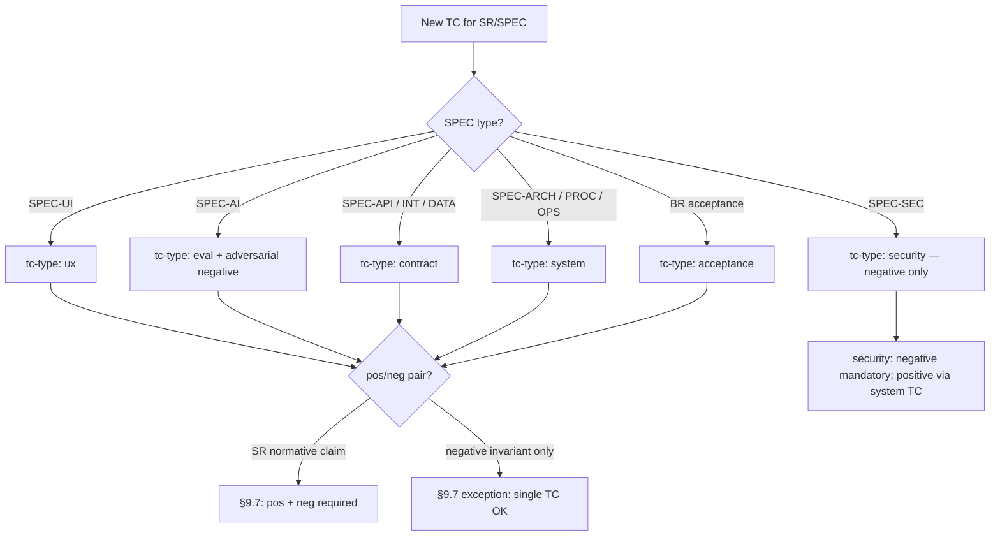

# 09. Test Cases

> **Part of the RENAR Standard v1.0-draft** · [← Table of contents](README.md)

## 9.1 A test case is a first-class artifact

In RENAR a test is not a postscript at the end of the code, but a full-fledged document: it has its own version, status, and place in the trace chain, just like the requirement it verifies. The reason is simple: tests are written by an AI agent, and an AI happily covers the "happy path" ("entered the right password — let in") and quietly skips the unpleasant parts ("entered someone else's — MUST NOT let in, MUST NOT hint which field is wrong, MUST NOT write the password to the log"). It is precisely in the unhandled negative cases that defects live.

For this reason RENAR makes two requirements normative. **Pos/neg pairing**: for every verifiable statement — at least one positive test case and one negative one (what MUST happen and what MUST NOT happen). **Judge isolation**: if the result is assessed by another AI model (for the `ux`, `eval` types), it MUST differ from the one that produced the artifact under assessment — a model does not check itself. The TC ([Test Case](04-terms.md#451-tc--test-case)) closes the trace chain TZ → [ADAPT](07-adapt.md) → BR / SR / [SPEC](08-specifications.md) → TR → TC (see [§2.3](02-methodology-positioning.md#2.3)): from a test failure one can trace back to the TZ section it ultimately verifies.

The chapter builds on ISO/IEC/IEEE 29119 "Software testing" for the concepts of test design, test execution, test result reporting, and pos/neg coverage, but fixes a closed list of TC types, mandatory pos/neg pairing, and judge ≠ production isolation as normative requirements of v1.0 that are not present in formalized form in ISO 29119.

From the practices of Specification by Example (Adzic) and BDD / Gherkin — where executable examples also serve as a specification — RENAR differs in that it moves pos/neg pairing ([§9.7](#97-posneg-pairing--normative-requirement)), judge ≠ production isolation ([§9.13](#913-protection-against-test-gaming)), and version-pinning a TC to the requirement version (V5, [§3.3.5](03-substrate-versioning.md#3.3.5)) from a recommendation to blocking normative clauses ([§14.5.2](14-normative-refs.md#14.5.2)).

The clauses of this chapter are normative. The closed lists (principles, TC types, mandatory TC kinds per SPEC type) are RENAR mandatory clauses ([chapter 13](13-conformance.md)); extension is only through the formal change procedure of the standard.

> **Dense chapter:** [reference/09](../../reference/en/09-pedagogical-density.md) · the decision tree below is informative routing.

### 9.1.1 Decision tree: choosing `tc-type` (informative)



The adversarial-review procedure for TC — [guide/07 §4.5](../../guide/en/07-failure-modes.md); the agent panel (informative) — same place, §4.5.

---

## 9.2 Closed list of normative TC principles

| # | Principle | Normative formulation |
|---|---|---|
| P1 | First-class artifact (TC) | A TC is a standalone artifact of the standard, equal to a requirement in lifecycle and versioning. It is stored as a separate file in the `tests/` subfolder of the requirements substrate ([§9.17](#917-storage-layout)). |
| P2 | Document ≠ implementation | A TC describes **what is verified and how** (decoupled from the implementation). The implementation (code) is addressed by the `automation.location` field and stored in the code substrate. One TC — one implementation. |
| P3 | AI-generated | TC are created and edited by an AI agent on the engineer's assignment; the engineer does not write TC by hand (see [chapter 11 §11.N](11-maturity-model.md)). |
| P4 | AI-executed | All TC in status `ready` and above are automated. The run is performed by an automated runner (CI / AI-runner / specialized executor). Results in `last-run` are recorded only by the runner (a bot-managed actor) upon the run. |
| P5 | Pos/neg pairing | For every statement of a requirement (BR / SR / SPEC), at least one positive + negative TC pair is created ([§9.7](#97-posneg-pairing--normative-requirement)). |
| P6 | `last-run` — bot-managed | The `last-run` field (date / result / runner-id / requirement-version / judge-report) is filled in only by the automated runner. Manual editing of `last-run` by any actor is prohibited by the standard ([§9.12](#912-last-run--bot-managed-only)). |
| P7 | Judge ≠ production isolation | For TC types that use LLM-as-judge (ux, eval), the judge model **MUST NOT coincide** with the production model that generates the artifact under assessment. A coincidence is blocked by a substrate hook ([§9.6.2](#962-tc-type-eval--eval-tests-based-on-spec-ai)). |

The list is closed. New principles are added only through the formal change procedure of the standard ([chapter 13](13-conformance.md)).

---

## 9.3 General TC schema (frontmatter)

All TC types share a common set of frontmatter fields. Type-specific fields are added as extensions on top (§9.6). The full machine-readable schema — in [reference/02-schemas.md](../../reference/en/02-schemas.md).

```yaml
---
# === Identity (mandatory) ===
id: TC-NN                            # immutable; NN sequential within scope
title: "<short, descriptive>"
type: TC
slug: "<kebab-case>"                 # auto-derived

# === Classification (mandatory) ===
tc-type: acceptance | ux | system | contract | eval | security
negative: boolean                    # true for the paired negative TC

# === Scope (mandatory) ===
level: system | subsystem | module
scope:
  system: "<system-id>"
  subsystem: "<subsystem-id>"        # null if level=system
  module: "<module-id>"              # null if level ≠ module

# === Lifecycle (mandatory) ===
status: draft | ready | passing | failing | obsolete

# === Verification target (mandatory; at least one) ===
verifies:
  - id: SR-NN | BR-NN | SPEC-<TYPE>-NN
    requirement-version: "<substrate-native version-ref>"   # V5 pinning (see chapter 3)
  - id: ...

# === Pair link (mandatory if negative=false and a pair exists) ===
paired-with:                         # ID of the paired TC (positive ↔ negative)
  - TC-NN

# === Automation (mandatory) ===
automation:
  status: automated | manual-pending
  location: "<substrate-native pointer to implementation>"  # mandatory if automated
  manual-pending-until: "<ISO date>"                        # mandatory if manual-pending
  manual-pending-reason: "<text>"                            # mandatory if manual-pending

# === Execution (mandatory if type=ux | eval) ===
judge:
  vendor: "<provider>"               # mandatory; see P7 isolation
  model: "<model-id>"
  prompt-template: "<template-path>@<version>"

baseline:                            # mandatory for ux | eval
  artifact: "<substrate-native pointer>"
  perceptual-diff-threshold: float   # for ux
  metric-thresholds: {}              # for eval

# === Last run (auto-managed; bot-only) ===
last-run:
  date: "<ISO-datetime>"
  result: pass | fail | skipped | n/a
  runner-id: "<runner-name@version>"
  run-ref: "<substrate-native reference>"
  requirement-version: "<version-ref of verified artifact>"
  judge-report: "<inline or pointer>"

# === AI provenance (mandatory at RENAR-4+; canonical schema — §4.10.1) ===
ai-provenance:
  generated-by: "<vendor>-<model>@<date>"
  generated-at: "<ISO-8601>"
  prompt-template: "<template-path>@<version>"
  context-tokens: integer
  output-tokens: integer
  human-edits: boolean
  # optional at RENAR-4, mandatory at RENAR-5 (see §4.10.1):
  # cost-budget, cost-actual, generation-time-ms

# === Replacement / obsolescence ===
obsolete-pending: boolean            # true on detected delta-TZ invalidation
replaces: "<old-id>"
replaced-by: "<new-id>"
obsoleted-date: "<ISO date>"
---
```

`verifies[]` is a closed list of references to verifiable artifacts (BR / SR / SPEC). TR is not stated directly in `verifies` — a TR is verified through its parent SR (see [§6.7](06-requirements-hierarchy.md#6.7)). `verifies[].requirement-version` is the substrate-native pinning of the artifact (V5 capability, see [chapter 3 §3.3.5](03-substrate-versioning.md#3.3.5)); QG-2 ([§9.10](#910-quality-gates-for-tc)) requires `verifies[].requirement-version` to match the current version of the artifact.

---

## 9.4 TC body sections

The body of any TC mandatorily contains the following sections (regardless of substrate):

| Section | Obligation | Content |
|---|---|---|
| Context | mandatory | Which clause of the verifiable artifact the TC references; a quotation or paraphrase of the statement. |
| Preconditions | mandatory | The state of the system and data required for the run; provided by a seed mechanism. |
| Steps | mandatory | Runner actions; for `tc-type: ux` — intents, not selectors (see [§9.6.1](#961-tc-type-ux--ux-tests-based-on-spec-ui)). |
| Pass criterion | mandatory | Binary, observable, reproducible (see [§9.11](#911-pass--fail--out-of-scope--normative-criteria)). |
| Fail criterion | mandatory | A list of observable signs of a violation (not the negation of Pass); includes leaks, side-effects, race conditions. |
| Postconditions | mandatory | What state is expected after the run; cleanup mechanism. |
| Out of scope | mandatory | What is **intentionally** not verified, with a reference to the paired TC where it is covered. |
| Related TC | optional | References to semantically related TC. |

The "Out of scope" section is normatively mandatory: it guards against a false sense of coverage. The absence of the section blocks the TC's transition into `ready`.

The body section names are machine-detectable `##`-level headings. The canonical section identifiers for the criteria sections are `## Pass criterion` and `## Fail criterion`; it is precisely these that the change-of-criteria control hook detects ([§10.11.3](10-lifecycle-qg.md#10.11.3)), so the names of these sections are fixed and not subject to local substitution.

---

## 9.5 Closed list of TC types

```text
tc-type ∈ { acceptance, ux, system, contract, eval, security }
```

| Type | What it verifies | Applied to | runner family |
|---|---|---|---|
| `acceptance` | Is the business goal achieved? | BR | E2E + AI validator |
| `ux` | Does the UX match the stated experience? | SPEC-UI | AI-driver + VLM-judge |
| `system` | Does the system behave as described? | SR, SPEC-PROC, SPEC-ARCH | xUnit family |
| `contract` | Is the contract honored? | SPEC-API, SPEC-INT, SPEC-DATA | Contract-testing framework |
| `eval` | Is the AI component quality achieved? | SPEC-AI | Eval-runner with a reference dataset |
| `security` | Are the security invariants honored? | SPEC-SEC | Authz/threat-test framework |

The list is closed. New types are added only through the formal change procedure of the standard ([chapter 13](13-conformance.md)). Specific runner technologies are substrate-specific and fixed in the implementation conformance manifest.

---

## 9.6 Type-specific extensions

### 9.6.1 `tc-type: ux` — UX tests based on SPEC-UI

A UX test is normatively built as a two-layer structure:

| Layer | Content | Executor |
|---|---|---|
| Scenario (intent) | "<actor> wants <result> after <condition>" | AI-driver: translates the intent into actions, finds elements by semantics (without hard selectors) |
| Perceptual check | "On the rendered state, <criterion> is visible" | Perceptual judge (VLM): takes the render + criterion, returns pass/fail with a rationale |

**Mandatory frontmatter extension:** `judge.vendor`, `judge.model`, `baseline.artifact`, `baseline.perceptual-diff-threshold`.

**Mandatory body sections in addition to §9.4:** Scenario (intent, not selectors); Perceptual criterion (what the judge MUST see); Paired negative (empty state / error / lack of permissions).

**Visual regression.** In addition to the VLM-judge — a perceptual diff against `baseline.artifact` with the threshold `perceptual-diff-threshold`. Exceeding the threshold blocks the TC's transition into `passing`.

**Baseline update.** Changing `baseline.artifact` REQUIRES a substrate-native approval mechanism with the tag `[baseline-update]` (see [§9.13](#913-protection-against-test-gaming)); automatic update is prohibited.

### 9.6.2 `tc-type: eval` — Eval tests based on SPEC-AI

An eval test normatively verifies the quality of an AI component through a dataset with metrics and thresholds.

**Mandatory frontmatter extension:** `judge.vendor`, `judge.model`, `baseline.artifact` (versionable dataset), `baseline.metric-thresholds`.

**Mandatory body sections:** dataset provenance (how it was assembled, what labeling was applied); metric cluster (one eval-TC = one semantically coherent group of metrics; different families — different TC); regression rule (what counts as a failure — going outside the threshold or a regression of ≥ N% against the baseline).

**Judge ≠ production isolation (normative).** The `judge.vendor` + `judge.model` field MUST differ from the `production-model` of the SPEC-AI specification that normalizes the behavior under assessment. A substrate-native hook ([chapter 3 §3.3.3](03-substrate-versioning.md#3.3.3)) MUST block the merge of a change unit on a coincidence.

**Dataset versioning.** The eval dataset is a substrate-managed versionable artifact: every change is recorded as an atomic change unit with a description (what was added / removed / re-labeled) and authorship (generator agent / critic agent / human spot-check).

**Cost gating.** Eval is not run on every implementation change (cost): the runner is triggered on a change to SPEC-AI, the production model, or the dataset, or on a schedule. The triggers are fixed in the substrate-native runner configuration.

**Two-stage dataset labeling.** The generator agent creates candidates; the critic agent checks them against a checklist; the engineer performs a spot-check of ≥ 10% of random examples before merging the dataset.

### 9.6.3 `tc-type: contract` — Contract tests based on SPEC-API / SPEC-INT / SPEC-DATA

**Mandatory body sections:** machine-readable contract (a reference to OpenAPI / GraphQL SDL / Protobuf / JSON Schema from the SPEC); producer side / consumer side; mocked counterparty (for SPEC-INT — sandbox / real environment as a separate TC).

**Mandatory extension for SPEC-INT.** Contract TC MUST be combined with an integration TC (`tc-type: contract`, `level: subsystem | system`) against a real or sandbox counterparty — a mocked contract is not sufficient to verify SPEC-INT.

### 9.6.4 `tc-type: security` — Security tests based on SPEC-SEC

**Mandatory body sections:** threat-model attributes (STRIDE category or equivalent); subject under test (authn / authz / data classification / secrets / audit / encryption); negative scenarios (bypass attempt, unauthorized access, leakage); expected system behavior on a violation.

A security TC normatively contains **only negative scenarios** (an attempt to bypass protection). The positive "grant correct access to the correct actor" is covered by `tc-type: system` with coverage scope SPEC-SEC.

---

## 9.7 Pos/neg pairing — normative requirement

**For every statement of a requirement (BR / SR / SPEC) that describes observable behavior, at least one positive + negative TC pair is created.**

| Positive TC | Paired negative TC |
|---|---|
| `negative: false` | `negative: true` |
| Describes the happy path / success behavior | Describes boundary conditions, violations, bypasses |
| `paired-with: [TC-<neg-id>]` | `paired-with: [TC-<pos-id>]` |

A negative TC normatively describes the observable signs of a violation (what MUST NOT happen), not the negation of the positive TC's Pass criterion. Examples:

| Statement | Pos TC | Neg TC |
|---|---|---|
| "Authentication by email + password" | Correct credentials → 200 + JWT | Wrong password → 401 without disclosing which field is wrong; no record in the session-store; rate-limit after N attempts |
| "Order creation" | Valid payload → 201 + order-id | Invalid price < 0 → 422 with an explicit error; no record in the DB; no side-effect (notification, accrual) |

QG-2 ([§9.10](#910-quality-gates-for-tc)) MUST block the promotion of an artifact to `verified` if at least one normative statement is covered only by a positive TC.

Single-TC coverage is permitted **only** in one case: the artifact describes a prohibition / negative invariant on its own (for example, a security TC by STRIDE category — it is negative by nature).

---

## 9.8 Spec-specific TC — mandatory kinds per SPEC type

A closed normative table: each SPEC type MUST have at least one TC of each "mandatory kind" before transitioning into `verified` ([chapter 8 §8.8](08-specifications.md#8.8)).

| SPEC type | Mandatory TC kinds | Additional TC kinds |
|---|---|---|
| SPEC-ARCH | Conformance (zoning / dependency rules) | Reference quality-attribute values (latency / throughput / availability) |
| SPEC-API | Contract (against the contract from `contract-file`) | Auth negative; rate-limit; versioning compatibility |
| SPEC-DATA | Constraint (FK / NOT NULL / unique); Migration (forward pass + rollback) | PII handling; retention; index regression |
| SPEC-INT | Contract (mocked counterparty); contract TC `tc-type: contract` (real / sandbox counterparty) | Failure injection; idempotency; observability (correlation IDs) |
| SPEC-PROC | Happy path E2E; Alternative paths E2E | Compensation (for saga); SLA end-to-end |
| SPEC-UI | VLM-judge against a baseline (judge ≠ production); Accessibility (WCAG-AA minimum) | i18n (string overflow / RTL); Journey E2E |
| SPEC-AI | Eval against a reference dataset (judge isolated) | Adversarial (prompt injection as a negative TC); Cost regression; Hallucination tests |
| SPEC-SEC | Authz / RBAC matrix; Threat-test per STRIDE category | Audit log; Secrets leakage; Encryption invariants |
| SPEC-OPS | Smoke after deploy; SLO regression (load test) | Failover / DR drill; Observability (alert firing correctness) |

The substrate-native hook `promote SPEC → verified` ([chapter 3 §3.3.3](03-substrate-versioning.md#3.3.3)) MUST check for the presence of at least one TC of each mandatory kind and block the transition in their absence.

The table is closed at v1.0. Extension is only through the formal change procedure of the standard ([chapter 13](13-conformance.md)).

---

## 9.9 TC lifecycle

### 9.9.1 State machine

```text
draft  ──[QG-0 approval]──▶  ready  ──[runner pass]──▶  passing
                                │                          │
                                │   [runner fail]          │
                                └─────────────────────▶  failing
                                                           │
            [delta-TZ invalidation;                        │
             see §9.16]                                    │
                  ┌────────────────────────────────────────┘
                  ▼
              obsolete
```

| Status | Meaning | Transition trigger |
|---|---|---|
| `draft` | Created, implementation in progress | Creation by the AI agent |
| `ready` | Implementation valid; dry-run runner passed; pos/neg pairing confirmed | QG-0 ([§9.10](#910-quality-gates-for-tc)): one-click approval |
| `passing` | The latest run had `last-run.result = pass` on the current `requirement-version` | Bot-managed upon the run |
| `failing` | The latest run had `last-run.result = fail` | Bot-managed upon the run |
| `obsolete` | Terminal; the covered behavior no longer exists | Delta-TZ invalidation ([§9.16](#916-delta-tz-and-tc)) or deprecation of the parent artifact |

`obsolete` is a terminal status. A TC in `obsolete` is substrate-natively preserved as a historical trace: the substrate implementation **MUST** ensure the immutability of the TC identifier and **MUST NOT** allow its reuse for a new TC (V1 capability; see [chapter 3 §3.3.1](03-substrate-versioning.md#3.3.1)).

### 9.9.2 Relation to the status of the verifiable artifact

Moving a BR / SR / SPEC into `verified` normatively requires: all TC from the verifiable artifact's `verified-by` have `last-run.result = pass` and `last-run.requirement-version` matches the current version of the artifact (see [§9.10](#910-quality-gates-for-tc) QG-2).

---

## 9.10 Quality Gates for TC

The canonical definitions of the Quality Gates — in [chapter 10 §10.3](10-lifecycle-qg.md#10.3). This section is a TC-local summary of the gates applicable to TC directly (QG-0, QG-1) or using TC as evidence (QG-2). The numbering and semantics MUST match the canonical §10.3; a project-level local override is prohibited ([§10.10.2](10-lifecycle-qg.md#10.10.2)).

| Gate (canonical) | Role of TC | Precondition (brief; full formulation — ch. 10) | Postcondition |
|---|---|---|---|
| QG-0 — approval ([§10.3.1](10-lifecycle-qg.md#10.3.1)) | TC (`draft → ready`) — the "approval" part | The `verifies[]` reference — the artifact exists in the substrate in a state no lower than `approved`; the general preconditions of §10.3.1; the approver's decision is recorded substrate-natively (V3 + V6) | The TC is admitted to the implementation-gate checks (QG-1) |
| QG-1 — verification implementation ([§10.3.2](10-lifecycle-qg.md#10.3.2)) | TC (`draft → ready`) — the "implementation" part | `automation.status = automated` (or `manual-pending` with a deadline and reason); pos/neg pairing ([§9.7](#97-posneg-pairing--normative-requirement)); dry-run runner passed; the mandatory TC body sections ([§9.4](#94-tc-body-sections)) are filled in | The TC moves into `ready`; the production runner run is admitted |
| QG-2 — verification ([§10.3.3](10-lifecycle-qg.md#10.3.3)) | Artifact (BR / SR / SPEC / TR) `→ verified` / `→ done`; TC — evidence | All TC from the verifiable artifact's `verified-by` are in status `passing`; pos/neg pairing for each normative statement; the mandatory spec-specific TC kinds ([§9.8](#98-spec-specific-tc--mandatory-kinds-per-spec-type)) are present; `last-run.requirement-version` matches the current `version` of the artifact | The verifiable artifact moves into `verified` (a TR — into `done`); the TC stays `passing` |

The substrate-native one-click promote `draft → ready` atomically checks the preconditions of both QG-0 and QG-1 as a single bundle (see [§10.3.2 "Trigger"](10-lifecycle-qg.md#10.3.2)) — the diagram in [§9.9.1](#991-state-machine) shows the aggregate gate passage as "QG-0 approval".

Checking that `last-run.requirement-version` matches the current `version` of the verifiable artifact on every subsequent TC run is a runner-managed consistency check ([§10.9.3](10-lifecycle-qg.md#10.9.3)), **not** a separate Quality Gate in the sense of [§10.2.1](10-lifecycle-qg.md#10.2.1). On a mismatch, the substrate automatically moves the TC into `failing` until a re-run on the current artifact version; the audit-trail record (§10.13) is recorded with the type `runner-fail`, not `gate-passage`.

The substrate-native hooks ([chapter 3 §3.3](03-substrate-versioning.md#3.3)) MUST block gate transitions that violate a precondition.

---

## 9.11 Pass / Fail / Out of scope — normative criteria

### 9.11.1 Pass criterion

The Pass criterion MUST be:

- **Binary** — yes or no, without interpretation.
- **Observable** — recorded without access to the system's internal structures.
- **Reproducible** — a repeated run under the same conditions yields the same result.

| Bad | Good |
|---|---|
| "Login works correctly" | "`POST /auth/login` with valid credentials returns 200 and a JWT with `exp = now + 24h ± 1m`" |
| "Performance is acceptable" | "p95 latency < 200 ms at 100 RPS on `/search` over 5 minutes" |
| "The error is handled" | "On an invalid email, 422 is returned with body `{"field":"email","code":"invalid_format"}`" |

### 9.11.2 Fail criterion

The Fail criterion is **not the negation** of Pass. It enumerates observable signs of a violation, including those the Pass criterion does not explicitly cover:

- Which response / state / event is recognized as a failure.
- Information leaks (for example, a 401 MUST NOT indicate exactly which credentials field is wrong).
- Side-effects that MUST NOT occur — a log record, an email being sent, mutation of other records.
- Race conditions: concurrent requests do not lead to a violation of invariants.

### 9.11.3 Out of scope

Every TC mandatorily contains an "Out of scope" section with an explicit enumeration of:

- What is intentionally not verified by this TC;
- Where it is covered (a reference to the paired TC or another TC).

The section guards against a false sense of coverage (see also [chapter 11](11-maturity-model.md) — coverage matrix). The absence of an explicit "Out of scope" normatively blocks QG-0 ([§9.10](#910-quality-gates-for-tc)).

---

## 9.12 `last-run` — bot-managed only

The `last-run` field (date / result / runner-id / run-ref / requirement-version / judge-report) is filled in **only** by the automated runner (CI-bot / AI-runner / specialized executor). Manual editing of `last-run` by any human is a violation of the standard; the substrate hook ([chapter 3 §3.3.6](03-substrate-versioning.md#3.3.6)) MUST block a change unit that alters `last-run` from an author who is not a bot.

Composition of `last-run`:

| Field | Mandatory | Content |
|---|---|---|
| `date` | yes | ISO-datetime of the run |
| `result` | yes | `pass \| fail \| skipped \| n/a` |
| `runner-id` | yes | Runner identifier + version |
| `run-ref` | yes | substrate-native pointer to the full run log |
| `requirement-version` | yes | Version of the verifiable artifact at the time of the run (V5 pinning) |
| `judge-report` | yes for `ux \| eval` | Inline or a pointer to the VLM/eval-judge report |

---

## 9.13 Protection against test gaming

### 9.13.1 Normative rule

**An AI agent MUST NOT simultaneously change the implementation code and the Pass / Fail criteria of an existing TC in a single change unit such that a `failing` TC becomes `passing`, without an explicit approval by the engineer of the TC change.**

Without this rule, the AI agent has a trivial path to a green run — to weaken the criterion instead of fixing the code.

### 9.13.2 The `[test-spec-change]` mechanism

| Change class | Tag | Approval |
|---|---|---|
| Change to the Pass / Fail criteria of an existing TC | `[test-spec-change]` | Mandatory: an explicit engineer approval of the change unit, separate from any implementation-code change |
| Change to `automation.location` (relocating the implementation without changing the verified behavior) | — | Without a separate approval |
| Change to the implementation code without TC edits | — | Standard workflow |
| Update of `baseline.artifact` / dataset / `mockup-baseline` | `[baseline-update]` | Mandatory: an explicit engineer approval |
| Creation of a new TC | — | QG-0 ([§9.10](#910-quality-gates-for-tc)) |

The substrate-native implementation of the tags is substrate-specific (see [guide/03](../../guide/en/03-tool-guide-git.md), [guide/04](../../guide/en/04-document-store-substrate.md)); the normative requirement is the atomicity of the change unit, an explicit designation of the change class, and the optional (but recommended) isolation of such changes into a separate change unit from implementation-code changes.

### 9.13.3 Audit

All change units with the `[test-spec-change]` tag are aggregated into a substrate-native audit-feed for the architect. The aim is to track a pattern: if the AI agent frequently requests a criteria change, this is a signal of a problem with the formulation of the source requirement ([chapter 7 ADAPT](07-adapt.md), the backward-findings categories `terminology` or `gap`).

### 9.13.4 Judge isolation (P7) — a special case of protection

`judge.vendor` + `judge.model` mandatorily differs from the production model of the verifiable SPEC-AI ([§9.6.2](#962-tc-type-eval--eval-tests-based-on-spec-ai)). A coincidence is blocked by a substrate hook.

---

## 9.14 Engineer's spot-check

### 9.14.1 Normative procedure

Once per iteration (by default — the regular implementation cycle; the specific interval is fixed in the project conformance manifest) the engineer performs a spot-check of 5 random TC in status `passing`. The aim is to catch the situation where the AI agent generated a "green" TC that verifies nothing meaningful (an `assert True` equivalent; a VLM-prompt that passes on a blank screen; an eval criterion that always returns pass on the baseline).

### 9.14.2 Sampling

| Parameter | Normative requirement |
|---|---|
| Sample size | 5 TC (by default); MAY be increased in the project conformance manifest |
| Distribution across types | Uniform across `tc-type` (acceptance / ux / system / contract / eval / security) — each type has a chance of being selected |
| Status | Only `passing` |
| Who selects | The AI agent at random (substrate-native randomness; the seed is fixed in the audit-feed) |

### 9.14.3 What the engineer checks

1. Does the Pass / Fail criterion match the stated behavior in the verifiable artifact?
2. Is the VLM-judge or eval-judge criterion too lenient?
3. Are the preconditions real (not substituted via a seed that masks a bug)?
4. Does the Out-of-scope cover exactly what the paired TC is supposed to cover?

### 9.14.4 Recording the result

The spot-check result is recorded substrate-natively:

```yaml
last-spot-check:
  date: "<ISO-date>"
  by: "<engineer-id>"
  sampled-tests: [TC-NN, TC-NN, ...]
  issues-found: integer
  issues:
    - test: "TC-NN"
      issue: "<short description>"
```

### 9.14.5 Reaction to findings

On `issues-found > 0`:

- The architect registers a change unit to fix the found TC.
- The AI agent MUST account for the identified pattern in subsequent TC generations; the pattern is added to the agent's system prompt or to the meta-style guide.
- On a repeated occurrence of the same pattern — escalation to a review of the TC generation template.

---

## 9.15 Coverage matrix (auto-generated)

### 9.15.1 COVERAGE artifact

`COVERAGE.md` (the substrate-native artifact name) is an auto-generated summary report of requirements and specifications coverage by test cases at the level of the requirements substrate. It is marked with a substrate-native auto-generated flag.

### 9.15.2 Mandatory metrics

| Metric | Goal | Action on violation |
|---|---|---|
| `coverage-percent` (verified / total artifacts) | The target threshold is fixed in the conformance manifest | A substrate-native gate blocks promotion |
| `approved` without `verified` | 0 before promotion | AI-agent backlog for the next iteration |
| Coverage by a paired negative TC | 100% of statements | The AI agent creates a change unit with a paired negative |
| `passing-tests / total-tests` | 100% before change-unit promotion | Blocks QG-2 ([§9.10](#910-quality-gates-for-tc)) |
| `manual-pending` overdue | 0 | Notification to the architect; blocking of the affected artifacts |
| Stale (`last-run.requirement-version` < current) | 0 | The AI agent re-runs the run |

### 9.15.3 Regeneration triggers

`COVERAGE.md` is regenerated automatically on:

- Completion of a change unit with a change to requirement / SPEC / TC artifacts;
- Promotion of a change unit into the substrate main line;
- Every successful runner run (an update to `last-run`);
- On a schedule (a substrate-native scheduler).

---

## 9.16 Delta-TZ and TC

### 9.16.1 Impact analysis over tests

On a delta-TZ ([chapter 7 §7.6](07-adapt.md#7.6)) the AI agent performs an impact analysis over TC simultaneously with the impact analysis over requirements:

1. Finds all TC whose `verifies[].requirement-version` is below the new version of the verifiable artifact.
2. Marks them `obsolete-pending: true`.
3. Forms a table of affected TC in the frontmatter of the delta-ADAPT or the associated change unit:

   | TC | Verifies | Old version | New version | Action |
   |---|---|---|---|---|
   | TC-NN | SR-NN | v1.1 | v1.2 | Update (new step) |
   | TC-NN | SR-NN | v1.1 | v1.2 | No change (still current) |
   | TC-NN | BR-NN | v1.0 | deprecated | Move to `obsolete` |

4. Generates updated versions of the TC in the same change unit as the delta-ADAPT.
5. After running the updated TC and their transition into `passing` — removes `obsolete-pending` and updates `verifies[].requirement-version` to the new artifact version.

### 9.16.2 TC transition into `obsolete`

A TC moves into `obsolete` (terminally) if:

- The parent artifact (BR / SR / SPEC) was moved into `deprecated` without a replacement;
- The parent artifact was replaced by a new one (`replaced-by`) for which a new set of TC was created, **and** the old set does not cover the behavior of the new artifact;
- The behavior covered by the TC no longer exists in the new version of the artifact.

An `obsolete` TC is immutable and is not deleted (V1; see [chapter 3 §3.3.1](03-substrate-versioning.md#3.3.1)).

---

## 9.17 Storage layout

Test cases are stored in the `tests/` subfolder of the requirements substrate. The substrate-native storage implementation is substrate-specific (see [guide/03](../../guide/en/03-tool-guide-git.md) for distributed VCS; [guide/04](../../guide/en/04-document-store-substrate.md) for a document-oriented store).

### 9.17.1 At the system / subsystem level

```text
[requirements-substrate]/      # system or subsystem scope (chapter 6 §6.11)
  br/   sr/   tr/                # chapter 6
  specs/                          # chapter 8
  adapt/                          # chapter 7
  tests/
    acceptance/  TC-NN-*.md
    system/      TC-NN-*.md
    ux/          TC-NN-*.md
    contract/    TC-NN-*.md
    eval/        TC-NN-*.md
    security/    TC-NN-*.md
    baselines/                    # for ux / eval
      <baseline-artifact>.png
      <eval-dataset>.jsonl
  COVERAGE.md                     # auto-generated (see §9.15)
```

### 9.17.2 Implementation in the code substrate

The TC implementation (code) lives in the code substrate, separately from the requirements substrate; it is addressed by the `automation.location` field (a substrate-native pointer). The TC↔implementation relationship: 1:1.

---

## 9.18 Relation to other chapters

| Chapter | Relation |
|---|---|
| [02 Positioning in the methodology typology](02-methodology-positioning.md) | TC — the bottom layer of the trace chain (Statement 1, Source-of-Truth inversion); pinning the requirement through `verifies[].requirement-version` (Statement 3, substrate versioning) |
| [06 Requirements hierarchy](06-requirements-hierarchy.md) | TC verifies BR / SR; `verified-by[]` — an auto-derived inverse edge on the requirement side |
| [07 ADAPT](07-adapt.md) | TC → SR → ADAPT → TZ — the full trace chain; backward findings (`terminology`, `gap`) are fed by patterns from the `[test-spec-change]` audit ([§9.13.3](#9133-audit)) |
| [08 Specifications](08-specifications.md) | Spec-specific TC per the table in §9.8; SPEC → `verified-by[]` auto-derived; type-specific extensions §9.6 |
| [10 Lifecycle and QG](10-lifecycle-qg.md) | the TC state machine; the QG-0 + QG-1 bundle for TC (`draft → ready`); QG-2 for the verifiable artifact requires pos/neg pairing and spec-specific TC kinds |
| [03 Substrate versioning](03-substrate-versioning.md) | Immutable IDs (V1); atomic change unit and hooks (V2 + V3); diff & review for `[test-spec-change]` (V3); TC versioning without loss of history (V4); pinning `verifies[].requirement-version` (V5); author + timestamp for `last-run` (V6) |
| [11 Maturity model](11-maturity-model.md) | RENAR-1: TC mandatory; RENAR-3+: pos/neg pairing 100%, spec-specific TC table mandatory; RENAR-4+: AI-generated + AI-executed |
| [13 Conformance](13-conformance.md) | Closed list of TC types (§9.5) — a mandatory clause of v1.0; spec-specific TC table (§9.8) — a mandatory clause of v1.0; pos/neg pairing — a mandatory clause of v1.0; judge ≠ production isolation — a mandatory clause of v1.0 |
| [reference/02 — schemas](../../reference/en/02-schemas.md) | The full machine-readable schema of the TC frontmatter + type-specific extensions |
