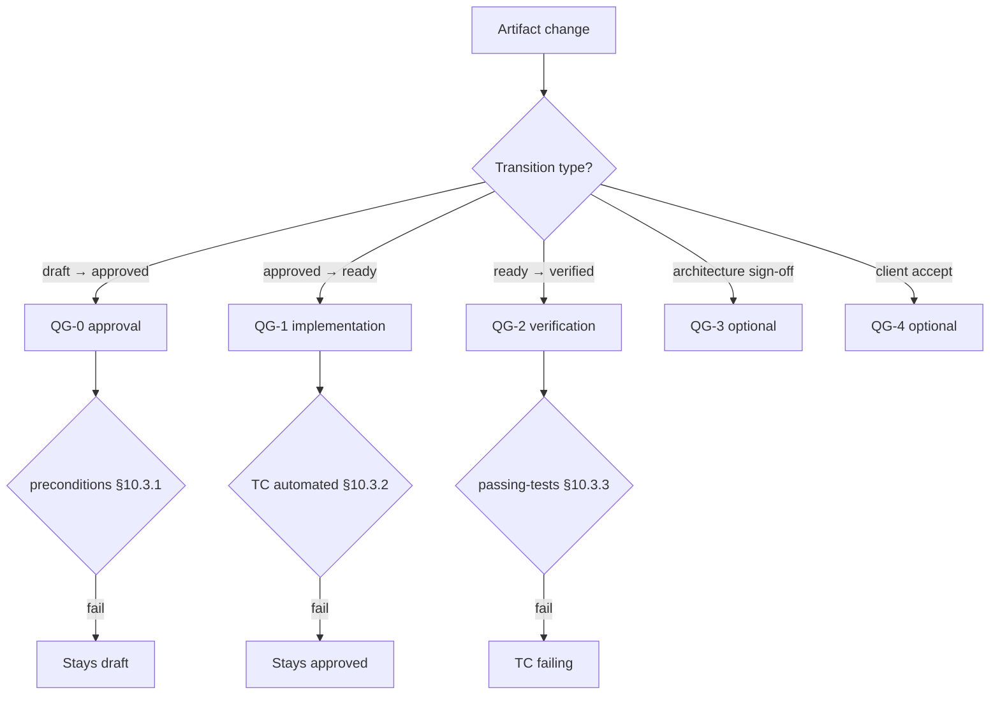

# 10. Lifecycle and Quality Gates

> **Dense chapter:** read after [§6](06-requirements-hierarchy.md)–[§9](09-test-cases.md); passing the QGs — [guide/00](../../guide/en/00-quickstart.md); density — [reference/09](../../reference/en/09-pedagogical-density.md).

## 10.1 How artifacts move: statuses and gates

A RENAR artifact — a requirement, a specification, an ADAPT, a test — does not sit still. It moves through states: `draft → approved → verified → …`. And it cannot move arbitrarily: every transition is guarded by a **Quality Gate** — a condition that MUST be satisfied, or the transition does not happen. A requirement does not become `verified` until all of its tests have gone green on the current version; an ADAPT does not become `approved` without two signatures. A gate is not a "success checkmark" but a check that is entitled to say "no" and leave the artifact where it is.

This chapter brings together the state machines of all artifacts and normalizes the gates: what is checked before each transition, who MUST check it and when. The chapter fixes **only** states, transitions, and gates; artifact frontmatter is defined by chapters 6–09.

### 10.1.1 Decision tree: which gate now (informative)



---

## 10.2 Normative definition of a Quality Gate

### 10.2.1 Quality Gate

**Quality Gate (gate)** is a normative condition whose check MUST be performed for a permitted transition of an artifact from one lifecycle state to another. Each gate consists of:

1. **Identifier** — `QG-N` or `QG-<artifact>-<state>` (closed list §10.3, §10.4).
2. **Precondition** — a set of checkable assertions about the artifact and related artifacts that MUST be true at the moment the gate is triggered.
3. **Postcondition** — the state the artifact transitions into after a successful gate pass, and the observable effects (for example, the appearance of a record in the transition log §10.13).
4. **Trigger** — who or what initiates the gate check (participant: AI agent / Architect / automated runner; event: approval / run completion / arrival of a delta-TZ).
5. **Control point** — the place in the substrate where the check MUST be automated (§10.11).

A gate is not a success event — it is a condition that **MUST be checked**. A gate pass MAY be negative (the precondition is not satisfied) — in that case the transition is prohibited and the artifact stays in its current state.

### 10.2.2 Who MUST check a gate

| Gate type | Required participant | Substrate enforcement |
|---|---|---|
| Approval (QG-0) | Architect or authorized role-holder on the substrate | Atomic recording of authorship and time (V6, [§3.3.6](03-substrate-versioning.md#3.3.6)) |
| Implementation (QG-1) | Automated runner (CI, eval-runner) | Atomic recording of the run result pinned to the artifact version (V5, [§3.3.5](03-substrate-versioning.md#3.3.5)) |
| Verification (QG-2) | Automated runner with `version-pin` confirmation | V5 + V6 |
| Architecture (QG-3, optional) | Dual signature (client + Architect) | V3 + V6 |
| Acceptance (QG-4, optional) | Stakeholder with authority | V6 |

### 10.2.3 Relationship to SENAR

SENAR §8 describes Quality Gates as an abstract concept for AI-driven development. RENAR **extends** SENAR in the requirements-engineering domain:

- It keeps the identifiers QG-0 / QG-1 / QG-2 as mandatory.
- It normalizes **formal state machines** for each artifact type (SENAR does not do this).
- It binds every transition in a state machine to a concrete gate with preconditions and postconditions.
- It adds optional QG-3 / QG-4 for industries with extended audit requirements.

RENAR does not contradict SENAR; an implementation is SENAR-compatible with RENAR if the requirements of §10.3 + §10.11 are met.

---

## 10.3 Canonical RENAR gates (mandatory)

A closed list of three mandatory gates. Extensions outside this list are only the optional ones in §10.4 or through the formal standard change procedure §10.10.

### 10.3.1 QG-0 — approval gate

**Purpose**: permits an artifact to transition from draft into a state approved for development.

**Precondition** (common part, supplemented per-artifact in §10.5–§10.9):

- The artifact frontmatter is valid against the schema of its chapter.
- The artifact identifier is unique in the substrate (V1, [§3.3.1](03-substrate-versioning.md#3.3.1)).
- An adversarial review has been performed; or its non-applicability is explicitly recorded — permitted **only** for trivial artifacts (by the criteria declared in the conformance manifest, [§13](13-conformance.md)) with the reason recorded in the transition log (§10.13).
- If the artifact references a source (`source.adapt` for BR/SR/SPEC, `verifies[]` for TC) — the referenced artifact exists in the substrate in a state no lower than `approved`.

**Postcondition**:

- The artifact transitions into `approved` (for requirements / SPEC) or `ready` (for TC) or `approved` ADAPT (§10.8).
- A record in the transition log (§10.13).
- For requirements / SPEC: decomposition into child artifacts is permitted (for BR — SR; for SR — TR + SPEC via `constrained-by` / `implements-spec`).

**Trigger**: explicit approval by the Architect / role-holder through the substrate's native mechanism (V3 diff & review, [§3.3.3](03-substrate-versioning.md#3.3.3)).

**Applicable artifacts**: BR, SR, TR, SPEC, ADAPT, TC.

### 10.3.2 QG-1 — implementation gate (TC only)

**Purpose**: confirms that a valid implementation exists for the artifact — code, configuration, an infrastructure artifact — suitable for verification.

**Precondition**:

- The implementation is pinned to the artifact version via `version-pin` (V5, [§3.3.5](03-substrate-versioning.md#3.3.5)).
- `automation.status: automated` (with a valid `automation.location`) or `automation.status: manual-pending` (with `manual-pending-until` set and `manual-pending-reason`).
- All static checks of the implementation by the substrate agent (types, lint, schema) — passed.
- Pos/neg pairing for the artifact's covered assertions is ensured ([chapter 9 §9.7](09-test-cases.md#9.7)).
- All mandatory body sections of the TC ([chapter 9 §9.4](09-test-cases.md#9.4)) are filled in.

**Postcondition**:

- The TC transitions into `ready`.
- A record in the transition log.

**Trigger**: the approving participant (one-click promote `draft → ready`) upon the automated runner's confirmation of a passing dry-run.

**Applicable artifacts**: TC (`draft → ready`).

**Note**: TR does not pass a separate QG-1 gate. The implementation-validity conditions (impl scope, version-pin, static checks) for TR are part of the QG-2 preconditions ([§10.6.2](#10.6.2)). **QG-1 applies only to TC.** For BR / SR / SPEC the `approved → verified` transition is governed by a single QG-2; there is no intermediate QG-1 implementation gate for requirements and SPEC.

### 10.3.3 QG-2 — verification gate

**Purpose**: confirms that the system's observed behavior conforms to the artifact: all TCs in the artifact's `verified-by` are in state `passing` on the artifact's current version.

**Precondition**:

- For BR / SR / SPEC: all TCs in `verified-by` have `last-run.result = pass`, and `last-run.requirement-version` (or the equivalent `spec-version` / `version`) matches the current `version` of the verified artifact.
- Pos/neg pairing on the artifact's normative assertions — satisfied.
- All mandatory spec-specific TC kinds for the artifact type are present ([chapter 9 §9.8](09-test-cases.md#9.8)).
- For TR: all its AC are verified by bound TCs (`last-run.result = pass`).
- Spec-specific additional preconditions:
  - SPEC-UI / SPEC-AI: TC in state `passing` with `judge-isolation` observed ([chapter 9 §9.13.4](09-test-cases.md#9.13.4)).
  - SPEC-SEC: a TC `tc-type: security` is present and `passing`.

**Postcondition**:

- The artifact transitions into `verified`.
- A record in the transition log with evidence-refs (a list of run IDs).
- The substrate MUST record the `version` of the verified artifact in the evidence record (V5).

**Trigger**: the automated runner confirms passing TCs and initiates the promote-transition on the author's request (one-click promote `approved → verified`).

**Applicable artifacts**: BR, SR, SPEC, TR.

---

## 10.4 Optional gates

QG-3 and QG-4 are normatively described but **not mandatory** for conformance ([chapter 13](13-conformance.md)). An implementation MAY declare in the conformance manifest either support for QG-3 / QG-4 or their absence. Conformance without QG-3 / QG-4 remains valid.

### 10.4.1 QG-3 — architecture gate (optional)

**Purpose**: permits an ADAPT to transition from `answered` to `approved` (§10.8). Also applicable to SPEC-ARCH decomposition decisions in projects with regulated architectural acceptance.

**Precondition**:

- All backward findings in the ADAPT are in status `resolved` ([chapter 7 §7.4.5](07-adapt.md#7.4.5)).
- The dual signature is ready: client signature + Architect signature ([chapter 7 §7.5](07-adapt.md#7.5)).
- For SPEC-ARCH (if QG-3 is applied): the decomposition decision is recorded in the substrate as an ADR-like artifact with a reference from the SPEC-ARCH (the ADR form is substrate-specific — fits in guide/).

**Postcondition**:

- The ADAPT transitions into `approved` (immutable, on a par with the TZ).
- A record in the transition log with both signatures (V6 author + timestamp records both participants).

**Trigger**: explicit dual approval; the substrate MUST atomically record both signatures (V2 atomic change unit, [§3.3.2](03-substrate-versioning.md#3.3.2)).

**When to apply**:

- ADAPT — always (but an implementation MAY declare QG-3 as a local alias for ADAPT approval, without carving it out as a separate gate).
- SPEC-ARCH — in projects with regulatory requirements for architectural acceptance.

### 10.4.2 QG-4 — acceptance gate (optional)

**Purpose**: records the client's acceptance of the business outcome after release. The transition of a BR from `verified` to `accepted`.

**Precondition**:

- BR in `verified` (QG-2 passed).
- The measurable business outcome (`business-outcome` in the BR frontmatter) — measured; `current-value` recorded.
- `achievement` ≥ the project-configurable threshold (80% by default, fixed in the conformance manifest).
- A formal Stakeholder signature.

**Postcondition**:

- The BR transitions into `accepted` (a terminal non-degradable status — a reverse transition requires a delta-TZ).
- A record in the transition log with the Stakeholder signature.

**Trigger**: formal acceptance by the Stakeholder upon release.

**When to apply**:

- Projects with explicit recording of post-release outcomes (product SaaS, regulated industries).
- In the absence of QG-4 — the `accepted` status is not used; the BR stays in `verified` until `deprecated`.

### 10.4.3 Conformance with optional gates

The conformance manifest ([chapter 13](13-conformance.md)) MUST explicitly declare:

```yaml
quality-gates:
  qg-0: required          # always required
  qg-1: required
  qg-2: required
  qg-3: declared          # required | declared | absent
  qg-4: declared
```

`declared` means: the implementation supports the gate; artifacts MAY pass it, but conformance does not require passing it for all artifacts. `absent` — the gate is not applied in the implementation; the artifact's terminal state is `verified` (without `accepted`).

---

## 10.5 BR / SR state machine

### 10.5.1 States and transitions

```text
draft  ──[QG-0]──▶  approved  ──[QG-2]──▶  verified  ──[QG-4 (optional)]──▶  accepted
  │                     │                      │                                    │
  │                     │                      │                                    │
  └──────────┬──────────┴──────────────────────┴──────────[deprecation]─────────────┘
             ▼
        deprecated  (terminal; with `replaced-by` if there is a replacement)
```

| Status | Semantics | Transition gate |
|---|---|---|
| `draft` | Created by an AI agent or the Architect; not yet approved | — (creation) |
| `approved` | Approved for decomposition / implementation | QG-0 (§10.3.1) |
| `verified` | All derived TCs `passing` on the current version | QG-2 (§10.3.3) |
| `accepted` | Post-release business outcome confirmed | QG-4 (§10.4.2, optional) |
| `deprecated` | Terminal; not deleted (V1 immutable history) | Deprecation transition (§10.5.3) |

BR / SR frontmatter (including the mandatory status fields) is defined in [chapter 6 §6.5.2 / §6.6.2](06-requirements-hierarchy.md#6.5.2). This section normalizes **only** the transitions between states and the binding to gates.

### 10.5.2 Per-transition preconditions

| Transition | Gate | Additional preconditions (on top of §10.3) |
|---|---|---|
| `draft → approved` | QG-0 | BR: `business-outcome` filled in. SR: the `parent` BR in a state no lower than `approved`. If the SR references a SPEC via `constrained-by[]` — all SPECs in `approved` or higher. |
| `approved → verified` | QG-2 | At least one TC with `negative: true` in `verified-by`. All `last-run.requirement-version` match the current `version`. |
| `verified → accepted` | QG-4 | Only if the implementation declared QG-4. |
| `* → deprecated` | Deprecation transition (§10.5.3) | See §10.5.3 |

### 10.5.3 Deprecation transition

**Precondition**:

- The artifact is in any non-`deprecated` state.
- `replaced-by` (if specified) exists in the substrate and is in a state no lower than `approved`.
- There are no active child TRs in state `approved` and no active implementer tasks on this artifact (atomic re-pointing of tasks to the replacement is a mandatory condition, V2 atomic change unit).

**Postcondition**:

- `status: deprecated`.
- `deprecated-date` recorded (V6).
- `replaced-by` specified, if there is a replacement.

**Trigger**: the Architect or the Product Owner.

### 10.5.4 Reverse evolution of verification

If an artifact is already `verified` but its `version` has been incremented (for example, after applying a delta-ADAPT, [chapter 7 §7.6](07-adapt.md#7.6)) — the status MUST revert to `approved` before re-passing QG-2 on the new version. This transition is mandatory and automatic: the substrate MUST invalidate `verified` upon a change of `version` ([chapter 6 §6.5.4 reverse evolution](06-requirements-hierarchy.md#6.5.4)).

---

## 10.6 TR state machine

### 10.6.1 States and transitions

```text
draft  ──[QG-0]──▶  approved  ──[QG-2 (per TR)]──▶  done
  │                     │                            │
  │                     │                            │
  └─────────────────────┴───[deprecation]───────────▶ obsolete
```

| Status | Semantics | Gate |
|---|---|---|
| `draft` | TR created; AC not yet finalized | — |
| `approved` | AC approved; implementer work may start | QG-0 (§10.3.1) with the TR preconditions from §10.6.2 |
| `done` | AC verified; all bound TCs `passing` | QG-2 (§10.3.3) with the TR preconditions from §10.6.2 |
| `obsolete` | TR has lost relevance before completion (the parent SR changed) | Deprecation (Architect) |

### 10.6.2 Preconditions for TR

**QG-0 for TR (`draft → approved`)** — in addition to the common part:

- A goal is stated (`goal`).
- AC are verifiable and independent (each AC is a separate check).
- At least one negative scenario is present.
- A reference to the parent SR (or BR for simple configurations) is established via `implements`.
- If the TR implements a SPEC — the mandatory field `implements-spec[]` ([chapter 8 §8.6.2](08-specifications.md#8.6.2)).
- If the task touches security — `threat-surface` is declared ([chapter 8 §8.5.8](08-specifications.md#8.5.8)).

**QG-2 for TR (`approved → done`)**:

- All TR AC are confirmed by the passing of corresponding TCs (`last-run.result = pass`).
- Pos/neg pairing for each AC.
- For a TR implementing a SPEC: a TC of the corresponding spec-specific kind exists and is `passing` ([chapter 9 §9.8](09-test-cases.md#9.8)).

### 10.6.3 TR deprecation

If the parent SR transitions into `deprecated` or its `version` has changed such that the TR's AC are no longer relevant — the TR transitions into `obsolete`. This is **not** degradation — it is an alternative terminal path. A TR in `obsolete` is not deleted.

---

## 10.7 SPEC state machine

### 10.7.1 States and transitions

```text
draft  ──[review-transition]──▶  review  ──[QG-0]──▶  approved  ──[QG-2]──▶  verified
                                                          │                       │
                                                          └───[deprecation]──▶ obsolete  (terminal)
```

| Status | Semantics | Gate |
|---|---|---|
| `draft` | SPEC created; mandatory frontmatter fields being filled in | — |
| `review` | Mandatory body sections ([§8.4.1](08-specifications.md#8.4.1)) and type-specific ones ([§8.5](08-specifications.md#8.5)) present; ready for review | Review-transition (§10.7.2) |
| `approved` | Architect confirmed; `depends-on[]` consistent | QG-0 |
| `verified` | All mandatory spec-specific TCs `passing` | QG-2 |
| `obsolete` | Replaced or no longer relevant; `replaced-by` mandatory | Deprecation (§10.5.3 mutatis mutandis) |

### 10.7.2 Review-transition (`draft → review`)

The review-transition is not a full-fledged gate in the sense of §10.2.1 — it is an automatic check of structural completeness. **Precondition**:

- All mandatory frontmatter fields [§8.4](08-specifications.md#8.4) are filled in.
- All mandatory body sections [§8.4.1](08-specifications.md#8.4.1) are present.
- Type-specific sections [§8.5](08-specifications.md#8.5) are present for the corresponding `spec-type`.

**Postcondition**: `status: review`; the artifact is visible to the Architect for review.

If the review-transition is not passed — the artifact stays in `draft`; the substrate MUST return the list of missing sections (V3 diff & review supports structural feedback).

### 10.7.3 Preconditions for SPEC

**QG-0 for SPEC (`review → approved`)** — in addition to the common part §10.3.1:

- The `depends-on[]` graph is acyclic ([chapter 8 §8.6.3](08-specifications.md#8.6.3)).
- All SPECs in `depends-on[]` are in a state no lower than `approved`.
- If the SPEC references an ADAPT via `source.adapt` — the ADAPT is in state `approved`.

**QG-2 for SPEC (`approved → verified`)**:

- All mandatory spec-specific TC kinds for the `spec-type` are present and `passing` ([chapter 9 §9.8](09-test-cases.md#9.8)).
- For SPEC-AI: pos/neg pair coverage over `evaluation-criteria` = 100%; judge-isolation observed.
- For SPEC-SEC: `tc-type: security` is present.
- For SPEC-DATA: `tc-type: contract` is present for published interface fields.

---

## 10.8 ADAPT state machine

### 10.8.1 Macro-states

```text
draft  ──[review-transition]──▶  review  ──[backward-ready]──▶  client-ready
                                                                       │
                                                                       │ [client returns answers]
                                                                       ▼
                                                                  answered
                                                                       │
                                                                       │ [QG-3]
                                                                       ▼
                                                                  approved
                                                                       │
                                                                       │ [immutable; only delta-ADAPT / errata / supersession]
                                                                       ▼
                                                                  frozen ──[supersession: §10.8.5]──▶ superseded
                                                                                                        (terminal)
```

The ADAPT states (`draft → review → client-ready → answered → approved → frozen`, and the terminal `superseded` upon supersession) are defined in [chapter 7 §7.4](07-adapt.md#7.4) and [§7.6.4](07-adapt.md#7.6). This section normalizes the gates.

| Transition | Gate | Precondition |
|---|---|---|
| `draft → review` | Review-transition | The Forward interpretation covers all TZ sections; the primary backward findings are recorded in `open` |
| `review → client-ready` | Backward-ready | All backward findings moved to `asked-to-client`; the question package is formed |
| `client-ready → answered` | Client-return | All backward findings in `answered` with author + timestamp of the client's answer (V6) |
| `answered → approved` | **QG-3** (§10.4.1) | All backward findings in `resolved`; the dual signature is ready |
| `approved → frozen` | Freeze-transition | Automatic after approve; the ADAPT is immutable; generation of BR / SR / SPEC with `source.adapt = approved` is permitted |
| `frozen → superseded` | **QG-3 of the superseding ADAPT** (§10.8.5) | The superseding ADAPT (`supersedes: ADAPT-MMM`) has reached `approved`; derived BR / SR / SPEC are re-pointed or re-derived |

### 10.8.2 Nested state machine for a backward-finding record

Each backward-finding record inside an ADAPT has its own subordinate state machine ([chapter 7 §7.4.5](07-adapt.md#7.4.5)):

```text
open  ──▶  asked-to-client  ──▶  answered  ──▶  resolved  ──[approve ADAPT]──▶  frozen
                  ▲                  │
                  └──── revised ─────┘  (if the answer requires clarification)
```

| Sub-state | Semantics |
|---|---|
| `open` | Recorded by the Engineer; not sent to the client |
| `asked-to-client` | Sent to the client; the question date is recorded |
| `answered` | The client answered; the answer recorded (V6 author + timestamp) |
| `resolved` | The Engineer integrated the answer into the Forward interpretation |
| `revised` | The answer is vague; a repeat question (return to `asked-to-client`) |
| `frozen` | After ADAPT approval; changes are impossible |

**Normative rule**: QG-3 (approve ADAPT) is **prohibited** if at least one backward-finding record is in `open` / `asked-to-client` / `answered` / `revised`. All such records MUST be in `resolved` ([chapter 7 §7.4.5](07-adapt.md#7.4.5)).

### 10.8.3 QG-3 for ADAPT — detailed

**Precondition** (full):

- All Forward-interpretation sections are filled in (the forward-complete criterion).
- All backward-finding records in `resolved`.
- The client signature obtained and recorded by the substrate's native mechanism (V3 + V6).
- The Architect signature obtained and recorded.
- If the ADAPT is a delta-ADAPT: the parent-ADAPT in `frozen` ([chapter 7 §7.6](07-adapt.md#7.6)).

**Postcondition**:

- The ADAPT transitions into `approved`.
- A record in the transition log with both signatures.
- The substrate MUST atomically (V2) record both signatures: a partial signature (client only / Architect only) does **not** transition the ADAPT into `approved`.

**Trigger**: explicit approval by both participants.

### 10.8.4 Errata for a frozen ADAPT

`frozen` is a terminal state along the derivation line. Changes are possible only by adding a new artifact via one of three paths:

1. **Delta-ADAPT** (if the TZ contains an ambiguity discovered late) — a new artifact with an explicit `parent-adapt` link.
2. **Errata-ADAPT** (if there is an interpretation error by the engineer) — a separate artifact with the client signature (if the contractual outcome changes) or the Architect's alone (if cosmetic).
3. **Supersession** (if the prior decision was correct but later refuted) — a superseding ADAPT transitions the superseded one into `superseded` (§10.8.5, [chapter 7 §7.6.4](07-adapt.md#7.6)).

In all three cases the frozen ADAPT is **not edited**. This is a V1 requirement (immutable history) for contractual artifacts ([chapter 7 §7.6.3](07-adapt.md#7.6.3)).

### 10.8.5 The frozen → superseded transition (supersession)

Supersession of an approved/frozen ADAPT is normalized in [chapter 7 §7.6.4](07-adapt.md#7.6). The lifecycle transition:

```text
frozen ──[superseding ADAPT reached approved via QG-3]──▶ superseded (terminal, immutable)
```

**No separate QG is introduced.** Supersession goes through the same **QG-3** (dual signature, §10.8.3) as an ordinary ADAPT — no additional control point is created.

**Precondition** of the `ADAPT-MMM → superseded` transition:

- A superseding `ADAPT-NNN` has been created with the field `supersedes: ADAPT-MMM` and a non-empty `supersession-rationale` ([chapter 7 §7.6.4](07-adapt.md#7.6)).
- The superseding ADAPT has passed QG-3 and reached `approved`. If the superseded decision had a contractual outcome (the typical case) — the dual signature MUST include the client signature; the Architect signature alone is permitted only for a strictly cosmetic correction without a contractual outcome.
- All derived `BR` / `SR` / `SPEC` with `source.adapt: ADAPT-MMM` are re-pointed to the superseding ADAPT or re-derived (no dangling references).

**Postcondition**:

- `ADAPT-MMM` transitions into the terminal **`superseded`** — distinct from `obsolete` and from `frozen`; immutable and **retained** for audit (V1), not deleted.
- The field `superseded-by: ADAPT-NNN` on `ADAPT-MMM` is recorded automatically.
- A record in the transition log with the signatures of the superseding ADAPT (V6).

**Trigger**: approval of the superseding ADAPT via QG-3.

**Hook obligation**: after the transition, a dangling `source.adapt` reference to an ADAPT in status `superseded` is **fatal**; enforcement — the `adapt-supersession` validation (§10.11.1), the `check-adapt-supersession.js` gate.

---

## 10.9 TC state machine

### 10.9.1 States and transitions

```text
draft  ──[QG-0]──▶  ready  ──[runner pass]──▶  passing
                      │                            │
                      │   [runner fail]            │ [criteria change |
                      └─────────────────────▶ failing      delta invalidation]
                                                   │            │
                                                   ▼            ▼
                                                obsolete  ◀─────┘  (terminal)
```

| Status | Semantics | Gate / trigger |
|---|---|---|
| `draft` | TC created; implementation in progress | — |
| `ready` | dry-run runner passed; pos/neg pairing confirmed | QG-0 (§10.3.1) with the TC preconditions from §10.9.2 |
| `passing` | `last-run.result = pass` on the current `requirement-version` | runner pass; bot-managed |
| `failing` | `last-run.result = fail` | runner fail; bot-managed |
| `obsolete` | The covered behavior no longer exists | Deprecation (§10.9.4) |

TC frontmatter and pos/neg pairing are defined in [chapter 9](09-test-cases.md).

### 10.9.2 Preconditions for TC

**QG-0 for TC (`draft → ready`)** — in addition to the common part:

- `automation.status: automated` (with a valid `automation.location`) OR `automation.status: manual-pending` (with `manual-pending-until` ≤ +1 sprint and a filled-in `manual-pending-reason`).
- Pos/neg pairing over the covered assertions confirmed ([§9.7](09-test-cases.md#9.7)).
- The dry-run runner passed (structural validity only; not to be confused with a production run).
- All mandatory body sections of the TC ([§9.4](09-test-cases.md#9.4)) are filled in.
- The citation in `verifies[]` — the artifact exists in the substrate in a state no lower than `approved`.

**Postcondition**:

- `status: ready`.
- The runner is permitted to do a production run.

### 10.9.3 Runner-managed transitions (not Quality Gates)

`ready → passing`, `ready → failing`, `passing → failing`, `failing → passing` — transitions that happen **only** upon a runner run ([chapter 9 §9.12 `last-run` bot-managed](09-test-cases.md#9.12)). These transitions are **not** Quality Gates in the sense of §10.2.1: they are normative consequences of run results, not the passing of a gate with preconditions and postconditions. In particular, the check that `last-run.requirement-version` matches the current version of the verified artifact (see [§9.10](09-test-cases.md#9.10)) is a runner-managed consistency check, not a separate gate.

**Postcondition of each runner transition**:

- `last-run` updated: `result`, `timestamp`, `requirement-version`, `evidence-refs`.
- The substrate MUST prohibit manual modification of `last-run` (runner-actor only).

### 10.9.4 TC deprecation

A TC transitions into `obsolete` if:

1. An artifact in `verifies[]` transitions into `deprecated` / `obsolete`.
2. A delta-TZ invalidates the test behavior ([chapter 9 §9.16](09-test-cases.md#9.16)).

**Postcondition**: `status: obsolete`. The TC is not deleted (V1 immutable history).

### 10.9.5 Change-of-criteria — a separate normative path

Changing `## Pass criterion` or `## Fail criterion` in a TC is **not an ordinary transition**; it is a special path that requires a separate approval workflow ([chapter 9 §9.13](09-test-cases.md#9.13)). Enforcement details — §10.11.3.

---

## 10.10 Closed-list policy

### 10.10.1 Normative rule

The closed list of RENAR Quality Gates is the mandatory {QG-0, QG-1, QG-2} and the optional {QG-3, QG-4}. Changing the list is possible **only** through the formal RENAR Standard change procedure ([chapter 13](13-conformance.md)).

This policy is a specialization of [§1.7](01-scope.md#1.7) Closed-list policy for Quality Gates; the general rule for all RENAR closed lists and the master index — [§1.7.5](01-scope.md#1.7.5).

### 10.10.2 What is prohibited

| Action | Prohibited? | Why |
|---|---|---|
| Locally creating a new gate type `QG-N` at the project level | Prohibited | Violates the closed list; makes conformance non-portable |
| Locally overriding the preconditions of a canonical gate | Prohibited | Makes conformance incomparable across implementations |
| Additionally tightening the preconditions of a local gate | Permitted | The conformance manifest MAY declare stricter thresholds (for example, `qg-2.required-negative-tc: true`) |
| Locally weakening the preconditions of a canonical gate | Prohibited | Violates the standard's contract |
| Declaring QG-3 / QG-4 as `absent` in the conformance manifest | Permitted | Optional gates — §10.4 |
| Declaring QG-0 / QG-1 / QG-2 as `absent` | Prohibited | Violates conformance §10.4.3 |

### 10.10.3 Extending the list

Adding a new gate type is possible through:

1. A standard change request with a rationale — a research draft with a typology and a comparison with the canonical gates.
2. Public review (the period and forum are fixed by the standard policy, [chapter 13](13-conformance.md)).
3. Inclusion in the next minor version of the standard (`v1.X` or `v2.0`).

Project-local extensions remain outside conformance — they are permitted as internal practices but do **not** affect the conformance manifest.

---

## 10.11 Substrate-independent enforcement

### 10.11.1 Normative requirements

A substrate implementing RENAR MUST ensure an automatic check of gate preconditions at the following points:

| Control point | What MUST be checked | Relies on capabilities |
|---|---|---|
| **Promote-transition** (any transition to a higher status) | The preconditions of the corresponding gate (§10.3, §10.4, §10.5–§10.9) | V3 (diff & review) to block the transition until approve; V4 (branching) to separate WIP from the approved truth |
| **Approve-transition** (any approval action) | Authorship recorded (actor) and timestamp | V6 (author + timestamp) |
| **Reference-validation** (any creation/change of an artifact with a reference to another) | The referenced artifact exists and is in the required state | V1 (immutable history) for a stable identifier; V5 (version pin) for cross-substrate references |
| **Change-of-criteria for TC** (§10.11.3) | A separate approval process is applied | V3 + V6 |
| **Runner-transitions for TC** (`ready → passing`/`failing`) | Only the runner-actor may write `last-run` | V6 (authorship); the substrate's native ACL or role-based restrictions |
| **Lifecycle invalidation** (artifact `verified`, version incremented) | The artifact is automatically reverted to `approved` | V5 (version pin) for detection |
| **`implements`-edge validation** (subsystem BR referencing a system BR, [§6.5.2](06-requirements-hierarchy.md#6.5.2), [§6.8.2](06-requirements-hierarchy.md#6.8.2)) | (1) the target BR exists by `id + scope.system`; (2) the target in `approved`+ at the approval of this BR (a `deprecated` target — warning, not fatal; cascade-warning over `implemented-by[]`); (3) the `implements` chain forms no cycles; (4) `implements[]` is absent when `level: system` | V1 (stable identifier for target lookup); V3 (block approve until validation passes); V5 (cross-substrate ID resolution when the target is in another substrate) |
| **`adapt-applicability` validation** ([§7.4.1](07-adapt.md#7.4.1)) | (1) For each TZ, an adversarial-review verdict is recorded (V6 author + timestamp). (2) If the verdict is "findings present" — a corresponding ADAPT MUST exist in `approved`+ with a dual signature; the BR/SR/SPEC derivatives have `source.adapt`. (3) If the verdict is "no findings, no clarifications" — no ADAPT, and the BR/SR/SPEC have `source.tz-section` + `source.adversarial-review-ref` evidence. (4) No mixing: artifacts with `source.adapt` omitted without verdict evidence — fatal. | V3 (block approve until validation passes); V6 (verdict + signature attribution); V1 (verdict as immutable evidence) |
| **`adapt-supersession` validation** ([§7.6.4](07-adapt.md#7.6), §10.8.5) | (1) `supersedes: ADAPT-MMM` references an existing ADAPT; the back-reference `superseded-by` is symmetric. (2) `supersession-rationale` is non-empty and references a concrete contradicting `BR` / `SR` / `SPEC`. (3) When the superseded decision has a contractual outcome — the superseding ADAPT has the client signature. (4) A dangling `source.adapt` reference to an ADAPT in status `superseded` — **fatal**. | V1 (stable identifier + immutable superseded history); V3 (block approve until validation passes); V6 (signature attribution) |

### 10.11.2 A substrate without V3 / V4 / V6 is non-conformant

A substrate that does not provide V3 (diff & review) cannot implement gates: there is no way to separate a "proposed change" from the "approved truth" ([chapter 3 §3.3.3](03-substrate-versioning.md#3.3.3)). The same holds for V4 (branching, [§3.3.4](03-substrate-versioning.md#3.3.4)) and V6 (author + timestamp, [§3.3.6](03-substrate-versioning.md#3.3.6)) — without them the approval mechanics are impossible. A substrate that does not satisfy V3 / V4 / V6 **does not implement RENAR** regardless of other properties.

### 10.11.3 Change-of-criteria for TC — special enforcement

Changing the Pass / Fail criterion of a TC is a high-risk operation (protection against test-fitting, [chapter 9 §9.13](09-test-cases.md#9.13)). The substrate MUST:

1. **Detect**: any change to the `## Pass criterion` / `## Fail criterion` sections in a TC artifact.
2. **Forcibly isolate**: a change-of-criteria MUST be a separate change-set (V4 atomic change unit), marked with a flag distinguishing it from ordinary edits (the substrate's native mechanism — a special case of V3 diff & review; the form of the flag is substrate-specific, deferred to guide/).
3. **Prohibit combining**: the same person MUST NOT approve both a change-of-criteria and the approval of a code fix that is tested by this same TC. The substrate MUST check this rule at the approve-transition.
4. **Register**: a change-of-criteria is recorded in the audit trail (§10.13) with explicit event typing.

### 10.11.4 Forms of substrate-native implementation

The concrete substrate-native mechanisms (how exactly a hook is implemented in a given substrate) are deferred to `guide/` and the conformance manifest. The standard does not normalize the **form** of a hook (this is a substrate-specific decision). The standard normalizes **what a hook MUST check and at which point**.

The `guide/` section MUST contain, for each supported substrate:

- A mapping of the enforcement points of §10.11.1 onto the substrate-native mechanisms.
- Example implementations.
- The known limitations of the substrate regarding the automation of each check.

---

## 10.12 Prohibited transitions

A closed list of transitions that violate the lifecycle. The substrate MUST block them.

| From | To | Artifact | Why prohibited |
|---|---|---|---|
| `draft` | `verified` | BR / SR / SPEC | Skips QG-0; no approval evidence |
| `draft` | `accepted` | BR | Same; and skips QG-2 |
| `draft` | `done` | TR | Skips QG-0 |
| `draft` | `passing` | TC | Skips QG-0 (no dry-run runner) |
| `obsolete` | * | Any | Terminal status; "resurrection" is prohibited — a new artifact with `supersedes` is needed |
| `deprecated` | * | Any | Same |
| `frozen` | * | ADAPT | Same; changes only through a delta-ADAPT or errata (§10.8.4) |
| `verified` | `draft` | BR / SR / SPEC | Degradation across several steps — potential loss of trace; if rework is needed — `verified → approved` via delta or reverse evolution §10.5.4 |
| `accepted` | `verified` | BR | Degradation after acceptance — impermissible without a delta-TZ |
| `accepted` | `approved` | BR | Same |
| `passing` | `draft` | TC | Degradation loses run history; use `passing → failing → obsolete` or the change-of-criteria path |
| `ready` | `draft` | TC | Degradation loses dry-run evidence (§10.9.2); weakening a TC via `[test-spec-change]` ([chapter 9 §9.13](09-test-cases.md#9.13)) — is not a path back to `draft` |
| `failing` | `draft` | TC | Degradation loses runner history; re-diagnosis is via a new run (`failing → passing` runner-managed) or `obsolete` |

### 10.12.1 Substrate reaction

On an attempt at a prohibited transition the substrate MUST:

1. Block the transition (V3 diff & review).
2. Return to the calling participant an error code indicating the concrete violated rule (by the row identifier of this table).
3. Not create a record in the transition log (§10.13).

---

## 10.13 Logging of gate-pass events

### 10.13.1 Normative requirement

Every successful gate pass (of any type: QG-0, QG-1, QG-2, QG-3, QG-4, runner-transition, deprecation, freeze-transition) MUST be recorded in the substrate as an immutable event with the following fields:

| Field | Semantics | Obligation |
|---|---|---|
| `timestamp` | UTC ISO-8601 moment of the successful pass | Mandatory |
| `artifact-id` | Artifact identifier (immutable, V1) | Mandatory |
| `artifact-type` | `BR` / `SR` / `TR` / `SPEC-<type>` / `ADAPT` / `TC` | Mandatory |
| `artifact-version` | Artifact version at the moment of the transition (V5) | Mandatory |
| `from-status` | Source state | Mandatory |
| `to-status` | Target state | Mandatory |
| `gate-id` | `QG-0` / `QG-1` / `QG-2` / `QG-3` / `QG-4` / `deprecation` / `freeze` / `runner-pass` / `runner-fail` / `change-of-criteria` | Mandatory |
| `actor` | Initiator identifier (V6); for a dual signature — a list of participants | Mandatory |
| `evidence-refs` | References to evidence: runner run IDs, adversarial-review artifact IDs, signature IDs | Mandatory for QG-2 / QG-3 / QG-4 |
| `notes` | Free text | Optional |

### 10.13.2 Substrate-independent format

The event-storage format is substrate-specific (a separate log stream / append-only collection / other forms). The standard normalizes only the mandatory fields of §10.13.1, not their serialization.

The conformance manifest MUST specify the event-storage mechanism and the export format (for audit, [chapter 13](13-conformance.md)).

### 10.13.3 Retention

Events are **not deleted** throughout the entire artifact lifecycle and after its transition into `deprecated` / `obsolete` / `frozen`. This is required by V1 (immutable history) and the normative compliance clauses ([chapter 13](13-conformance.md)).

---

## 10.14 Relationship to other chapters

| Chapter | Relationship |
|---|---|
| [02](02-methodology-positioning.md) | SENAR QG-0..QG-2 — the conceptual basis; RENAR extends it (§10.2.3) |
| [06](06-requirements-hierarchy.md) | frontmatter and body of BR / SR / TR ([§6.5](06-requirements-hierarchy.md#6.5)–[§6.7](06-requirements-hierarchy.md#6.7)); the state machines are detailed here (§10.5–§10.6) |
| [07](07-adapt.md) | ADAPT frontmatter ([§7.8](07-adapt.md#7.8)); backward sub-states ([§7.4.5](07-adapt.md#7.4.5)); dual signature ([§7.5](07-adapt.md#7.5)); delta-ADAPT ([§7.6](07-adapt.md#7.6)) — the state machine is here (§10.8) |
| [08](08-specifications.md) | SPEC frontmatter ([§8.4](08-specifications.md#8.4)); type-specific QG ([§8.8](08-specifications.md#8.8)); the state machine is here (§10.7) |
| [09](09-test-cases.md) | TC frontmatter ([§9.3](09-test-cases.md#9.3)); pos/neg pairing ([§9.7](09-test-cases.md#9.7)); change-of-criteria ([§9.13](09-test-cases.md#9.13)); the state machine is here (§10.9) |
| [03](03-substrate-versioning.md) | V1–V6 — the foundation of enforcement (§10.11); without V3 / V4 / V6 — no gate implementation |
| [11](11-maturity-model.md) | The maturity levels determine the scope of applicable gates (for example, RENAR-1 — QG-0 / QG-1 / QG-2 mandatory; at higher levels the QG-2 preconditions are strengthened: pos/neg pairing, spec-specific TC) |
| [13](13-conformance.md) | The conformance manifest declares gate support (§10.4.3); holds the event retention policy (§10.13.3) |
